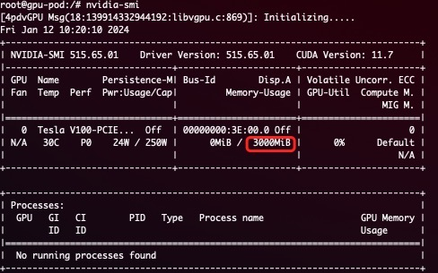

English version|[中文版](README_cn.md)


# Heterogeneous AI Computing Virtualization Middleware

[](https://github.com/Project-HAMi/HAMi/actions/workflows/main.yml)
[](https://hub.docker.com/r/4pdosc/k8s-vgpu)
[](https://join.slack.com/t/hami-hsf3791/shared_invite/zt-2gcteqiph-Ls8Atnpky6clrspCAQ_eGQ)
[](https://github.com/Project-HAMi/HAMi/discussions)
[](https://github.com/Project-HAMi/HAMi#contact)

---
<p>

</p>

**HAMi is a [Cloud Native Computing Foundation](https://cncf.io/) Landscape project.**

## Supperted devices

[](https://github.com/Project-HAMi/HAMi#preparing-your-gpu-nodes)
[](docs/cambricon-mlu-support.md)
[](docs/hygon-dcu-support.md)
[](docs/iluvatar-gpu-support.md)
[](docs/ascend910b-support.md)

## Introduction

 

**Heterogeneous AI Computing Virtualization Middleware (HAMi), formerly known as k8s-vGPU-scheduler, is an "all-in-one" chart designed to manage Heterogeneous AI Computing Devices in a k8s cluster.** It includes everything you would expect, such as:

***Device sharing***: Each task can allocate a portion of a device instead of the entire device, allowing a device to be shared among multiple tasks.

***Device Memory Control***: Devices can be allocated a specific device memory size (e.g., 3000M) or a percentage of the whole GPU's memory (e.g., 50%), ensuring it does not exceed the specified boundaries.

***Device Type Specification***: You can specify the type of device to use or avoid for a particular task by setting annotations, such as "nvidia.com/use-gputype" or "nvidia.com/nouse-gputype".

***Device UUID Specification***: You can specify the UUID of device to use or avoid for a particular task by setting annotations, such as "nvidia.com/use-gpuuuid" or "nvidia.com/nouse-gpuuuid".

***Easy to use***: You don't need to modify your task YAML to use our scheduler. All your jobs will be automatically supported after installation. Additionally, you can specify a resource name other than "nvidia.com/gpu" if you prefer.

## Major Features

- Hard Limit on Device Memory.

A simple demostration for Hard Limit:
A task with the following resources.

```
      resources:
        limits:
          nvidia.com/gpu: 1 # requesting 1 vGPU
          nvidia.com/gpumem: 3000 # Each vGPU contains 3000m device memory
```

will see 3G device memory inside container



- Allows partial device allocation by specifying device memory.
- Imposes a hard limit on streaming multiprocessors.
- Permits partial device allocation by specifying device core usage.
- Requires zero changes to existing programs.

## Architect

 

HAMi consists of several components, including a unified mutatingwebhook, a unified scheduler extender, different device-plugins and different in-container virtualization technics for each heterogeneous AI devices.

## Application Scenarios

1. Device sharing (or device virtualization) on Kubernetes.
2. Scenarios where pods need to be allocated with specific device memory 3. usage or device cores.
3. Need to balance GPU usage in a cluster with multiple GPU nodes.
4. Low utilization of device memory and computing units, such as running 10 TensorFlow servings on one GPU.
5. Situations that require a large number of small GPUs, such as teaching scenarios where one GPU is provided for multiple students to use, and cloud platforms that offer small GPU instances.

## Quick Start

### Prerequisites

The list of prerequisites for running the NVIDIA device plugin is described below:

- NVIDIA drivers >= 440
- CUDA Version > 10.2
- nvidia-docker version > 2.0
- Kubernetes version >= 1.16
- glibc >= 2.17 & glibc < 2.3.0
- kernel version >= 3.10
- helm > 3.0

### Preparing your GPU Nodes

<details> <summary> Configure nvidia-container-toolkit </summary>

Execute the following steps on all your GPU nodes.

This README assumes pre-installation of NVIDIA drivers and the `nvidia-container-toolkit`. Additionally, it assumes configuration of the `nvidia-container-runtime` as the default low-level runtime.

Please see: <https://docs.nvidia.com/datacenter/cloud-native/container-toolkit/install-guide.html>

#### Example for debian-based systems with `Docker` and `containerd`

##### Install the `nvidia-container-toolkit`

```bash
distribution=$(. /etc/os-release;echo $ID$VERSION_ID)
curl -s -L https://nvidia.github.io/libnvidia-container/gpgkey | sudo apt-key add -
curl -s -L https://nvidia.github.io/libnvidia-container/$distribution/libnvidia-container.list | sudo tee /etc/apt/sources.list.d/libnvidia-container.list

sudo apt-get update && sudo apt-get install -y nvidia-container-toolkit
```

##### Configure `Docker`

When running `Kubernetes` with `Docker`, edit the configuration file, typically located at `/etc/docker/daemon.json`, to set up `nvidia-container-runtime` as the default low-level runtime:

```json
{
    "default-runtime": "nvidia",
    "runtimes": {
        "nvidia": {
            "path": "/usr/bin/nvidia-container-runtime",
            "runtimeArgs": []
        }
    }
}
```

And then restart `Docker`:

```
sudo systemctl daemon-reload && systemctl restart docker
```

##### Configure `containerd`

When running `Kubernetes` with `containerd`, modify the configuration file typically located at `/etc/containerd/config.toml`, to set up
`nvidia-container-runtime` as the default low-level runtime:

```
version = 2
[plugins]
  [plugins."io.containerd.grpc.v1.cri"]
    [plugins."io.containerd.grpc.v1.cri".containerd]
      default_runtime_name = "nvidia"

      [plugins."io.containerd.grpc.v1.cri".containerd.runtimes]
        [plugins."io.containerd.grpc.v1.cri".containerd.runtimes.nvidia]
          privileged_without_host_devices = false
          runtime_engine = ""
          runtime_root = ""
          runtime_type = "io.containerd.runc.v2"
          [plugins."io.containerd.grpc.v1.cri".containerd.runtimes.nvidia.options]
            BinaryName = "/usr/bin/nvidia-container-runtime"
```

And then restart `containerd`:

```
sudo systemctl daemon-reload && systemctl restart containerd
```

</details>

<details> <summary> Label your nodes </summary>

Label your GPU nodes for scheduling with HAMi by adding the label "gpu=on". Without this label, the nodes cannot be managed by our scheduler.

```
kubectl label nodes {nodeid} gpu=on
```

</details>

### Install and Uninstall

<details> <summary> Installation </summary>

First, you need to check your Kubernetes version by using the following command:

```
kubectl version
```

Then, add our repo in helm

```
helm repo add hami-charts https://project-hami.github.io/HAMi/
```

During installation, set the Kubernetes scheduler image version to match your Kubernetes server version. For instance, if your cluster server version is 1.16.8, use the following command for deployment:

```
helm install hami hami-charts/hami --set scheduler.kubeScheduler.imageTag=v1.16.8 -n kube-system
```

Customize your installation by adjusting the [configs](docs/config.md).

Verify your installation using the following command:

```
kubectl get pods -n kube-system
```

If both `vgpu-device-plugin` and `vgpu-scheduler` pods are in the *Running* state, your installation is successful.

</details>

<details> <summary> Upgrade </summary>

Upgrading HAMi to the latest version is a simple process, update the repository and restart the chart:

```
helm uninstall hami -n kube-system
helm repo update
helm install hami hami-charts/hami -n kube-system
```

> **WARNING:** *If you upgrade HAMi without clearing your submitted tasks, it may result in segmentation fault.*

</details>

<details> <summary> Uninstall </summary>

```
helm uninstall hami -n kube-system
```

> **NOTICE:** *Uninstallation won't kill running tasks.*

</details>

### Submit Task

<details> <summary> Task example </summary>

Containers can now request NVIDIA vGPUs using the `nvidia.com/gpu`` resource type.

```
apiVersion: v1
kind: Pod
metadata:
  name: gpu-pod
spec:
  containers:
    - name: ubuntu-container
      image: ubuntu:18.04
      command: ["bash", "-c", "sleep 86400"]
      resources:
        limits:
          nvidia.com/gpu: 2 # requesting 2 vGPUs
          nvidia.com/gpumem: 3000 # Each vGPU contains 3000m device memory （Optional,Integer）
          nvidia.com/gpucores: 30 # Each vGPU uses 30% of the entire GPU （Optional,Integer)
```

Exercise caution; if a task cannot fit into any GPU node (i.e., the requested number of `nvidia.com/gpu` exceeds the available GPUs in any node), the task will remain in a `pending` state.

You can now execute the `nvidia-smi` command in the container to observe the difference in GPU memory between vGPU and physical GPU.

> **WARNING:**
>
> *1. if you don't request vGPUs when using the device plugin with NVIDIA images all
> the vGPUs on the machine will be exposed inside your container.*
>
> *2. Do not set "nodeName" field, use "nodeSelector" instead.*

#### More examples

Click [here](examples/nvidia/)

</details>

### Monitor

<details> <summary> Get cluster overview </summary>

Monitoring is automatically enabled after installation. Obtain an overview of cluster information by visiting the following URL:

```
http://{scheduler ip}:{monitorPort}/metrics
```

The default monitorPort is 31993; other values can be set using `--set devicePlugin.service.httpPort` during installation.

Grafana dashboard [example](docs/dashboard.md)

> **Note** The status of a node won't be collected before you submit a task

</details>

## [Benchmarks](docs/benchmark.md)

## Known Issues

- Currently, A100 MIG can be supported in only "none" and "mixed" modes.
- Tasks with the "nodeName" field cannot be scheduled at the moment; please use "nodeSelector" instead.
- Only computing tasks are currently supported; video codec processing is not supported.
- We change `device-plugin` env var name from `NodeName` to `NODE_NAME`, if you use the image version `v2.3.9`, you may encounter the situation that `device-plugin` cannot start, there are two ways to fix it:
  - Manually execute `kubectl edit daemonset` to modify the `device-plugin` env var from `NodeName` to `NODE_NAME`.
  - Upgrade to the latest version using helm, the latest version of `device-plugin` image version is `v2.3.10`, execute `helm upgrade hami hami/hami -n kube-system`, it will be fixed automatically.

## Roadmap

Heterogeneous AI Computing device to support

| Production  | manufactor | MemoryIsolation | CoreIsolation | MultiCard support |
|-------------|------------|-----------------|---------------|-------------------|
| GPU         | NVIDIA     | ✅              | ✅            | ✅                |
| MLU         | Cambricon  | ✅              | ❌            | ❌                |
| DCU         | Hygon      | ✅              | ✅            | ❌                |
| Ascend      | Huawei     | In progress     | In progress   | ❌                |
| GPU         | iluvatar   | In progress     | In progress   | ❌                |
| DPU         | Teco       | In progress     | In progress   | ❌                |

- Support video codec processing
- Support Multi-Instance GPUs (MIG)

## Contributing

If you're interested in being a contributor and want to get involved in
developing the HAMi code, please see [CONTRIBUTING](CONTRIBUTING.md) for
details on submitting patches and the contribution workflow.

## Meeting & Contact

The HAMi community is committed to fostering an open and welcoming environment, with several ways to engage with other users and developers.

If you have any questions, please feel free to reach out to us through the following channels:

- Regular Community Meeting: Friday at 16:00 UTC+8 (Chinese)(weekly). [Convert to your timezone](https://www.thetimezoneconverter.com/?t=14%3A30&tz=GMT%2B8&).
  - [Meeting Notes and Agenda](https://docs.google.com/document/d/1YC6hco03_oXbF9IOUPJ29VWEddmITIKIfSmBX8JtGBw/edit#heading=h.g61sgp7w0d0c)
  - [Meeting Link](https://meeting.tencent.com/dm/Ntiwq1BICD1P)
- Email: refer to the [MAINTAINERS.md](MAINTAINERS.md) to find the email addresses of all maintainers. Feel free to contact them via email to report any issues or ask questions.
- [mailing list](https://groups.google.com/forum/#!forum/hami-project)
- [slack](https://join.slack.com/t/hami-hsf3791/shared_invite/zt-2gcteqiph-Ls8Atnpky6clrspCAQ_eGQ)

## License

HAMi is under the Apache 2.0 license. See the [LICENSE](LICENSE) file for details.
