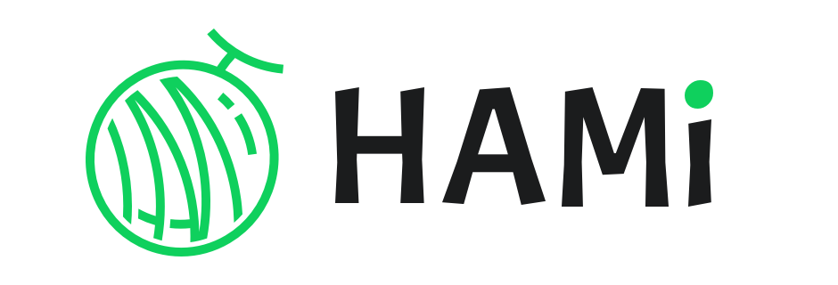
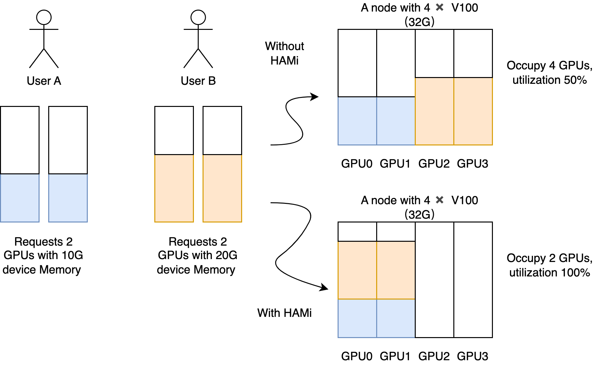
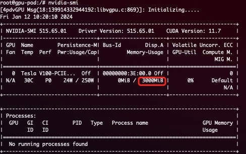
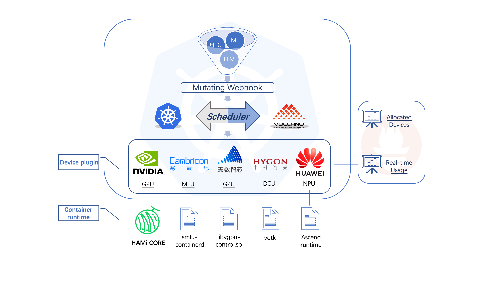

[English version](README.md) | 中文版 | [日本語版](README_ja.md)



[](/LICENSE)
[](https://github.com/Project-HAMi/HAMi/actions/workflows/ci.yaml)
[](https://github.com/Project-HAMi/HAMi/releases/latest)
[](https://www.bestpractices.dev/en/projects/9416)
[](https://goreportcard.com/report/github.com/Project-HAMi/HAMi)
[](https://codecov.io/gh/Project-HAMi/HAMi)
[](https://app.fossa.com/projects/git%2Bgithub.com%2FProject-HAMi%2FHAMi?ref=badge_shield)
[](https://hub.docker.com/r/projecthami/hami)
[](https://cloud-native.slack.com/archives/C07T10BU4R2)
[](https://github.com/Project-HAMi/HAMi/discussions)
[](http://project-hami.io)
[](https://github.com/Project-HAMi/HAMi#contact)

## Project-HAMi：异构 AI 计算虚拟化中间件

## 简介

HAMi（前身为 'k8s-vGPU-scheduler'）是一个面向 Kubernetes 的异构设备管理中间件。它可以管理不同类型的异构设备（如 GPU、NPU、MLU、DCU 等），实现异构设备在 Pod 之间的共享，并基于设备拓扑和调度策略做出更优的调度决策。

HAMi 旨在消除不同异构设备之间的差异，为用户提供统一的管理接口，无需对应用程序进行任何修改。截至 2024 年 12 月，HAMi 除了在互联网、公有云、私有云等领域外，在金融、证券、能源、运营商、教育、制造业等垂直领域，也得到了广泛采纳。超过 40 家企业和机构不仅是最终用户，同时也是活跃的贡献者。


HAMi 是 [Cloud Native Computing Foundation](https://cncf.io/)(CNCF) 基金会的沙箱项目和 [landscape](https://landscape.cncf.io/?item=orchestration-management--scheduling-orchestration--hami) 项目，同时也是 [CNAI Landscape 项目](https://landscape.cncf.io/?group=cnai&item=cnai--general-orchestration--hami)。

## 虚拟化能力

HAMi 可为多种异构设备提供虚拟化功能，支持设备共享和资源隔离。关于支持设备虚拟化的设备列表，请参见[支持的设备](#支持的设备)。

### 设备共享能力

- 通过设置核心使用率（百分比），进行设备的部分分配
- 通过设置显存（单位：MB），进行设备的部分分配
- 对流式多处理器进行硬限制
- 无需对现有程序进行任何修改
- 支持[动态MIG切片](docs/dynamic-mig-support_cn.md)能力，[样例](examples/nvidia/dynamic_mig_example.yaml)

 

### 设备资源隔离能力

HAMi支持设备资源的硬隔离
一个以 NVIDIA GPU 为例硬隔离的简单展示：
```yaml
      resources:
        limits:
          nvidia.com/gpu: 1 # 请求 1 个虚拟 GPU
          nvidia.com/gpumem: 3000 # 每个虚拟 GPU 包含 3000M 设备内存
```

在容器内将看到 3G 设备内存



> 注意：
1. **安装HAMi后，节点上注册的 `nvidia.com/gpu` 值默认为vGPU数量**
2. **pod中申请资源时，`nvidia.com/gpu` 指当前pod需要的物理GPU数量**

### 支持的设备

[NVIDIA GPU](https://github.com/Project-HAMi/HAMi#preparing-your-gpu-nodes)   
[寒武纪 MLU](docs/cambricon-mlu-support.md)   
[海光 DCU](docs/hygon-dcu-support.md)   
[天数智芯 GPU](docs/iluvatar-gpu-support.md)   
[摩尔线程 GPU](docs/mthreads-support.md)   
[昇腾 NPU](https://github.com/Project-HAMi/ascend-device-plugin/blob/main/README.md)   
[沐曦 GPU](docs/metax-support.md)   

## 架构

 

HAMi 由多个组件组成，包括统一的 mutatingwebhook、统一的调度器扩展器、不同的设备插件以及针对每种异构 AI 设备的容器内虚拟化技术。

## 快速开始

### 选择你的调度器

[](#前置条件)
[](docs/how-to-use-volcano-vgpu.md)

### 前置条件

运行 NVIDIA 设备插件的前置条件如下：

- NVIDIA 驱动 >= 440
- nvidia-docker 版本 > 2.0
- containerd/docker/cri-o 容器运行时的默认运行时配置为 nvidia
- Kubernetes 版本 >= 1.18
- glibc >= 2.17 & glibc < 2.30
- 内核版本 >= 3.10
- helm > 3.0

### 安装

首先，通过添加标签 "gpu=on" 来标记你的 GPU 节点以进行 HAMi 调度。没有此标签的节点将无法被我们的调度器管理。

```
kubectl label nodes {nodeid} gpu=on
```

在 helm 中添加我们的仓库

```
helm repo add hami-charts https://project-hami.github.io/HAMi/
```

使用以下命令进行部署：

```
helm install hami hami-charts/hami -n kube-system
```

通过调整[配置](docs/config.md)来自定义你的安装。

使用以下命令验证你的安装：

```
kubectl get pods -n kube-system
```

如果 `vgpu-device-plugin` 和 `vgpu-scheduler` pod 都处于 *Running* 状态，则安装成功。你可以在[这里](examples/nvidia/default_use.yaml)尝试示例。

### Web 界面

[HAMi-WebUI](https://github.com/Project-HAMi/HAMi-WebUI) 从 HAMi v2.4 版本开始可用

安装指南请点击[这里](https://github.com/Project-HAMi/HAMi-WebUI/blob/main/docs/installation/helm/index.md)

### 监控

安装后自动启用监控。通过访问以下 URL 获取集群信息概览：

```
http://{scheduler ip}:{monitorPort}/metrics
```

默认 monitorPort 为 31993；可以在安装时使用 `--set devicePlugin.service.httpPort` 设置其他值。

Grafana 仪表板[示例](docs/dashboard.md)

> **注意** 在提交任务之前不会收集节点状态

## 注意事项

- 如果在使用带有 NVIDIA 镜像的设备插件时不请求虚拟 GPU，机器上的所有 GPU 可能会在容器内暴露
- 目前，A100 MIG 仅支持 "none" 和 "mixed" 模式
- 带有 "nodeName" 字段的任务目前无法调度；请使用 "nodeSelector" 代替

## 社区治理

本项目由一组 [维护者](./MAINTAINERS.md) 和 [贡献者](./AUTHORS.md) 管理。他们的选择和管理方式在我们的[治理文档](https://github.com/Project-HAMi/community/blob/main/governance.md)中有详细说明。

如果你有兴趣成为贡献者并希望参与 HAMi 代码开发，请查看 [CONTRIBUTING](CONTRIBUTING.md) 了解提交补丁和贡献工作流程的详细信息。

查看[路线图](docs/develop/roadmap.md)了解你感兴趣的内容。

## 会议与联系方式

HAMi 社区致力于营造开放和友好的环境，提供多种方式与其他用户和开发者互动。

如果你有任何问题，请随时通过以下渠道与我们联系：

- 常规社区会议：每周五 16:00（UTC+8）（中文）。[转换为你的时区](https://www.thetimezoneconverter.com/?t=14%3A30&tz=GMT%2B8&)。
  - [会议记录和议程](https://docs.google.com/document/d/1YC6hco03_oXbF9IOUPJ29VWEddmITIKIfSmBX8JtGBw/edit#heading=h.g61sgp7w0d0c)
  - [会议链接](https://meeting.tencent.com/dm/Ntiwq1BICD1P)
- 电子邮件：请参考 [MAINTAINERS.md](MAINTAINERS.md) 查找所有维护者的电子邮件地址。如有任何问题或需要报告问题，请随时通过电子邮件联系他们。
- [邮件列表](https://groups.google.com/forum/#!forum/hami-project)
- [Slack](https://cloud-native.slack.com/archives/C07T10BU4R2) | [加入](https://slack.cncf.io/)

## 演讲和参考资料

|                  | 链接                                                                                                                    |
|------------------|-------------------------------------------------------------------------------------------------------------------------|
| 中国云计算基础架构开发者大会 (Beijing 2024) | [在 Kubernetes 集群式解锁异构 AI 基础设施](https://live.csdn.net/room/csdnnews/3zwDP09S) Starting from 03:06:15 |
| KubeDay(Japan 2024) | [Unlocking Heterogeneous AI Infrastructure K8s Cluster:Leveraging the Power of HAMi](https://www.youtube.com/watch?v=owoaSb4nZwg) |
| KubeCon & AI_dev Open Source GenAI & ML Summit(China 2024) | [Is Your GPU Really Working Efficiently in the Data Center?N Ways to Improve GPU Usage](https://www.youtube.com/watch?v=ApkyK3zLF5Q) |
| KubeCon & AI_dev Open Source GenAI & ML Summit(China 2024) | [Unlocking Heterogeneous AI Infrastructure K8s Cluster](https://www.youtube.com/watch?v=kcGXnp_QShs)                                     |
| KubeCon(EU 2024)| [Cloud Native Batch Computing with Volcano: Updates and Future](https://youtu.be/fVYKk6xSOsw) |

## 许可证

HAMi 采用 Apache 2.0 许可证。详情请参见 [LICENSE](LICENSE) 文件。

## Star 趋势

[](https://star-history.com/#Project-HAMi/HAMi&Date)
