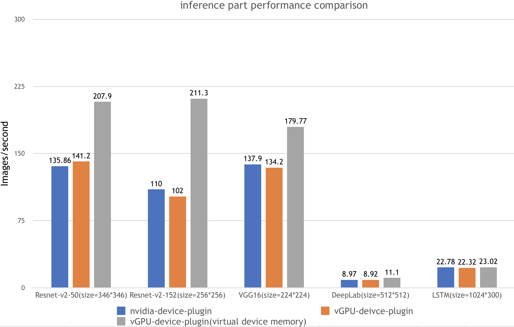
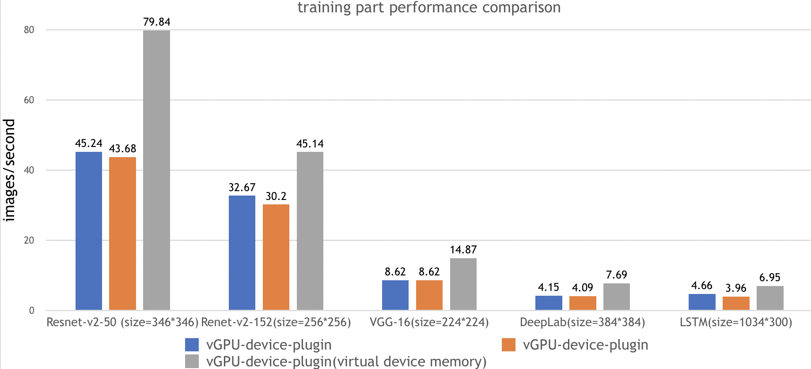

# vGPU scheduler for Kubernetes

[](https://github.com/4paradigm/k8s-vgpu-scheduler/actions/workflows/build.yml)
[](https://hub.docker.com/r/4pdosc/k8s-vgpu)
[](https://join.slack.com/t/k8s-device-plugin/shared_invite/zt-oi9zkr5c-LsMzNmNs7UYg6usc0OiWKw)
[](https://github.com/4paradigm/k8s-device-plugin/discussions)

## 目录

- [简介](#简介)
- [使用场景](#使用场景)
- [安装要求](#安装要求)
- [快速入门](#快速入门)
  - [GPU节点准备](#GPU节点准备)
  - [Kubernetes开启vGPU支持](#Kubernetes开启vGPU支持)
  - [运行GPU任务](#运行GPU任务
- [调度策略](#调度策略)
- [性能测试](#性能测试)
- [功能](#功能)
- [实验性功能](#实验性功能)
- [已知问题](#已知问题)
- [开发计划](#开发计划)
- [测试](#测试)
- [卸载](#卸载)
- [问题反馈及代码贡献](#问题反馈及代码贡献)

## 简介

第四范式vGPU调度器满足了所有你对于管理GPU集群所需要的能力，包括：

***GPU 共享***: 每个任务可以只占用一部分显卡，多个任务可以共享一张显卡

***可限制分配的显存大小***: 你现在可以用显存来分配GPU，vGPU调度器会确保任务使用的显存不会超过分配数值

***虚拟显存***: 你可以超额使用显存，并将内存当作显存的交换区使用

***无侵入***:  vGPU调度器兼容nvidia官方插件的显卡分配方式，所以安装完毕后，你不需要修改原有的任务文件就可以使用vGPU的功能。

**k8s vGPU scheduler** 在保留4pd-k8s-device-plugin([4paradigm/k8s-device-plugin](https://github.com/4paradigm/k8s-device-plugin))插件功能的基础上，添加了调度模块，以实现多个GPU节点间的负载均衡。k8s vGPU scheduler在原有显卡分配方式的基础上，可以进一步根据显存和算力来切分显卡。在k8s集群中，基于这些切分后的vGPU进行调度，使不同的容器可以安全的共享同一张物理GPU，提高GPU的利用率。此外，插件还可以对显存做虚拟化处理（使用到的显存可以超过物理上的显存），运行一些超大显存需求的任务，或提高共享的任务数，可参考[性能测试报告](#性能测试)。

## 使用场景

1. 需要定制GPU申请的场合，如申请特定大小的vGPU，每个vGPU使用特定比例的算力。
2. 在多个GPU节点组成的集群中，任务需要根据自身的显卡需求分配到合适的节点执行。
3. 显存、计算单元利用率低的情况，如在一张GPU卡上运行10个tf-serving。
4. 需要大量小显卡的情况，如教学场景把一张GPU提供给多个学生使用、云平台提供小GPU实例。
5. 物理显存不足的情况，可以开启虚拟显存，如大batch、大模型的训练。


## 安装要求

* NVIDIA drivers >= 384.81
* nvidia-docker version > 2.0 
* docker已配置nvidia作为默认runtime
* Kubernetes version >= 1.16
* glibc >= 2.17
* kernel version >= 3.10
* helm 

## 快速入门


### GPU节点准备

以下步骤要在所有GPU节点执行。这份README文档假定GPU节点已经安装NVIDIA驱动和`nvidia-docker`套件。

注意你需要安装的是`nvidia-docker2`而非`nvidia-container-toolkit`。因为新的`--gpus`选项kubernetes尚不支持。安装步骤举例：

```
# 加入套件仓库
$ distribution=$(. /etc/os-release;echo $ID$VERSION_ID)
$ curl -s -L https://nvidia.github.io/nvidia-docker/gpgkey | sudo apt-key add -
$ curl -s -L https://nvidia.github.io/nvidia-docker/$distribution/nvidia-docker.list | sudo tee /etc/apt/sources.list.d/nvidia-docker.list

$ sudo apt-get update && sudo apt-get install -y nvidia-docker2
$ sudo systemctl restart docker
```

你需要在节点上将nvidia runtime做为你的docker runtime预设值。我们将编辑docker daemon的配置文件，此文件通常在`/etc/docker/daemon.json`路径：

```
{
    "default-runtime": "nvidia",
    "runtimes": {
        "nvidia": {
            "path": "/usr/bin/nvidia-container-runtime",
            "runtimeArgs": []
        }
    }
}
```

> *如果 `runtimes` 字段没有出现, 前往的安装页面执行安装操作 [nvidia-docker](https://github.com/NVIDIA/nvidia-docker)*

最后，你需要将所有要使用到的GPU节点打上gpu=on标签，否则该节点不会被调度到

```
$ kubectl label nodes {nodeid} gpu=on
```

### 下载项目并进入deployments文件夹

当你在所有GPU节点完成前面提到的准备动作，如果Kubernetes有已经存在的NVIDIA装置插件，需要先将它移除。然后，你需要下载整个项目，并进入deployments文件夹

```
$ git clone https://github.com/4paradigm/k8s-vgpu-scheduler.git
$ cd k8s-vgpu-scheduler/deployments
```

### 设置调度器镜像版本

使用下列执行获取集群服务端版本

```
kubectl version
```

随后，根据获得的集群服务端版本，修改 `vgpu/values.yaml` 文件的 `scheduler.kubeScheduler.image` 中调度器镜像版本。例如，如果你的服务端版本为1.16.8，则你需要将镜像版本修改为1.16.8

```
scheduler:
  kubeScheduler:
    image: "registry.cn-hangzhou.aliyuncs.com/google_containers/kube-scheduler:v1.16.8"
```


### Kubernetes开启vGPU支持

安装之前，你可以修改这里的[配置](docs/config_cn.md)来定制安装

配置完成后，随后使用helm安装整个chart

```
$ helm install vgpu vgpu -n kube-system
```

通过kubectl get pods指令看到 `vgpu-device-plugin` 与 `vgpu-scheduler` 两个pod 状态为*Running*  即为安装成功

```
$ kubectl get pods -n kube-system
```

### 运行GPU任务

NVIDIA vGPUs 现在能透过资源类型`nvidia.com/gpu`被容器请求：

```
apiVersion: v1
kind: Pod
metadata:
  name: gpu-pod
spec:
  containers:
    - name: ubuntu-container
      image: ubuntu:18.04
      command: ["bash", "-c", "sleep 86400"]
      resources:
        limits:
          nvidia.com/gpu: 2 # 请求2个vGPUs
	        nvidia.com/gpumem: 3000 # 每个vGPU申请3000m显存 （可选，整数类型）
	        nvidia.com/gpucores: 30 # 每个vGPU的算力为30%实际显卡的算力 （可选，整数类型）
```

如果你的任务无法运行在任何一个节点上（例如任务的`nvidia.com/gpu`大于集群中任意一个GPU节点的实际GPU数量）,那么任务会卡在`pending`状态

现在你可以在容器执行`nvidia-smi`命令，然后比较vGPU和实际GPU显存大小的不同。

### 更新

只需要重新启动整个Chart即可自动完成更新，最新的镜像会被自动下载

```
$ helm uninstall vgpu -n kube-system
$ helm install vgpu vgpu -n kube-system
```

### 卸载

```
$ helm uninstall vgpu -n kube-system
```

## 调度策略

调度策略为，在保证显存和算力满足需求的GPU中，优先选择任务数最少的GPU执行任务，这样做可以使任务均匀分配到所有的GPU中

## 性能测试

## 使用场景

1. 显存、计算单元利用率低的情况，如在一张GPU卡上运行10个tf-serving。
2. 需要大量小显卡的情况，如教学场景把一张GPU提供给多个学生使用、云平台提供小GPU实例。
3. 物理显存不足的情况，可以开启虚拟显存，如大batch、大模型的训练。

## 性能测试

在测试报告中，我们一共在下面五种场景都执行了ai-benchmark 测试脚本，并汇总最终结果：

| 测试环境 | 环境描述                                              |
| ---------------- | :------------------------------------------------------: |
| Kubernetes version | v1.12.9                                                |
| Docker  version    | 18.09.1                                                |
| GPU Type           | Tesla V100                                             |
| GPU Num            | 2                                                      |

| 测试名称 |                      测试用例                      |
| -------- | :------------------------------------------------: |
| Nvidia-device-plugin        |         k8s + nvidia官方k8s-device-plugin          |
| vGPU-device-plugin        |      k8s + VGPU k8s-device-plugin，无虚拟显存      |
| vGPU-device-plugin(virtual device memory)  | k8s + VGPU k8s-device-plugin，高负载，开启虚拟显存 |

测试内容

| test id |     名称      |   类型    |          参数           |
| ------- | :-----------: | :-------: | :---------------------: |
| 1.1     | Resnet-V2-50  | inference |  batch=50,size=346*346  |
| 1.2     | Resnet-V2-50  | training  |  batch=20,size=346*346  |
| 2.1     | Resnet-V2-152 | inference |  batch=10,size=256*256  |
| 2.2     | Resnet-V2-152 | training  |  batch=10,size=256*256  |
| 3.1     |    VGG-16     | inference |  batch=20,size=224*224  |
| 3.2     |    VGG-16     | training  |  batch=2,size=224*224   |
| 4.1     |    DeepLab    | inference |  batch=2,size=512*512   |
| 4.2     |    DeepLab    | training  |  batch=1,size=384*384   |
| 5.1     |     LSTM      | inference | batch=100,size=1024*300 |
| 5.2     |     LSTM      | training  | batch=10,size=1024*300  |

测试结果： 



测试步骤：

1. 安装nvidia-device-plugin，并配置相应的参数
2. 运行benchmark任务

```
$ kubectl apply -f benchmarks/ai-benchmark/ai-benchmark.yml
```

3. 通过kubctl logs 查看结果

```
$ kubectl logs [pod id]
```

## 功能

- 指定每张物理GPU切分的最大vGPU的数量
- 限制vGPU的显存
- 允许通过指定显存来申请GPU
- 限制vGPU的计算单元
- 允许通过指定vGPU使用比例来申请GPU
- 对已有程序零改动

## 实验性功能

- 虚拟显存

  vGPU的显存总和可以超过GPU实际的显存，这时候超过的部分会放到内存里，对性能有一定的影响。

## 已知问题

- 目前仅支持计算任务，不支持视频编解码处理。
- 暂时不支持MIG

## 开发计划

- 支持视频编解码处理
- 支持Multi-Instance GPUs (MIG) 

# 测试

- TensorFlow 1.14.0/2.4.1
- torch1.1.0
- mxnet 1.4.0
- mindspore 1.1.1

以上框架均通过测试。

## 反馈和参与

* bug、疑惑、修改欢迎提在 [Github Issues](https://github.com/4paradigm/k8s-vgpu-scheduler/issues/new)
* 想了解更多或者有想法可以参与到[Discussions](https://github.com/4paradigm/k8s-device-plugin/discussions)和[slack](https://join.slack.com/t/k8s-device-plugin/shared_invite/zt-oi9zkr5c-LsMzNmNs7UYg6usc0OiWKw)交流

## 作者

- 李孟轩 (limengxuan@4paradigm.com)
- 裴兆友 (peizhaoyou@4paradigm.com)
- 石光川 (shiguangchuan@4paradigm.com)