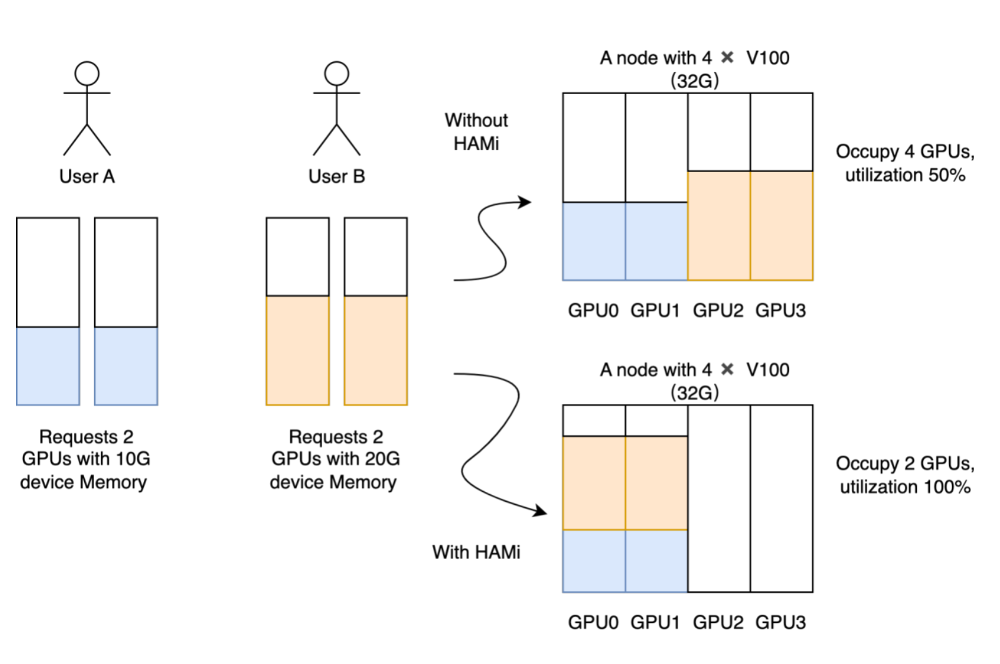

<<<<<<< HEAD
[English version](README.md) | 中文版 | [日本語版](README_ja.md)


=======


# HAMi--异构算力虚拟化中间件

[](https://github.com/4paradigm/k8s-vgpu-scheduler/actions/workflows/build.yml)
[](https://hub.docker.com/r/4pdosc/k8s-vgpu)
[](https://join.slack.com/t/k8s-device-plugin/shared_invite/zt-oi9zkr5c-LsMzNmNs7UYg6usc0OiWKw)
[](https://github.com/4paradigm/k8s-device-plugin/discussions)
[](https://github.com/4paradigm/k8s-vgpu-scheduler#contact)
>>>>>>> c7a3893 (Remake this repo to HAMi)

<<<<<<< HEAD
[](/LICENSE)
[](https://github.com/Project-HAMi/HAMi/actions/workflows/ci.yaml)
[](https://github.com/Project-HAMi/HAMi/releases/latest)
[](https://www.bestpractices.dev/en/projects/9416)
[](https://goreportcard.com/report/github.com/Project-HAMi/HAMi)
[](https://codecov.io/gh/Project-HAMi/HAMi)
[](https://app.fossa.com/projects/git%2Bgithub.com%2FProject-HAMi%2FHAMi?ref=badge_shield)
[](https://hub.docker.com/r/projecthami/hami)
[](https://github.com/Project-HAMi/HAMi#contact)
[](https://discord.gg/Amhy7XmbNq)
[](http://project-hami.io)
=======
## 支持设备：

[](https://github.com/4paradigm/k8s-vgpu-scheduler#preparing-your-gpu-nodes)
[](docs/cambricon-mlu-support_cn.md)
[](docs/hygon-dcu-support.md)

<<<<<<< HEAD

## 目录

- [简介](#简介)
- [使用场景](#使用场景)
- [安装要求](#安装要求)
- [快速入门](#快速入门)
  - [GPU节点准备](#GPU节点准备)
  - [Kubernetes开启vGPU支持](#Kubernetes开启vGPU支持)
  - [运行GPU任务](#运行GPU任务)
- [调度策略](#调度策略)
- [性能测试](#性能测试)
- [功能](#功能)
- [实验性功能](#实验性功能)
- [已知问题](#已知问题)
- [开发计划](#开发计划)
- [测试](#测试)
- [卸载](#卸载)
- [问题反馈及代码贡献](#问题反馈及代码贡献)
>>>>>>> 21785f7 (update to v2.3.2)

## Project-HAMi：异构 AI 计算虚拟化中间件

## 简介

HAMi（前身为 'k8s-vGPU-scheduler'）是一个面向 Kubernetes 的异构设备管理中间件。它可以管理不同类型的异构设备（如 GPU、NPU、MLU、DCU 等），实现异构设备在 Pod 之间的共享，并基于设备拓扑和调度策略做出更优的调度决策。

HAMi 旨在消除不同异构设备之间的差异，为用户提供统一的管理接口，无需对应用程序进行任何修改。截至 2024 年 12 月，HAMi 除了在互联网、公有云、私有云等领域外，在金融、证券、能源、运营商、教育、制造业等垂直领域，也得到了广泛采纳。超过 40 家企业和机构不仅是最终用户，同时也是活跃的贡献者。
=======
## 简介

! 

异构算力虚拟化中间件HAMi满足了所有你对于管理异构算力集群所需要的能力，包括：

***设备复用***: 每个任务可以只占用一部分显卡，多个任务可以共享一张显卡
>>>>>>> c7a3893 (Remake this repo to HAMi)


<<<<<<< HEAD
HAMi 是 [Cloud Native Computing Foundation](https://cncf.io/)(CNCF) 基金会的沙箱项目和 [landscape](https://landscape.cncf.io/?item=orchestration-management--scheduling-orchestration--hami) 项目，同时也是 [CNAI Landscape 项目](https://landscape.cncf.io/?group=cnai&item=cnai--general-orchestration--hami)。

## 虚拟化能力
=======
***指定设备型号***：当前任务可以通过设置annotation的方式，来选择使用或者不使用某些具体型号的设备
>>>>>>> c7a3893 (Remake this repo to HAMi)

HAMi 可为多种异构设备提供虚拟化功能，支持设备共享和资源隔离。关于支持设备虚拟化的设备列表，请参见[支持的设备](#支持的设备)。

<<<<<<< HEAD
### 设备共享能力

- 通过设置核心使用率（百分比），进行设备的部分分配
- 通过设置显存（单位：MB），进行设备的部分分配
- 对流式多处理器进行硬限制
- 无需对现有程序进行任何修改
- 支持[动态MIG切片](docs/dynamic-mig-support_cn.md)能力，[样例](examples/nvidia/dynamic_mig_example.yaml)

 

### 设备资源隔离能力

HAMi支持设备资源的硬隔离
一个以 NVIDIA GPU 为例硬隔离的简单展示：
```yaml
=======
## 使用场景

1. 云原生场景下需要复用算力设备的场合
2. 需要定制异构算力申请的场合，如申请特定显存大小的虚拟GPU，每个虚拟GPU使用特定比例的算力。
3. 在多个异构算力节点组成的集群中，任务需要根据自身的显卡需求分配到合适的节点执行。
4. 显存、计算单元利用率低的情况，如在一张GPU卡上运行10个tf-serving。
5. 需要大量小显卡的情况，如教学场景把一张GPU提供给多个学生使用、云平台提供小GPU实例。

## 产品设计

! 

HAMi 包含以下几个组件，一个统一的mutatingwebhook，一个统一的调度器，以及针对各种不同的异构算力设备对应的设备插件和容器内的控制组件，整体的架构特性如上图所示。

## 产品特性

- 显存资源的硬隔离

一个硬隔离的简单展示：
一个使用以下方式定义的任务提交后
```
      resources:
        limits:
          nvidia.com/gpu: 1 # requesting 1 vGPU
          nvidia.com/gpumem: 3000 # Each vGPU contains 3000m device memory
```
会只有3G可见显存


- 允许通过指定显存来申请算力设备
- 算力资源的硬隔离
- 允许通过指定算力使用比例来申请算力设备
- 对已有程序零改动

## 安装要求

* NVIDIA drivers >= 440
* nvidia-docker version > 2.0 
* docker已配置nvidia作为默认runtime
* Kubernetes version >= 1.16
* glibc >= 2.17 & glibc < 2.3.0
* kernel version >= 3.10
* helm > 3.0 

## 快速入门

### 准备节点

<details> <summary> 配置 nvidia-container-toolkit </summary>

### GPU节点准备

以下步骤要在所有GPU节点执行,这份README文档假定GPU节点已经安装NVIDIA驱动。它还假设您已经安装docker或container并且需要将nvidia-container-runtime配置为要使用的默认低级运行时。

安装步骤举例：

####
```
# 加入套件仓库
distribution=$(. /etc/os-release;echo $ID$VERSION_ID)
curl -s -L https://nvidia.github.io/libnvidia-container/gpgkey | sudo apt-key add -
curl -s -L https://nvidia.github.io/libnvidia-container/$distribution/libnvidia-container.list | sudo tee /etc/apt/sources.list.d/libnvidia-container.list

sudo apt-get update && sudo apt-get install -y nvidia-container-toolkit
```

##### 配置docker
你需要在节点上将nvidia runtime做为你的docker runtime预设值。我们将编辑docker daemon的配置文件，此文件通常在`/etc/docker/daemon.json`路径：

```
{
    "default-runtime": "nvidia",
    "runtimes": {
        "nvidia": {
            "path": "/usr/bin/nvidia-container-runtime",
            "runtimeArgs": []
        }
    }
}
```
```
systemctl daemon-reload && systemctl restart docker
```
##### 配置containerd
你需要在节点上将nvidia runtime做为你的containerd runtime预设值。我们将编辑containerd daemon的配置文件，此文件通常在`/etc/containerd/config.toml`路径
```
version = 2
[plugins]
  [plugins."io.containerd.grpc.v1.cri"]
    [plugins."io.containerd.grpc.v1.cri".containerd]
      default_runtime_name = "nvidia"

      [plugins."io.containerd.grpc.v1.cri".containerd.runtimes]
        [plugins."io.containerd.grpc.v1.cri".containerd.runtimes.nvidia]
          privileged_without_host_devices = false
          runtime_engine = ""
          runtime_root = ""
          runtime_type = "io.containerd.runc.v2"
          [plugins."io.containerd.grpc.v1.cri".containerd.runtimes.nvidia.options]
            BinaryName = "/usr/bin/nvidia-container-runtime"
```
```
systemctl daemon-reload && systemctl restart containerd
```

</details>

<details> <summary> 为GPU节点打上标签 </summary>

最后，你需要将所有要使用到的GPU节点打上gpu=on标签，否则该节点不会被调度到

```
$ kubectl label nodes {nodeid} gpu=on
```

</details>

### 安装，更新与卸载

<details> <summary> 安装 </summary>

首先使用helm添加我们的vgpu repo

```
helm repo add vgpu-charts https://4paradigm.github.io/k8s-vgpu-scheduler
```

随后，使用下列指令获取集群服务端版本

```
kubectl version
```

在安装过程中须根据集群服务端版本（上一条指令的结果）指定调度器镜像版本，例如集群服务端版本为1.16.8，则可以使用如下指令进行安装

```
$ helm install vgpu vgpu-charts/vgpu --set scheduler.kubeScheduler.imageTag=v1.16.8 -n kube-system
```

你可以修改这里的[配置](docs/config_cn.md)来定制安装

通过kubectl get pods指令看到 `vgpu-device-plugin` 与 `vgpu-scheduler` 两个pod 状态为*Running*  即为安装成功

```
$ kubectl get pods -n kube-system
```

</details>

<details> <summary> 更新 </summary>

只需要更新helm repo，并重新启动整个Chart即可自动完成更新，最新的镜像会被自动下载

```
$ helm uninstall vgpu -n kube-system
$ helm repo update
$ helm install vgpu vgpu -n kube-system
```

> **注意:** *如果你没有清理完任务就进行热更新的话，正在运行的任务可能会出现段错误等报错.*

</details>

<details> <summary> 卸载 </summary>

```
$ helm uninstall vgpu -n kube-system
```

> **注意:** *卸载组件并不会使正在运行的任务失败.*

</details>

### 提交任务

<details> <summary> 任务样例 </summary>

NVIDIA vGPUs 现在能透过资源类型`nvidia.com/gpu`被容器请求：

```
apiVersion: v1
kind: Pod
metadata:
  name: gpu-pod
spec:
  containers:
    - name: ubuntu-container
      image: ubuntu:18.04
      command: ["bash", "-c", "sleep 86400"]
>>>>>>> c7a3893 (Remake this repo to HAMi)
      resources:
        limits:
          nvidia.com/gpu: 1 # 请求 1 个虚拟 GPU
          nvidia.com/gpumem: 3000 # 每个虚拟 GPU 包含 3000M 设备内存
```

在容器内将看到 3G 设备内存


<<<<<<< HEAD
> 注意：
1. **安装HAMi后，节点上注册的 `nvidia.com/gpu` 值默认为vGPU数量**
2. **pod中申请资源时，`nvidia.com/gpu` 指当前pod需要的物理GPU数量**

### 支持的设备
=======
> **注意:** *1. 如果你使用privileged字段的话，本任务将不会被调度，因为它可见所有的GPU，会对其它任务造成影响.*
> 
> *2. 不要设置nodeName字段，类似需求请使用nodeSelector.* 

</details>

### 监控：

<details> <summary> 访问集群算力视图 </summary>
>>>>>>> c7a3893 (Remake this repo to HAMi)

[NVIDIA GPU](https://github.com/Project-HAMi/HAMi#preparing-your-gpu-nodes)   
[寒武纪 MLU](docs/cambricon-mlu-support.md)   
[海光 DCU](docs/hygon-dcu-support.md)   
[天数智芯 GPU](docs/iluvatar-gpu-support.md)   
[摩尔线程 GPU](docs/mthreads-support.md)   
[昇腾 NPU](https://github.com/Project-HAMi/ascend-device-plugin/blob/main/README.md)   
[沐曦 GPU](docs/metax-support.md)   

## 架构

 

HAMi 由多个组件组成，包括统一的 mutatingwebhook、统一的调度器扩展器、不同的设备插件以及针对每种异构 AI 设备的容器内虚拟化技术。

## 快速开始

### 选择你的调度器

[](#前置条件)
[](docs/how-to-use-volcano-vgpu.md)

### 前置条件

运行 NVIDIA 设备插件的前置条件如下：

- NVIDIA 驱动 >= 440
- nvidia-docker 版本 > 2.0
- containerd/docker/cri-o 容器运行时的默认运行时配置为 nvidia
- Kubernetes 版本 >= 1.18
- glibc >= 2.17 & glibc < 2.30
- 内核版本 >= 3.10
- helm > 3.0

### 安装

首先，通过添加标签 "gpu=on" 来标记你的 GPU 节点以进行 HAMi 调度。没有此标签的节点将无法被我们的调度器管理。

```
kubectl label nodes {nodeid} gpu=on
```

<<<<<<< HEAD
在 helm 中添加我们的仓库

```
helm repo add hami-charts https://project-hami.github.io/HAMi/
```

使用以下命令进行部署：

```
helm install hami hami-charts/hami -n kube-system
```

通过调整[配置](docs/config.md)来自定义你的安装。

使用以下命令验证你的安装：

```
kubectl get pods -n kube-system
```

如果 `vgpu-device-plugin` 和 `vgpu-scheduler` pod 都处于 *Running* 状态，则安装成功。你可以在[这里](examples/nvidia/default_use.yaml)尝试示例。

### Web 界面

[HAMi-WebUI](https://github.com/Project-HAMi/HAMi-WebUI) 从 HAMi v2.4 版本开始可用

安装指南请点击[这里](https://github.com/Project-HAMi/HAMi-WebUI/blob/main/docs/installation/helm/index.md)

### 监控

安装后自动启用监控。通过访问以下 URL 获取集群信息概览：

```
http://{scheduler ip}:{monitorPort}/metrics
```

默认 monitorPort 为 31993；可以在安装时使用 `--set devicePlugin.service.httpPort` 设置其他值。

Grafana 仪表板[示例](docs/dashboard.md)

> **注意** 在提交任务之前不会收集节点状态

## 注意事项

- 如果在使用带有 NVIDIA 镜像的设备插件时不请求虚拟 GPU，机器上的所有 GPU 可能会在容器内暴露
- 目前，A100 MIG 仅支持 "none" 和 "mixed" 模式
- 带有 "nodeName" 字段的任务目前无法调度；请使用 "nodeSelector" 代替
=======
来获取监控数据，其中monitorPort可以在Values中进行配置，默认为31992

grafana dashboard [示例](docs/dashboard_cn.md)

> **注意** 节点上的vGPU状态只有在其使用vGPU后才会被统计

</details>

## [性能测试](docs/benchmark_cn.md)
>>>>>>> c7a3893 (Remake this repo to HAMi)

## 社区治理

本项目由一组 [维护者](./MAINTAINERS.md) 和 [贡献者](./AUTHORS.md) 管理。他们的选择和管理方式在我们的[治理文档](https://github.com/Project-HAMi/community/blob/main/governance.md)中有详细说明。

如果你有兴趣成为贡献者并希望参与 HAMi 代码开发，请查看 [CONTRIBUTING](CONTRIBUTING.md) 了解提交补丁和贡献工作流程的详细信息。

<<<<<<< HEAD
查看[路线图](docs/develop/roadmap.md)了解你感兴趣的内容。

## 会议与联系方式

HAMi 社区致力于营造开放和友好的环境，提供多种方式与其他用户和开发者互动。

如果你有任何问题，请随时通过以下渠道与我们联系：
=======
- 目前支持的异构算力设备及其对应的复用特性如下表所示

| 产品  | 制造商 | 显存隔离 | 算力隔离 | 多卡支持 |
|-------------|------------|-----------------|---------------|-------------------|
| GPU         | NVIDIA     | ✅              | ✅            | ✅                |
| MLU         | 寒武纪  | ✅              | ❌            | ❌                |
| DCU         | 海光      | ✅              | ✅            | ❌                |
| Ascend      | 华为     | 开发中     | 开发中   | ❌                |
| GPU         | 天数智芯   | 开发中     | 开发中   | ❌                |
| DPU         | 太初       | 开发中     | 开发中   | ❌                | 
- 支持视频编解码处理
- 支持Multi-Instance GPUs (MIG) 

>>>>>>> c7a3893 (Remake this repo to HAMi)

- 常规社区会议：每周五 16:00（UTC+8）（中文）。[转换为你的时区](https://www.thetimezoneconverter.com/?t=14%3A30&tz=GMT%2B8&)。
  - [会议记录和议程](https://docs.google.com/document/d/1YC6hco03_oXbF9IOUPJ29VWEddmITIKIfSmBX8JtGBw/edit#heading=h.g61sgp7w0d0c)
  - [会议链接](https://meeting.tencent.com/dm/Ntiwq1BICD1P)
- 电子邮件：请参考 [MAINTAINERS.md](MAINTAINERS.md) 查找所有维护者的电子邮件地址。如有任何问题或需要报告问题，请随时通过电子邮件联系他们。
- [邮件列表](https://groups.google.com/forum/#!forum/hami-project)

## 演讲和参考资料

<<<<<<< HEAD
|                  | 链接                                                                                                                    |
|------------------|-------------------------------------------------------------------------------------------------------------------------|
| 中国云计算基础架构开发者大会 (Beijing 2024) | [在 Kubernetes 集群式解锁异构 AI 基础设施](https://live.csdn.net/room/csdnnews/3zwDP09S) Starting from 03:06:15 |
| KubeDay(Japan 2024) | [Unlocking Heterogeneous AI Infrastructure K8s Cluster:Leveraging the Power of HAMi](https://www.youtube.com/watch?v=owoaSb4nZwg) |
| KubeCon & AI_dev Open Source GenAI & ML Summit(China 2024) | [Is Your GPU Really Working Efficiently in the Data Center?N Ways to Improve GPU Usage](https://www.youtube.com/watch?v=ApkyK3zLF5Q) |
| KubeCon & AI_dev Open Source GenAI & ML Summit(China 2024) | [Unlocking Heterogeneous AI Infrastructure K8s Cluster](https://www.youtube.com/watch?v=kcGXnp_QShs)                                     |
| KubeCon(EU 2024)| [Cloud Native Batch Computing with Volcano: Updates and Future](https://youtu.be/fVYKk6xSOsw) |

## 许可证

HAMi 采用 Apache 2.0 许可证。详情请参见 [LICENSE](LICENSE) 文件。

## Star 趋势

[](https://star-history.com/#Project-HAMi/HAMi&Date)
=======
>>>>>>> c7a3893 (Remake this repo to HAMi)
