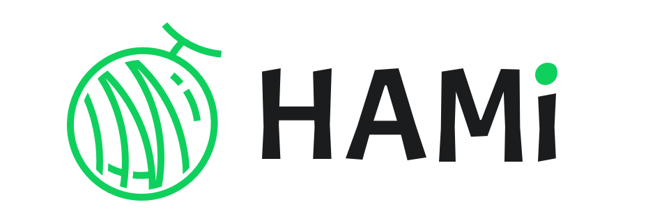
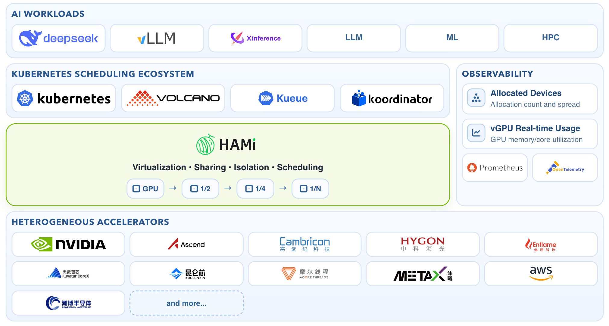
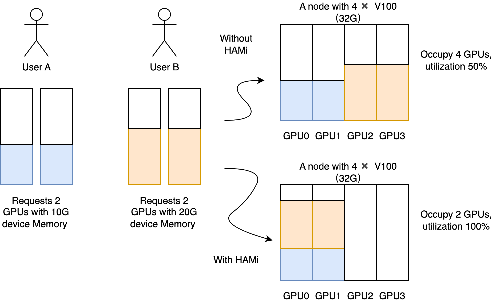
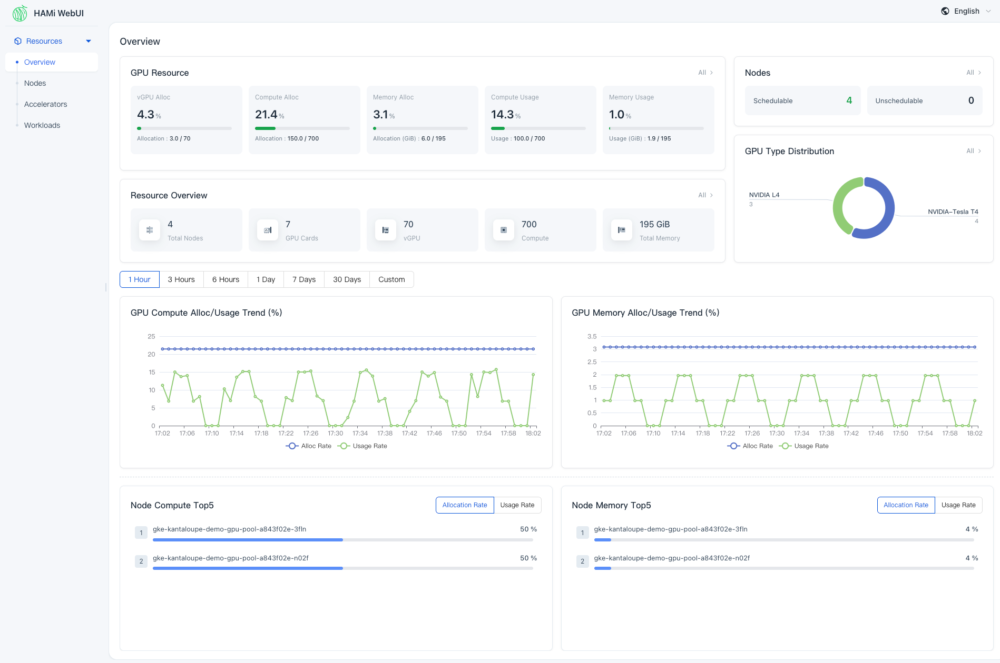

[English version](README.md) | [中文版](README_cn.md) | 日本語版



[](/LICENSE)
[](https://github.com/Project-HAMi/HAMi/actions/workflows/ci.yaml)
[](https://github.com/Project-HAMi/HAMi/releases/latest)
[](https://www.bestpractices.dev/en/projects/9416)
[](https://goreportcard.com/report/github.com/Project-HAMi/HAMi)
[](https://codecov.io/gh/Project-HAMi/HAMi)
[](https://app.fossa.com/projects/git%2Bgithub.com%2FProject-HAMi%2FHAMi?ref=badge_shield)
[](https://hub.docker.com/r/projecthami/hami)
[](https://cloud-native.slack.com/archives/C07T10BU4R2)
[](https://discord.gg/Amhy7XmbNq)
[](https://project-hami.io)

# HAMi

**AI インフラストラクチャ向け Kubernetes GPU 仮想化およびヘテロジニアスアクセラレータスケジューリング。**



HAMi は **Heterogeneous AI Computing Virtualization Middleware**（異種 AI コンピューティング仮想化ミドルウェア）の略称です。旧称 `k8s-vGPU-scheduler`。HAMi はプラットフォームチームが Kubernetes ワークロード間で高価な GPU やその他の AI アクセラレータを共有し、デバイスメモリとコンピュートを分離し、アプリケーションコードを変更することなくデバイスアウェアなスケジューリングポリシーで Pod をスケジュールできるようにします。

HAMi は [CNCF Sandbox](https://www.cncf.io/sandbox-projects/) および [CNCF Landscape](https://landscape.cncf.io/?item=orchestration-management--scheduling-orchestration--hami) プロジェクトであり、[CNAI Landscape](https://landscape.cncf.io/?group=cnai&item=cnai--general-orchestration--hami) にも掲載されています。


## なぜ HAMi？

AI インフラストラクチャチームは、同じような Kubernetes アクセラレータの問題に直面しています：GPU 全体が小さなジョブに割り当てられ、チームが希少なデバイスを争い、異なるアクセラレータベンダーが異なる運用モデルを提供し、スケジューラがワークロードを効率的に配置するための十分なデバイスコンテキストを持っていません。

HAMi は Kubernetes ネイティブなレイヤーを提供します：

- **デバイス共有**：メモリ、コア、またはデバイス数によって物理アクセラレータの一部を割り当てます。
- **リソース分離**：デバイスバックエンドがサポートする場合、ワークロードごとのアクセラレータメモリとコンピュートの制限を強制します。
- **デバイスアウェアスケジューリング**：トポロジアウェア、binpack、spread、およびデバイス固有のスケジューリングポリシーで Pod を配置します。
- **ヘテロジニアス AI クラスター**：NVIDIA GPU、NPU、DCU、MLU など、1 つのスケジューリングおよび割り当てワークフローで複数のアクセラレータタイプを管理します。
- **アプリケーションの変更不要**：標準の Kubernetes リソースリクエストとリミットを引き続き使用します。
- **本番運用**：メトリクス、ダッシュボード、WebUI、Helm インストール、コミュニティサポートのデプロイガイダンスを提供します。

## ユースケース

- 共有 Kubernetes AI クラスターでの GPU 利用率の向上。
- 同一のアクセラレータプール上でマルチテナントのノートブック、トレーニング、推論ワークロードを実行。
- 公平なデバイス割り当てとクォータ制御を備えたプライベートクラウド AI プラットフォームの構築。
- NVIDIA、Ascend、Cambricon、Hygon、Iluvatar、MetaX、Moore Threads など、複数ベンダーのヘテロジニアスアクセラレータクラスターの運用。
- バッチ AI ワークロード向けに kube-scheduler や Volcano などの Kubernetes スケジューラと HAMi を組み合わせて使用。

## 仕組み

HAMi は Mutating Webhook、スケジューラエクステンダー、デバイスプラグイン、およびデバイス固有のコンテナ内仮想化コンポーネントで構成されています。

```text
Pod サブミッション
  -> HAMi Mutating Webhook
  -> HAMi スケジューラ filter / score / bind
  -> デバイス割り当てを Pod アノテーションに書き込み
  -> デバイスプラグイン Allocate()
  -> コンテナランタイム環境
  -> HAMi モニターおよびメトリクス
```

## デバイス仮想化

HAMi はワークロードが必要なアクセラレータリソースのみをリクエストできるようにします。例えば、次の Pod は 3 GiB の GPU メモリを持つ物理 NVIDIA GPU を 1 つリクエストします：

```yaml
resources:
  limits:
    nvidia.com/gpu: 1
    nvidia.com/gpumem: 3000
```

ワークロードはコンテナ内で割り当てられたデバイスリソースを確認し、HAMi がスケジューリング、割り当て、分離を調整します。



> 注意：
>
> 1. HAMi のインストール後、ノードに登録される `nvidia.com/gpu` の値はデフォルトで vGPU の数になります。
> 2. Pod でリソースをリクエストする場合、`nvidia.com/gpu` は現在の Pod が必要とする物理 GPU の数を指します。

## サポートされているデバイス

HAMi は GPU、NPU、DCU、MLU、GCU、XPU など、複数のヘテロジニアスアクセラレータバックエンドをサポートしています。デバイスの機能はベンダー、モデル、ドライバー、ハードウェア世代によって異なります。

最新のサポートマトリクスについては、[HAMi サポートデバイス](https://project-hami.io/docs/userguide/device-supported)ページを参照してください。

## クイックスタート

### 前提条件

NVIDIA デバイスプラグインを使用する場合：

- NVIDIA ドライバー >= 440
- `nvidia-docker` バージョン > 2.0
- NVIDIA が containerd、Docker、または CRI-O のデフォルトランタイムとして設定されていること
- Kubernetes >= 1.23
- glibc >= 2.17 および < 2.30
- Linux カーネル >= 3.10
- Helm > 3.0

### Helm でインストール

HAMi が管理できるように GPU ノードにラベルを付けます：

```bash
kubectl label nodes <node-name> gpu=on
```

HAMi Helm リポジトリを追加します：

```bash
helm repo add hami-charts https://project-hami.github.io/HAMi/
helm repo update
```

HAMi をインストールします：

```bash
helm install hami hami-charts/hami -n kube-system
```

スケジューラとデバイスプラグインが実行されていることを確認します：

```bash
kubectl get pods -n kube-system
```

`hami-device-plugin` と `hami-scheduler` が両方とも `Running` になったら、サンプルワークロードをデプロイします：

```bash
kubectl apply -f examples/nvidia/default_use.yaml
```

完全なインストールガイドと設定オプションについては、[HAMi ドキュメント](https://project-hami.io/docs/get-started/deploy-with-helm/)を参照してください。

## スケジューリングポリシー

HAMi は AI ワークロード向けに複数のスケジューリングモードをサポートしています：

- **binpack**：少数のノードまたはデバイスにワークロードをパックしてリソース利用率を向上させます。
- **spread**：ノードまたはデバイス間でワークロードを分散させ、競合を減らします。
- **トポロジアウェアスケジューリング**：サポートされている場合、GPU トポロジに基づいてデバイスの組み合わせを選択します。
- **ダイナミック MIG**：対応するカードとモードに対して NVIDIA MIG インスタンスを動的に作成および割り当てます。

HAMi はデフォルトの Kubernetes スケジューラパスと互換性があり、バッチ指向の AI ワークロードに Volcano を組み合わせて使用することもできます。現在のスケジューラ統合ガイドについては、[HAMi Web サイト](https://project-hami.io/docs/)を参照してください。

## オブザーバビリティと WebUI

HAMi はクラスタのアクセラレータ使用状況を監視するためのメトリクスを公開します。インストール後、スケジューラのモニターエンドポイントからメトリクスにアクセスできます：

```text
http://<scheduler-ip>:<monitor-port>/metrics
```

デフォルトのモニターポートは `31993` です。Helm の値で `--set scheduler.service.monitorPort=<port>` のように変更できます。

HAMi は他にも以下を提供します：

- [HAMi-WebUI](https://github.com/Project-HAMi/HAMi-WebUI) — ビジュアルクラスタおよびデバイス管理。
- Grafana ダッシュボードの例 — アクセラレータモニタリング用。
- ベンチマーク素材 — ワークロードの動作とスケジューリング効果の評価用。



## ロードマップ、ガバナンス、コントリビューション

HAMi は[メンテナー](./MAINTAINERS.md)と[コントリビューター](./AUTHORS.md)によって管理されています。ガバナンスについては、[HAMi コミュニティリポジトリ](https://github.com/Project-HAMi/community/blob/main/governance.md)を参照してください。

コード、ドキュメント、テスト、デバイスバックエンドの改善に貢献するには、[CONTRIBUTING.md](./CONTRIBUTING.md) をお読みください。

## コミュニティ

HAMi コミュニティは、ユーザー、コントリビューター、ハードウェアベンダー、Kubernetes ベースの AI インフラストラクチャを構築するプラットフォームチームに開かれています。

- Web サイト：[project-hami.io](https://project-hami.io)
- Discord：[HAMi Discord に参加](https://discord.gg/Amhy7XmbNq)（推奨）
- Slack：[CNCF Slack #hami-dev](https://cloud-native.slack.com/archives/C07T10BU4R2)
- メーリングリスト：[hami-project](https://groups.google.com/forum/#!forum/hami-project)
- [ミーティングノートとアジェンダ](https://docs.google.com/document/d/1YC6hco03_oXbF9IOUPJ29VWEddmITIKIfSmBX8JtGBw/edit#heading=h.g61sgp7w0d0c)
- 中国語コミュニティミーティング：毎週金曜日 16:00 UTC+8 — [ミーティングリンク](https://meeting.tencent.com/dm/Ntiwq1BICD1P)
- 英語コミュニティミーティング：隔週水曜日 16:00 UTC+8 — [ミーティングリンク](https://zoom-lfx.platform.linuxfoundation.org/meeting/95994137931?password=55b961b5-3e8e-4040-8657-0f2d26511f1d)

## 講演と参考資料

| イベント | 講演 |
| --- | --- |
| CHINA CLOUD COMPUTING INFRASTRUCTURE DEVELOPER CONFERENCE, Beijing 2024 | [Unlocking heterogeneous AI infrastructure on k8s clusters](https://live.csdn.net/room/csdnnews/3zwDP09S) |
| KubeDay Japan 2024 | [Unlocking Heterogeneous AI Infrastructure K8s Cluster: Leveraging the Power of HAMi](https://www.youtube.com/watch?v=owoaSb4nZwg) |
| KubeCon + AI_dev Open Source GenAI & ML Summit China 2024 | [Is Your GPU Really Working Efficiently in the Data Center? N Ways to Improve GPU Usage](https://www.youtube.com/watch?v=ApkyK3zLF5Q) |
| KubeCon + AI_dev Open Source GenAI & ML Summit China 2024 | [Unlocking Heterogeneous AI Infrastructure K8s Cluster](https://www.youtube.com/watch?v=kcGXnp_QShs) |
| KubeCon Europe 2024 | [Cloud Native Batch Computing with Volcano: Updates and Future](https://youtu.be/fVYKk6xSOsw) |

## ライセンス

HAMi は Apache License 2.0 の下でライセンスされています。詳細は [LICENSE](LICENSE) を参照してください。

Copyright Contributors to HAMi, established as HAMi a Series of LF Projects, LLC.
