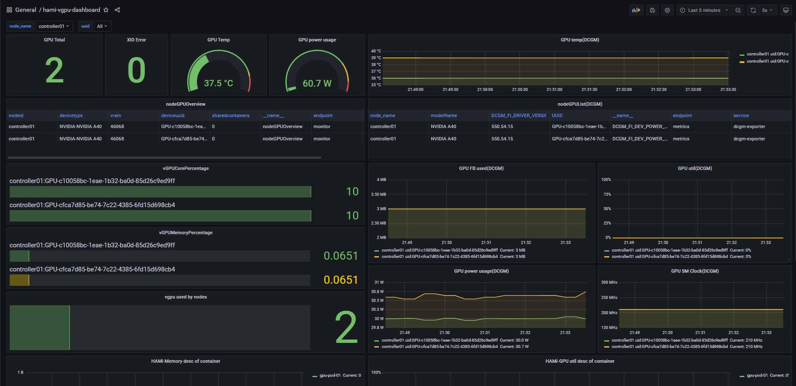

# HAMi Grafana dashboards

Importable Grafana dashboards for the metrics HAMi exposes through Prometheus.

| File | Dashboard | Data source |
| --- | --- | --- |
| [`hami-vgpu-dashboard.json`](hami-vgpu-dashboard.json) | HAMi vGPU metrics | Prometheus |



## Prerequisites

- A Prometheus instance scraping HAMi's components. HAMi exposes metrics from the
  **scheduler** and the **vGPU monitor**; the Helm chart can create `ServiceMonitor`
  objects for them when `prometheus.enabled=true` (see `charts/hami/values.yaml`).
- Grafana 9.x or newer with that Prometheus configured as a data source.

## Import

**From the Grafana UI**

1. Go to **Dashboards → New → Import**.
2. Upload `hami-vgpu-dashboard.json` (or paste its contents).
3. When prompted, select your Prometheus data source and click **Import**.

**From the API**

```bash
curl -sS -X POST "$GRAFANA_URL/api/dashboards/db" \
  -H "Authorization: Bearer $GRAFANA_TOKEN" \
  -H "Content-Type: application/json" \
  -d "{\"dashboard\": $(cat hami-vgpu-dashboard.json), \"overwrite\": true}"
```

The dashboard uses a templated data-source variable, so it is not tied to any
specific Prometheus UID — Grafana asks which data source to bind on import.

## Variables

| Variable | Meaning |
| --- | --- |
| `datasource` | The Prometheus data source to query. |
| `node` | Filter host/scheduler panels to one or more nodes (defaults to all). |
| `namespace` | Filter vGPU/container panels to one or more namespaces (defaults to all). |

## Panels

- **Cluster overview** — physical GPU count, total and allocated GPU memory,
  cluster memory-allocated %, and shared-container count.
- **Physical GPUs (host)** — per-device memory used and utilization, as measured by
  the vGPU monitor.
- **Scheduler / allocation** — allocated vs limit GPU memory, per-node memory and
  core allocation ratios, and per-device shared count.
- **vGPU / container workloads** — per-container vGPU memory used vs limit,
  container utilization, memory used as a % of limit, and a top-10 table.

## Metrics used

The dashboard is built on these HAMi metrics (the current `hami_*` names, exported
on the metrics port; the scheduler and the vGPU monitor each expose a subset):

| Metric | Source | Notes |
| --- | --- | --- |
| `hami_gpu_memory_limit_bytes` | scheduler | Schedulable GPU memory per device. |
| `hami_gpu_memory_allocated_bytes` | scheduler | GPU memory allocated to pods. |
| `hami_gpu_core_allocated_ratio` | scheduler | Allocated compute cores (0-100). |
| `hami_gpu_shared_count` | scheduler | Containers sharing a device. |
| `hami_node_gpu_memory_allocated_ratio` | scheduler | Per-node memory allocated as a ratio (0-1). |
| `hami_host_gpu_memory_used_bytes` | vGPU monitor | Real memory in use per device. |
| `hami_host_gpu_utilization_ratio` | vGPU monitor | Physical GPU utilization (0-100). |
| `hami_vgpu_memory_used_bytes` | vGPU monitor | Per-container vGPU memory used. |
| `hami_vgpu_memory_limit_bytes` | vGPU monitor | Per-container vGPU memory limit. |
| `hami_container_device_utilization_ratio` | vGPU monitor | Per-container utilization (0-100). |

> Utilization and core-allocation metrics are reported on a 0-100 scale. The
> node memory-allocation ratio is reported on a 0-1 scale and uses Grafana's
> fraction-to-percent unit.
