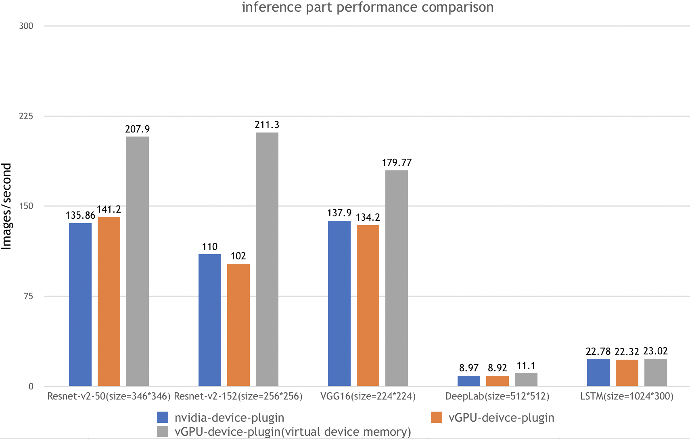
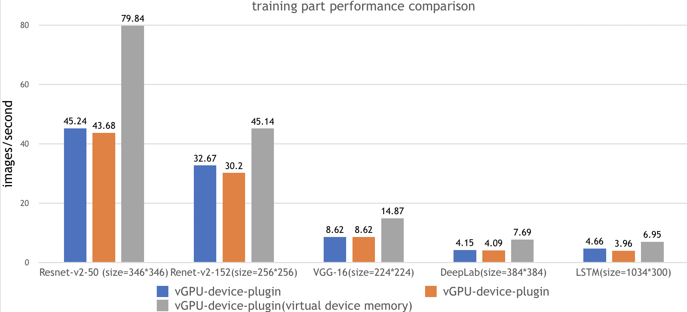

## Benchmarks

> **⚠️ Note**: The benchmark data below is from an older version of the project (when it was called vGPU-device-plugin) and uses outdated test environments. While the results are kept for historical reference, they may not reflect the current performance of HAMi.
>
> For up-to-date performance testing, please refer to the [Running Benchmarks](#running-benchmarks) section below.

### Historical Benchmark Results (Legacy)

Three instances from ai-benchmark were used to evaluate vGPU-device-plugin performance:

| Test Environment | Description                                              |
| ---------------- | :------------------------------------------------------: |
| Kubernetes version | v1.12.9                                                |
| Docker version     | 18.09.1                                                |
| GPU Type           | Tesla V100                                             |
| GPU Num            | 2                                                      |

| Test Instance |                         Description                         |
| ------------- | :---------------------------------------------------------: |
| nvidia-device-plugin      |               k8s + nvidia k8s-device-plugin                |
| vGPU-device-plugin        | k8s + vGPU k8s-device-plugin, without virtual device memory |
| vGPU-device-plugin (virtual device memory) |  k8s + vGPU k8s-device-plugin, with virtual device memory   |

Test Cases:

| Test ID |     Case      |   Type    |         Params          |
| ------- | :-----------: | :-------: | :---------------------: |
| 1.1     | Resnet-V2-50  | inference |  batch=50,size=346*346  |
| 1.2     | Resnet-V2-50  | training  |  batch=20,size=346*346  |
| 2.1     | Resnet-V2-152 | inference |  batch=10,size=256*256  |
| 2.2     | Resnet-V2-152 | training  |  batch=10,size=256*256  |
| 3.1     |    VGG-16     | inference |  batch=20,size=224*224  |
| 3.2     |    VGG-16     | training  |  batch=2,size=224*224   |
| 4.1     |    DeepLab    | inference |  batch=2,size=512*512   |
| 4.2     |    DeepLab    | training  |  batch=1,size=384*384   |
| 5.1     |     LSTM      | inference | batch=100,size=1024*300 |
| 5.2     |     LSTM      | training  | batch=10,size=1024*300  |

Historical Test Results:





---

## Running Benchmarks

To benchmark HAMi performance in your environment, follow these steps:

### Prerequisites

- HAMi installed and configured in your Kubernetes cluster (see [Quick Start](../README.md#quick-start))
- GPU nodes labeled with `gpu=on`
- Kubernetes version >= 1.18
- Docker or containerd runtime with NVIDIA support

### Build Benchmark Image (Optional)

If you want to build the benchmark image yourself:

```bash
cd benchmarks/ai-benchmark
sh build.sh
```

### Run Benchmark Jobs

HAMi provides two benchmark job configurations to compare performance:

**1. Run benchmark on HAMi:**

```bash
cd benchmarks/deployments
kubectl apply -f job-on-hami.yml
```

This will deploy a job that uses HAMi's GPU sharing and memory isolation features (requesting 50% of GPU memory).

**2. Run benchmark on NVIDIA device plugin (for comparison):**

```bash
kubectl apply -f job-on-nvidia-device-plugin.yml
```

For installing the official NVIDIA device plugin, refer to the [NVIDIA k8s-device-plugin Quick Start](https://github.com/NVIDIA/k8s-device-plugin?tab=readme-ov-file#quick-start).

### View Results

After the jobs complete, view the benchmark results:

```bash
# Check job status
kubectl get jobs

# View HAMi benchmark results
kubectl logs job/ai-benchmark-on-hami

# View NVIDIA device plugin benchmark results
kubectl logs job/ai-benchmark-on-official
```

### Customizing Benchmarks

You can modify the benchmark jobs in `benchmarks/deployments/` to test different configurations:

- Adjust GPU memory allocation (e.g., `nvidia.com/gpumem-percentage: 50`)
- Test with different GPU counts
- Compare with and without HAMi's memory isolation features

For more details, see the [benchmarks README](../benchmarks/README.md).
