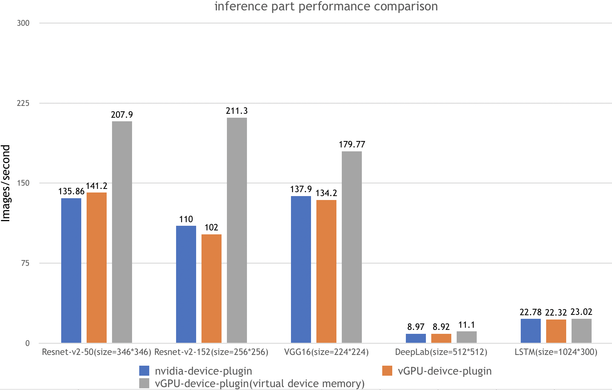
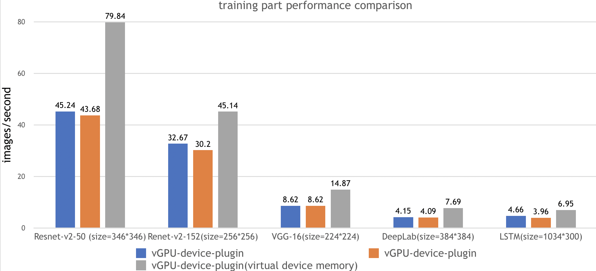

## 性能测试

在测试报告中，我们一共在下面五种场景都执行了ai-benchmark 测试脚本，并汇总最终结果：

| 测试环境 | 环境描述                                              |
| ---------------- | :------------------------------------------------------: |
| Kubernetes version | v1.12.9                                                |
| Docker  version    | 18.09.1                                                |
| GPU Type           | Tesla V100                                             |
| GPU Num            | 2                                                      |

| 测试名称 |                      测试用例                      |
| -------- | :------------------------------------------------: |
| Nvidia-device-plugin        |         k8s + nvidia官方k8s-device-plugin          |
| vGPU-device-plugin        |      k8s + VGPU k8s-device-plugin，无虚拟显存      |
| vGPU-device-plugin(virtual device memory)  | k8s + VGPU k8s-device-plugin，高负载，开启虚拟显存 |

测试内容

| test id |     名称      |   类型    |          参数           |
| ------- | :-----------: | :-------: | :---------------------: |
| 1.1     | Resnet-V2-50  | inference |  batch=50,size=346*346  |
| 1.2     | Resnet-V2-50  | training  |  batch=20,size=346*346  |
| 2.1     | Resnet-V2-152 | inference |  batch=10,size=256*256  |
| 2.2     | Resnet-V2-152 | training  |  batch=10,size=256*256  |
| 3.1     |    VGG-16     | inference |  batch=20,size=224*224  |
| 3.2     |    VGG-16     | training  |  batch=2,size=224*224   |
| 4.1     |    DeepLab    | inference |  batch=2,size=512*512   |
| 4.2     |    DeepLab    | training  |  batch=1,size=384*384   |
| 5.1     |     LSTM      | inference | batch=100,size=1024*300 |
| 5.2     |     LSTM      | training  | batch=10,size=1024*300  |

测试结果： 



测试步骤：

1. 安装nvidia-device-plugin，并配置相应的参数
2. 运行benchmark任务

```
$ kubectl apply -f benchmarks/ai-benchmark/ai-benchmark.yml
```

3. 通过kubctl logs 查看结果

```
$ kubectl logs [pod id]
```