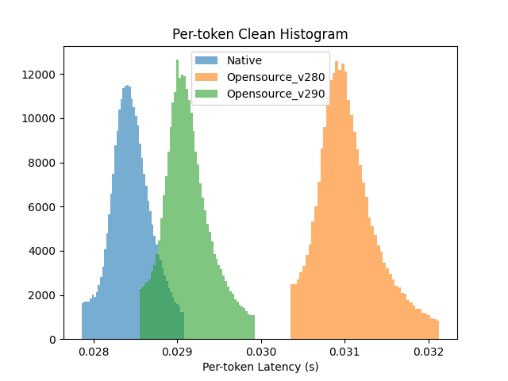
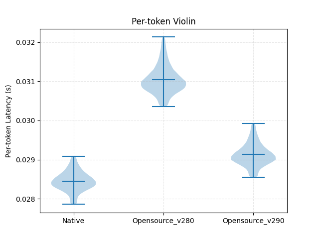
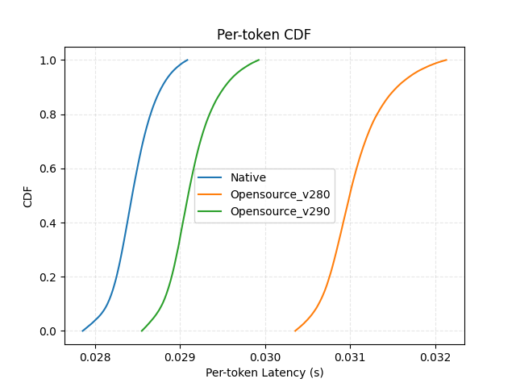
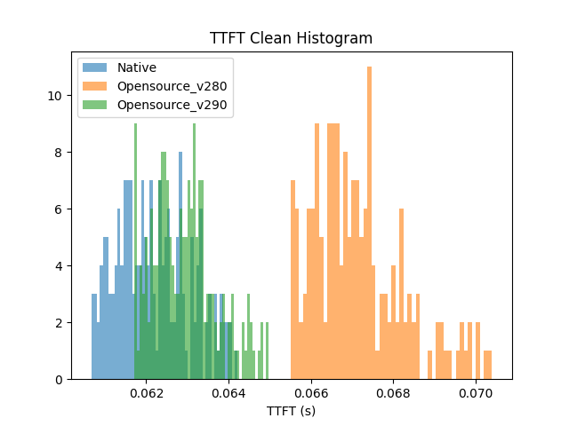
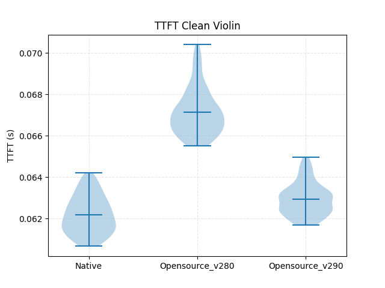
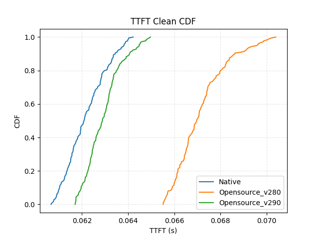

## 性能测试

在测试报告中，我们使用 vLLM benchmark 在以下三种场景执行测试脚本，并汇总最终结果：

| 测试环境 | 环境描述 |
| ---------------- | :----------: |
| Kubernetes version | v1.35.4 |
| Docker version | 29.4.0 |
| GPU Type | A100-SXM4-40GB |
| GPU Num | 2 |

| 测试名称 | 测试用例 |
| -------- | :------------------------------------------------: |
| Native | k8s + nvidia 官方 k8s-device-plugin |
| Opensource_v280 | k8s + VGPU k8s-device-plugin，开源版本 v280 |
| Opensource_v290 | k8s + VGPU k8s-device-plugin，开源版本 v290 |

测试内容

| test id |      名称      |   类型    |                   参数                    |
| ------- | :------------: | :-------: | :--------------------------------------: |
| 6.1     | Qwen3-8B (vLLM) | inference | batch=1, stream=True, max_model_len=8192 |

测试结果：

| 指标 | Native | Opensource_v280 | Opensource_v290 |
| ---- | :----: | :-------------: | :-------------: |
| TTFT p50 (s) | 0.0621 | 0.0670 | 0.0629 |
| TTFT p95 (s) | 0.0642 | 0.0713 | 0.0650 |
| TTFT p99 (s) | 0.0652 | 0.0735 | 0.0674 |
| 每 token 延迟 (clean mean, s) | 0.0285 | 0.0310 | 0.0291 |













测试步骤：

1. 安装 k8s-vGPU-scheduler，并配置相应的参数
2. 构建 benchmark 镜像

```
$ cd benchmarks/ai-benchmark
$ sh build.sh
```

3. 运行 benchmark 任务

```
$ kubectl apply -f benchmarks/deployments/job-on-nvidia-device-plugin.yml
$ kubectl apply -f benchmarks/deployments/job-on-hami.yml
```

4. 查看结果

```
$ kubectl cp <pod-name>:/results ./results
$ python3 benchmarks/ai-benchmark/gen_report.py \
    --dataset native ./results/bench_native.jsonl \
    --dataset hami ./results/bench_hami.jsonl
```
