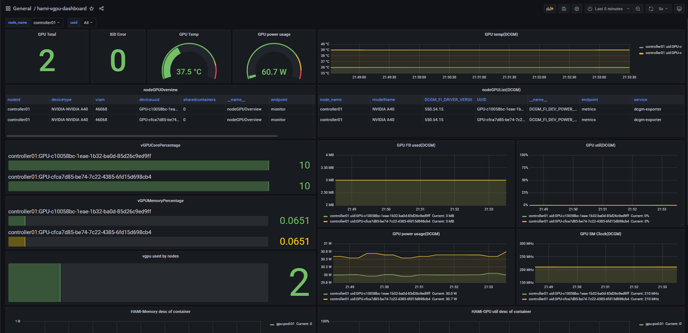

# Abstract

For the sake of simplicity, this article provides only one possible way to ultimately use prometheus to capture monitoring metrics as a data source and grafana to present monitoring information.

Many users feedback from creating issues that they do not know how to install and configure related components, resulting in failure to use related dashboard normally. The installation and configuration steps are described as follows, Hope you use it smoothly! Any feedback is welcome.

This article assumes that Kubernetes cluster and HAMi has been deployed successfully. The following components are installed in a kubernetes cluster. The components or software versions are as follows:

| components or software name | version             | remark           |
| --------------------------- | ------------------- | ---------------- |
| kubernetes cluster          | v1.23.10            | in AMD64 servers |
| kube-prometheus stack       | branch release-0.11 |                  |
| dcgm-exporter               | tag 3.2.5-3.1.7     |                  |

# Deploy and configure kube-prometheus stack

## Deploy kube-prometheus stack

**Note:** See the version compatibility matrix for kubernetes and kube-prometheus stack in：https://github.com/prometheus-operator/kube-prometheus?tab=readme-ov-file#compatibility 

```shell
#Clone kube-prometheus code repository(using release-0.11 here)
git clone -b release-0.11 https://github.com/prometheus-operator/kube-prometheus.git
cd kube-prometheus

#Change type of grafana service into NodePort by Adding "type: NodePort" under spec section
vi manifests/grafana-service.yaml
...
spec:
  type: NodePort
...
#Similarly, change the prometheus and alertmanager service types to NodePort. Their configuration files are prometheus-service.yaml and alertmanager-service.yaml, respectively, in the manifests directory

#Do deployment
kubectl create -f manifests/setup/
kubectl create -f manifests/.

#All resouce objects are been created under the monitoring namespace, you can check them and their status by run the following command
kubectl -n monitoring get all
```

```shell
#Once all resouce objects under the monitoring namespace are in right status, you can obtain svc information for grafana, prometheus, and alertmanager in the following way
root@controller01:~/kube-prometheus# kubectl -n monitoring get svc | egrep "NAME|grafana|prometheus-k8s|alertmanager-main"
NAME                    TYPE        CLUSTER-IP      EXTERNAL-IP   PORT(S)                         AGE
alertmanager-main       NodePort    10.233.5.65     <none>        9093:30093/TCP,8080:30401/TCP   19h
grafana                 NodePort    10.233.56.112   <none>        3000:30300/TCP                  19h
prometheus-k8s          NodePort    10.233.38.113   <none>        9090:30090/TCP,8080:31273/TCP   19h
```

If ip address of controller node is 10.0.0.21, then grafana, prometheus, and alertmanager can be accessed using the following urls: http://10.0.0.21:30300 , http://10.0.0.21:30090 , and http://10.0.0.21:30093 , and the default user name and password for accessing grafana are admin

## Configure grafana

### Create Datasource ALL

Go to the "Configuration" -> "Data soutces" page in grafana and create a datasource named "ALL", and keep the value of HTTP.URL be same with the counterpart in default "prometheus" datasource.

### Import dashboard

Go to the "Configuration" -> "Data soutces" page in grafana and import the dashboard from https://grafana.com/grafana/dashboards/22043-hami-vgpu-metrics-dashboard/ , and a dashboard page named "hami-vgpu-metrics-dashboard" will be created. 22043-hami-vgpu-metrics-dashboard is valid in grafana8.5.5 and grafana9.1.0, and it's grealty possible that this dashboard is vaild in grafana version later than 9.1.0. Now data of some panels in this dashboard page are missing, which requires you read the rest of the document.

For versions earlier than grafana8.5.5, such as grafana7.5.17, please refer to：https://grafana.com/grafana/dashboards/21833-hami-vgpu-dashboard/ 

# Deploy dcgm-exporter

```shell
#Clone dcgm-exporter code repository(the compatibility matrix for dcgm-export and kubernetes is not been founded in its official website, using "tag 3.2.5-3.1.7" here)
git clone -b 3.2.5-3.1.7 https://github.com/NVIDIA/dcgm-exporter.git
cd dcgm-exporter

#Modified file "deployment/values.yaml", add configurations under relabelings in serviceMonitor section, these configurations are necessary for dashboard page display
#There is only one serviceMonitor in file "deployment/values.yaml", and the contents of the modified file are as follows
vi deployment/values.yaml
...
serviceMonitor:
  apiVersion: "monitoring.coreos.com/v1"
  enabled: true
  interval: 15s
  honorLabels: false
  additionalLabels: {}
    #monitoring: prometheus
  relabelings:
  - sourceLabels: [__meta_kubernetes_endpoints_name]
    regex: dcgm-exporter
    replacement: $1
    action: keep
  - sourceLabels: [__meta_kubernetes_pod_node_name]
    regex: (.*)
    targetLabel: node_name
    replacement: ${1}
    action: replace
  - sourceLabels: [__meta_kubernetes_pod_host_ip]
    regex: (.*)
    targetLabel: ip
    replacement: $1
    action: replace
...

#Install dcgm-exporter under monitoring namespace with helm
helm install dcgm-exporter deployment/ -n monitoring

#Check the result of running "helm install ..."
helm list -n monitoring
NAME            NAMESPACE       REVISION        UPDATED                                 STATUS          CHART                   APP VERSION
dcgm-exporter   monitoring      1               2024-10-02 16:32:35.691073696 +0800 CST deployed        dcgm-exporter-3.1.7     3.1.7
#Make sure pod(s)/dcgm-exporter-xxx is(are) in running status
kubectl -n monitoring get pods | egrep "NAME|dcgm-exporter"
NAME                                  READY   STATUS             RESTARTS         AGE
dcgm-exporter-p4fdp                   1/1     Running            0                4h14m
```

# Create ServiceMonitor

```shell
#Create the file hami-device-plugin-svc-monitor.yaml
root@controller01:~# touch hami-device-plugin-svc-monitor.yaml
#The content of the file hami-device-plugin-svc-monitor.yaml
root@controller01:~# cat hami-device-plugin-svc-monitor.yaml
apiVersion: monitoring.coreos.com/v1
kind: ServiceMonitor
metadata:
  name: hami-device-plugin-svc-monitor
  namespace: kube-system
spec:
  selector:
    matchLabels:
      app.kubernetes.io/component: hami-device-plugin
  namespaceSelector:
    matchNames:
      - "kube-system"
  endpoints:
  - path: /metrics
    port: monitorport
    interval: "15s"
    honorLabels: false
    relabelings:
    - sourceLabels: [__meta_kubernetes_endpoints_name]
      regex: hami-.*
      replacement: $1
      action: keep
    - sourceLabels: [__meta_kubernetes_pod_node_name]
      regex: (.*)
      targetLabel: node_name
      replacement: ${1}
      action: replace
    - sourceLabels: [__meta_kubernetes_pod_host_ip]
      regex: (.*)
      targetLabel: ip
      replacement: $1
      action: replace

#apply the file hami-device-plugin-svc-monitor.yaml
root@controller01:~# kubectl apply -f hami-device-plugin-svc-monitor.yaml
```

```shell
#Create the file hami-scheduler-svc-monitor.yaml
root@controller01:~# touch hami-device-plugin-svc-monitor.yaml
#The content of the file hami-scheduler-svc-monitor.yaml
root@controller01:~# cat hami-scheduler-svc-monitor.yaml
apiVersion: monitoring.coreos.com/v1
kind: ServiceMonitor
metadata:
  name: hami-scheduler-svc-monitor
  namespace: kube-system
spec:
  selector:
    matchLabels:
      app.kubernetes.io/component: hami-scheduler
  namespaceSelector:
    matchNames:
      - "kube-system"
  endpoints:
  - path: /metrics
    port: monitor
    interval: "15s"
    honorLabels: false
    relabelings:
    - sourceLabels: [__meta_kubernetes_endpoints_name]
      regex: hami-.*
      replacement: $1
      action: keep
    - sourceLabels: [__meta_kubernetes_pod_node_name]
      regex: (.*)
      targetLabel: node_name
      replacement: ${1}
      action: replace
    - sourceLabels: [__meta_kubernetes_pod_host_ip]
      regex: (.*)
      targetLabel: ip
      replacement: $1
      action: replace

#apply the file hami-scheduler-svc-monitor.yaml
root@controller01:~# kubectl apply -f hami-scheduler-svc-monitor.yaml
```

```shell
#Check the servicemonitors
root@controller01:~# kubectl -n kube-system get servicemonitor
NAME                             AGE
hami-device-plugin-svc-monitor   28h
hami-scheduler-svc-monitor       28h
```

# Confirm the final monitoring effect

```shell
#Create the file gpu-pod.yaml
root@controller01:~# touch gpu-pod.yaml
root@controller01:~# cat gpu-pod.yaml
apiVersion: v1
kind: Pod
metadata:
  name: gpu-pod-01
spec:
  restartPolicy: Never
  containers:
  - name: cuda-container
    image: nvcr.io/nvidia/k8s/cuda-sample:vectoradd-cuda10.2
    resources:
      limits:
        nvidia.com/vgpu: 2 # requesting 2 vGPUs
        nvidia.com/gpumem: 3000 # Each vGPU contains 3000m device memory （Optional,Integer）
        nvidia.com/gpucores: 10 # Each vGPU uses 30% of the entire GPU （Optional,Integer)

#apply the file gpu-pod.yaml
root@controller01:~# kubectl apply -f gpu-pod.yaml
root@controller01:~# kubectl get pods -o wide
NAME           READY   STATUS        RESTARTS   AGE   IP               NODE           NOMINATED NODE   READINESS GATES
gpu-pod-01     0/1     Completed     0          52s   10.233.81.70     controller01   <none>           <none>
```

You can see the monitoring details in the dashboard. The contents are as follows:

