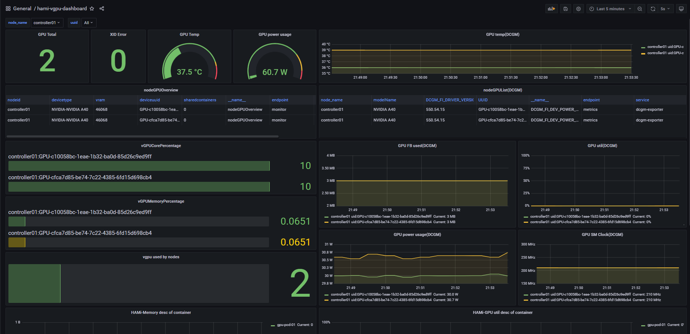

# 说明

​		为了阐述的简明性，本文只提供一种可行的办法，最终实现使用prometheus抓取监控指标并作为数据源、使用grafana来展示监控信息的目的。

​		很多使用者通过issue反馈不知如何安装与配置相关组件导致无法正常使用相关dashboard，现将安装与配置步骤叙述如下，希望大家使用顺利！如有问题欢迎创建issue反馈，如有不足欢迎补充！

​        本文假设读者已经部署好Kubernetes集群、HAMi。以下涉及到的相关组件都是在kubernetes集群内安装的，相关组件或软件版本信息如下：

| 组件或软件名称        | 版本              | 备注                  |
| --------------------- | ----------------- | --------------------- |
| kubernetes集群        | v1.23.10          | AMD64构架服务器环境下 |
| kube-prometheus stack | 分支 release-0.11 |                       |
| dcgm-exporter         | tag 3.2.5-3.1.7   |                       |

# 部署与配置kube-prometheus stack

## 部署kube-prometheus stack

**注：**kubernetes与kube-prometheus stack的版本兼容矩阵请查看 https://github.com/prometheus-operator/kube-prometheus?tab=readme-ov-file#compatibility ，请根据自己的kubernetes版本选择合适版本的kube-prometheus stack

```shell
#下载kube-prometheus代码仓库（此处使用分支 release-0.11）
git clone -b release-0.11 https://github.com/prometheus-operator/kube-prometheus.git
cd kube-prometheus

#修改下grafana的service类型为NodePort。即在spec下添加type配置项
vi manifests/grafana-service.yaml
...
spec:
  type: NodePort
...
#类似的方法修改prometheus与alertmanager service类型为NodePort，它们的配置文件分别是manifests目录下的prometheus-service.yaml与alertmanager-service.yaml

#执行部署
kubectl create -f manifests/setup/
kubectl create -f manifests/.

#创建的所有资源对象都在monitorin命名空间下，使用如下命令查看资源对象的运行状态
kubectl -n monitoring get all
```

```shell
#等monitorin命名空间下所有资源对象处于正常运行状态后，使用如下方式获取grafana、prometheus与alertmanager的svc信息
root@controller01:~/kube-prometheus# kubectl -n monitoring get svc | egrep "NAME|grafana|prometheus-k8s|alertmanager-main"
NAME                    TYPE        CLUSTER-IP      EXTERNAL-IP   PORT(S)                         AGE
alertmanager-main       NodePort    10.233.5.65     <none>        9093:30093/TCP,8080:30401/TCP   19h
grafana                 NodePort    10.233.56.112   <none>        3000:30300/TCP                  19h
prometheus-k8s          NodePort    10.233.38.113   <none>        9090:30090/TCP,8080:31273/TCP   19h
```

​		此时，假如控制节点的ip是10.0.0.21，则可以分别使用如下url访问grafana、prometheus与alertmanager：http://10.0.0.21:30300 、http://10.0.0.21:30090 、http://10.0.0.21:30093 ，其中访问grafana的默认用户名与密码都是admin

## 配置grafana

### 创建数据源ALL

​		访问”Configuration“->“Data soutces”页面，创建一个名为"ALL"的数据源，其中HTTP.URL的值保持跟默认创建的数据源“prometheus”中的一样即可为 “http://prometheus-k8s.monitoring.svc:9090” ，然后保存上述数据源“ALL”

### 导入HAMi默认的dashboard

​		访问“Dashboards”->“Browse”页面，导入此dashboard：https://grafana.com/grafana/dashboards/22043-hami-vgpu-metrics-dashboard/ ，grafana中将创建一个名为“hami-vgpu-metrics-dashboard”的dashboard，22043这个编号对应的dashboard在grafana8.5.5与grafana9.1.0验证过，在grafana9.1.0之后应该也能用。此时此页面中有一些Panel如vGPUCorePercentage还没有数据，请继续看完此文档，执行完"部署dcgm-exporter"与“创建ServiceMonitor”中的步骤之后Panel数据将正常显示。

​		对于grafana8.5.5之前的版本如grafana7.5.17，请使用此dashboard：https://grafana.com/grafana/dashboards/21833-hami-vgpu-dashboard/ 

# 部署dcgm-exporter

```shell
#下载dcgm-exporter代码仓库（未看到与kubernetes的兼容矩阵说明，此处使用tag 3.2.5-3.1.7）
git clone -b 3.2.5-3.1.7 https://github.com/NVIDIA/dcgm-exporter.git
cd dcgm-exporter

#修改 deployment/values.yaml 文件，为其中的serviceMonitor添加relabelings配置，这样dcgm-exporter的监控指标才有node_name与ip属性
#只有这一处serviceMonitor，relabelings内的内容都是添加的，添加后内容如下
root@controller01:~/dcgm-exporter# vi deployment/values.yaml
...
serviceMonitor:
  enabled: true
  interval: 15s
  honorLabels: false
  additionalLabels: {}
    #monitoring: prometheus
  relabelings:
  - sourceLabels: [__meta_kubernetes_endpoints_name]
    regex: dcgm-exporter
    replacement: $1
    action: keep
  - sourceLabels: [__meta_kubernetes_pod_node_name]
    regex: (.*)
    targetLabel: node_name
    replacement: ${1}
    action: replace
  - sourceLabels: [__meta_kubernetes_pod_host_ip]
    regex: (.*)
    targetLabel: ip
    replacement: $1
    action: replace
...

#使用helm工具在monitoring空间下安装dcgm-exporter
root@controller01:~/dcgm-exporter# helm install dcgm-exporter deployment/ -n monitoring

#查看helm install结果
root@controller01:~/dcgm-exporter# helm list -n monitoring
NAME            NAMESPACE       REVISION        UPDATED                                 STATUS          CHART                   APP VERSION
dcgm-exporter   monitoring      1               2024-10-02 16:32:35.691073696 +0800 CST deployed        dcgm-exporter-3.1.7     3.1.7
#还需确认dcgm-exporter 相关的pod已经处于running状态
root@controller01:~/dcgm-exporter# kubectl -n monitoring get pods | egrep "NAME|dcgm-exporter"
NAME                                  READY   STATUS             RESTARTS         AGE
dcgm-exporter-p4fdp                   1/1     Running            0                4h14m
```

# 创建ServiceMonitor

```shell
#创建文件hami-device-plugin-svc-monitor.yaml
root@controller01:~# touch hami-device-plugin-svc-monitor.yaml
#文件hami-device-plugin-svc-monitor.yaml内容如下
root@controller01:~# cat hami-device-plugin-svc-monitor.yaml
apiVersion: monitoring.coreos.com/v1
kind: ServiceMonitor
metadata:
  name: hami-device-plugin-svc-monitor
  namespace: kube-system
spec:
  selector:
    matchLabels:
      app.kubernetes.io/component: hami-device-plugin
  namespaceSelector:
    matchNames:
      - "kube-system"
  endpoints:
  - path: /metrics
    port: monitorport
    interval: "15s"
    honorLabels: false
    relabelings:
    - sourceLabels: [__meta_kubernetes_endpoints_name]
      regex: hami-.*
      replacement: $1
      action: keep
    - sourceLabels: [__meta_kubernetes_pod_node_name]
      regex: (.*)
      targetLabel: node_name
      replacement: ${1}
      action: replace
    - sourceLabels: [__meta_kubernetes_pod_host_ip]
      regex: (.*)
      targetLabel: ip
      replacement: $1
      action: replace

#应用此文件
root@controller01:~# kubectl apply -f hami-device-plugin-svc-monitor.yaml
```

```shell
#创建文件hami-scheduler-svc-monitor.yaml
root@controller01:~# touch hami-device-plugin-svc-monitor.yaml
#文件hami-scheduler-svc-monitor.yaml内容如下
root@controller01:~# cat hami-scheduler-svc-monitor.yaml
apiVersion: monitoring.coreos.com/v1
kind: ServiceMonitor
metadata:
  name: hami-scheduler-svc-monitor
  namespace: kube-system
spec:
  selector:
    matchLabels:
      app.kubernetes.io/component: hami-scheduler
  namespaceSelector:
    matchNames:
      - "kube-system"
  endpoints:
  - path: /metrics
    port: monitor
    interval: "15s"
    honorLabels: false
    relabelings:
    - sourceLabels: [__meta_kubernetes_endpoints_name]
      regex: hami-.*
      replacement: $1
      action: keep
    - sourceLabels: [__meta_kubernetes_pod_node_name]
      regex: (.*)
      targetLabel: node_name
      replacement: ${1}
      action: replace
    - sourceLabels: [__meta_kubernetes_pod_host_ip]
      regex: (.*)
      targetLabel: ip
      replacement: $1
      action: replace

#应用此文件
root@controller01:~# kubectl apply -f hami-scheduler-svc-monitor.yaml
```

```shell
#确认创建的ServiceMonitor
root@controller01:~# kubectl -n kube-system get servicemonitor
NAME                             AGE
hami-device-plugin-svc-monitor   28h
hami-scheduler-svc-monitor       28h
```

# 确认最终监控效果

```shell
#创建文件gpu-pod.yaml，尝试使用HAMi虚拟出来的NVIDIA vGPU
root@controller01:~# touch gpu-pod.yaml
root@controller01:~# cat gpu-pod.yaml
apiVersion: v1
kind: Pod
metadata:
  name: gpu-pod-01
spec:
  restartPolicy: Never
  containers:
  - name: cuda-container
    image: nvcr.io/nvidia/k8s/cuda-sample:vectoradd-cuda10.2
    resources:
      limits:
        nvidia.com/vgpu: 2 # 请求2个vGPUs
        nvidia.com/gpumem: 3000 # 每个vGPU申请3000m显存 （可选，整数类型）
        nvidia.com/gpucores: 10 # 每个vGPU的算力为10%实际显卡的算力 （可选，整数类型）

#应用此文件
root@controller01:~# kubectl apply -f gpu-pod.yaml
root@controller01:~# kubectl get pods -o wide
NAME           READY   STATUS        RESTARTS   AGE   IP               NODE           NOMINATED NODE   READINESS GATES
gpu-pod-01     0/1     Completed     0          52s   10.233.81.70     controller01   <none>           <none>
```

​		此时，应该可以dashboard中看到监控详情。内容大概如下

