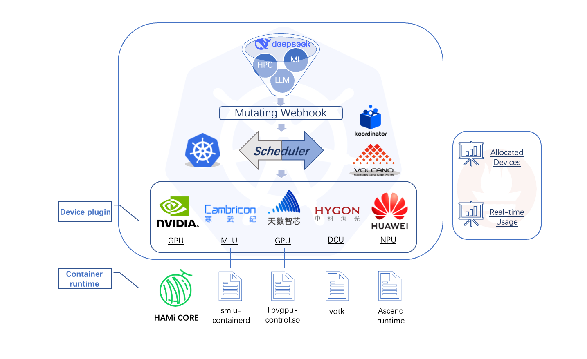

# Design

 

The architect of HAMi is shown in the figure above, It is organized in the form of "chart".

- MutatingWebhook

The MutatingWebhook checks the validity of each task, and set the "schedulerName" to "HAMi scheduler" if the resource requests have been recognized by HAMi
If Not, the MutatingWebhook does nothing and pass this task to default-scheduler.

- Scheduler

HAMi support default kube-scheduler and volcano-scheduler, it implements an extender and register 'Filter' and 'Score' methods to deal with sharable devices.
When a pod with sharable device request arrives, 'Filter' searches the cluster and returns a list of 'available' nodes. 'Score' scores each node 'Filter' returned, and pick the highest one to host the pod. It patches the schedule decision on corresponding pod annotations, for the detailed protocol, see protocol.md

- DevicePlugin

When the schedule decision is made, scheduler calls devicePlugin on that node to generate environment variables and mounts according to pod annotations.
Please note that, the DP used here is a customized version, you need to install according to README document with that device. Most officaial DP will not fit in HAMi, and will result in unexpected behaviour

- InContainer Control

The implementation of in-container hard limit is different for diffent devices. For example, HAMi-Core is responsible for NVIDIA devices. libvgpu-control.so is responsible for iluvatar devices, etc. HAMi needs to pass the correct environment variables in order for it to operate.

 

In summary, The flowchart of pod is descirbed as the figure above.
