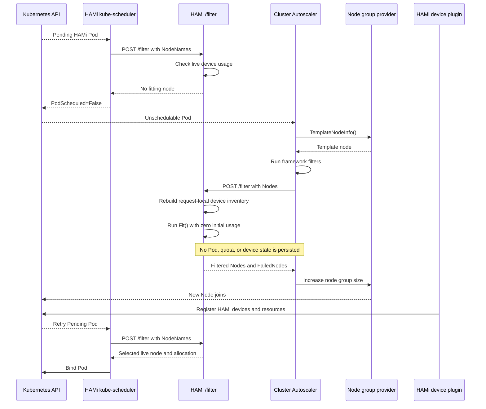

# HAMi Scale-Up Simulation Design for Cluster Autoscaler

When a Pod requesting a HAMi-managed device cannot fit on any existing node, kube-scheduler marks it unschedulable. Cluster Autoscaler (CA) then has to answer a different question: which node group, if scaled up, could make the Pod schedulable?

For CPU and memory, CA can usually answer this question from the Node's `Capacity` and `Allocatable` fields and the standard Kubernetes resource filters. HAMi-managed device memory, compute shares, MIG configuration, and device topology are not fully represented by those fields. Without consulting HAMi, CA sees an incomplete device model. It may reject a scale-up that would work, or add a node that still cannot run the Pod.

This document explains CA's scale-up model, how HAMi differs from that model, the simulation filter design currently in use, and the work still required for complete HAMi autoscaling support. Here, "simulation" means hypothetical scheduling performed in CA's in-memory snapshot. It is not Kubernetes API server-side dry-run, and it never binds a Pod.

## Background

### Why Kubernetes needs node autoscaling

kube-scheduler can only place Pods on nodes that already exist. If the remaining resources are insufficient, taints do not match, or topology constraints cannot be satisfied, a Pod stays Pending and is marked unschedulable. The scheduler does not create nodes.

CA manages node counts. It continuously watches unschedulable Pods, queries the node groups managed by cloud providers or other infrastructure providers, and decides whether to add nodes. After a new node joins the cluster, kube-scheduler retries the Pending Pods.

CA does not replace the scheduler. It does not select a physical device for a Pod or perform the final bind. It only determines whether a new node could make the Pod schedulable, then uses that result to choose a node group and the number of nodes to add.

### How CA decides whether a node group is worth scaling

CA does not create a node just to try scheduling against it. It obtains `TemplateNodeInfo()` from the provider, constructs a template node in memory, and adds that node to the cluster snapshot.

kube-scheduler organizes its scheduling logic through the scheduler framework. A scheduling cycle has several stages. PreFilter plugins prepare state for the current Pod, and Filter plugins check candidate nodes one by one. `NodeResourcesFit` is a built-in Filter plugin. It checks whether a Node's `Allocatable`, after subtracting requests from existing Pods, can still satisfy the current Pod's CPU, memory, ephemeral storage, and scalar resource requests. CA reuses these plugins during simulation so that its basic filtering stays as close as possible to kube-scheduler.

The scheduler framework Filter stage is an in-process extension point. HAMi's `/filter` is an HTTP endpoint exposed by a scheduler extender. `/bind` is another HTTP endpoint used for the real bind. The names are similar, but they operate at different layers.

If a template node passes the filters, CA treats its node group as a scale-up candidate. CA's bin-packing estimator can then place multiple Pending Pods into the snapshot in sequence to estimate how many Pods one new node can hold and how many nodes the group needs.

This process depends on two assumptions:

- The template node represents the resources and scheduling properties of a new node in the node group.
- CA's filtering logic covers all scheduling requirements of the Pod.

HAMi integration affects both assumptions. CA must be able to call HAMi's device filtering logic, and the template node must carry device information that HAMi can understand.

### Node groups, template nodes, warm groups, and cold-zero groups

A node group is a set of nodes expected to be homogeneous and managed by a provider, such as an Azure VMSS. CA changes the size of the group; it does not create an individual Kubernetes Node directly.

A template node is CA's in-memory representation of the node that a node group would add. It usually contains the instance type, capacity, labels, taints, and other scheduling properties, but it may not correspond to any Node that currently exists.

Node groups fall into two cases based on their current size:

- A warm node group has at least one node. The provider can build a template from an existing node, so HAMi device registration annotations may be retained in the template.
- A cold-zero node group has a current size of 0. The provider can only build a template from the instance type and node group configuration; it cannot copy the registration result produced by a HAMi device plugin from an existing node.

The difference between warm and cold-zero groups determines where device information can come from. A warm template may reuse a runtime inventory from an existing node. A cold-zero template needs a device profile supplied by the provider or separate configuration. Allowing CA to call HAMi does not by itself provide that profile.

### How HAMi performs real scheduling

The HAMi admission webhook identifies device resource requests and sets `schedulerName`. The kube-scheduler shipped with HAMi first runs its scheduler framework plugins, then invokes the HAMi scheduler's `/filter` endpoint through an HTTP extender.

The current Helm configuration sets the extender's `nodeCacheCapable` field to `true`, so kube-scheduler sends only candidate node names:

```json
{
  "pod": {"metadata": {"name": "gpu-workload"}},
  "nodeNames": ["node-a", "node-b"]
}
```

The HAMi live filter then:

- reads device registration data from the node manager;
- reads existing allocations from the pod manager and quota manager;
- runs the `Fit()` and scoring logic implemented by each device backend;
- selects a node and specific devices;
- reserves the allocation in the pod manager and quota manager;
- writes the target node and device allocation to Pod annotations; and
- returns one node name for the subsequent `/bind` request.

This is a stateful scheduling path. Pod annotations, device usage, and quota usage all change because `/bind` needs the recorded result to complete real scheduling.

### Why HAMi device information cannot come from `Allocatable` alone

For an NVIDIA device, a Pod after admission might request:

```yaml
resources:
  limits:
    nvidia.com/gpu: 1
    nvidia.com/gpumem: 11000
    nvidia.com/gpucores: 100
```

Whether the request fits depends on more than the device count. HAMi also checks per-device memory, compute shares, health, NUMA placement, MIG configuration, device topology, and usage already allocated to other Pods. This information comes from `hami.io/node-*-register` annotations and runtime state maintained by HAMi.

`Allocatable` describes the total resources a Node exposes to the scheduler. `NodeResourcesFit` can use it to check total CPU, memory, and extended scalar resources, but it cannot see HAMi's per-device structure. A sufficient aggregate resource count does not mean that any one device has enough free memory. `NodeResourcesFit` also cannot reproduce HAMi's selection constraints for MIG, NUMA placement, or device-pair scoring.

Running only the built-in Filter plugins therefore gives CA a Kubernetes resource-level result. It does not replace the vendor-specific `Fit()` logic in HAMi's `/filter` endpoint.

## Why This Capability Is Needed

The standard CA simulator does not currently call HTTP scheduler extenders. A HAMi workload can fail scale-up evaluation in two ways.

The first failure occurs before HAMi could be called. If a template node does not advertise an extender-managed resource such as `nvidia.com/gpucores`, `NodeResourcesFit` returns `Insufficient`. CA then excludes a node group that HAMi might have accepted.

The second failure comes from the missing device model. Framework filters may accept the template based on aggregate resource counts, while HAMi would reject the Pod because of per-device memory, compute, or topology constraints. CA may scale the wrong node group, only to find that the Pod is still unschedulable after the new node joins.

Adding HAMi to the scale-up simulation lets CA use the same vendor `Fit()` logic as real scheduling to decide whether a new node would help. For a warm node group with trustworthy device annotations, a Pending HAMi Pod can participate in node group selection and scale-up decisions without modifying the real Pod, quota state, or device cache during hypothetical scheduling.

This capability addresses scale-up feasibility for HAMi workloads. It provides a working foundation for one Pod on a warm node group, but it does not yet solve cold-zero device descriptions, multi-Pod bin packing, or upstream CA release availability.

## Problems the Design Must Solve

Integrating CA with HAMi requires four pieces to work together.

**Allow the request to reach HAMi.** CA must load scheduler extender configuration and add resources marked with `ignoredByScheduler: true` to `NodeResourcesFitArgs.IgnoredResources`. Otherwise, the framework filter rejects the template before HAMi can evaluate it.

**Let HAMi inspect the template node.** A template node is absent from HAMi's node manager, so a node name alone is not enough to reconstruct its devices. CA must send the complete Node object, including HAMi registration annotations.

**Isolate simulation from real scheduling.** CA may test multiple node groups repeatedly. A simulation request must not write Pod annotations, reserve quota usage, or add a template node to the global node manager.

**Define what the template represents.** Reconstructing a zero-usage device view from an annotation represents a new node that has completed device registration but has not yet run ordinary workloads. Multi-Pod simulation and cold-zero groups need additional state or a profile; neither can be inferred from this request alone.

## Design Overview

The current design changes both CA and HAMi.

On the CA side, scheduler extender support loads a `KubeSchedulerConfiguration`, identifies resources managed by extenders, runs the framework filters first, and then passes the complete list of surviving Node objects to HAMi.

On the HAMi side, the design reuses the existing `/filter` endpoint. When a request contains `Nodes`, `Scheduler.Filter()` takes the simulation path. When it contains only `NodeNames`, the existing live-filter behavior is unchanged. The simulation path rebuilds a device inventory from annotations on the Nodes in the request, initializes every device with zero usage, and calls the existing vendor `Fit()` implementations without retaining any allocation result.



The middle `/filter` call answers only whether this Pod fits this template node. After the node is created, the device plugin must still register its devices. The final allocation and bind continue through HAMi's live scheduling path.

## Extender Call Contract

### `Nodes` and `NodeNames`

`nodeCacheCapable` determines whether `ExtenderArgs.Nodes` or `ExtenderArgs.NodeNames` is used:

| `nodeCacheCapable` | Request field | Response field | Meaning |
| --- | --- | --- | --- |
| `true` | `NodeNames` | `NodeNames` | The extender caches Nodes, so the caller sends only node names. |
| `false` | `Nodes` | `Nodes` | The extender does not cache Nodes, so the caller sends complete Node objects. |

The Kubernetes HTTP extender implementation does not populate both fields when `nodeCacheCapable: false`. `Nodes` is not a CA-specific marker: a regular kube-scheduler configured the same way also sends complete Node objects.

The current design therefore depends on a deployment convention:

- HAMi's kube-scheduler keeps `nodeCacheCapable: true`, so real scheduling sends `NodeNames`.
- CA uses `nodeCacheCapable: false`, so scale-up simulation sends `Nodes`.

This convention allows both request types to share `/filter`, but it is also the main interface risk in the current implementation. See [Risks](#risks).

### CA-side configuration

The following is the minimum configuration for the current implementation. The URL, TLS settings, and managed resource names must match the HAMi deployment.

```yaml
apiVersion: kubescheduler.config.k8s.io/v1
kind: KubeSchedulerConfiguration
profiles:
  - schedulerName: default-scheduler
extenders:
  - urlPrefix: https://hami-scheduler.kube-system.svc
    filterVerb: filter
    enableHTTPS: true
    nodeCacheCapable: false
    ignorable: false
    httpTimeout: 30s
    managedResources:
      - name: nvidia.com/gpu
        ignoredByScheduler: true
      - name: nvidia.com/gpumem
        ignoredByScheduler: true
      - name: nvidia.com/gpucores
        ignoredByScheduler: true
```

`ignoredByScheduler` only determines whether the extender, rather than `NodeResourcesFit`, evaluates a resource. It does not create a device inventory for a template node, nor does it give a cold-zero node group a `hami.io/node-*-register` annotation.

The CA implementation must:

- create HTTP extenders from the scheduler configuration;
- call an extender only for a Pod that requests one of its `managedResources`;
- configure `NodeResourcesFitArgs.IgnoredResources` before creating the framework;
- collect every candidate that passes the framework filters before calling extenders;
- pass each extender's result set to the next extender in configuration order;
- use `ignorable` to decide whether an extender error rejects the evaluation or is ignored; and
- preserve fast paths for ordinary Pods and unrelated extenders.

## HAMi-Side Design

### Request routing

After parsing the Pod's resource requests, `Scheduler.Filter()` selects a path based on the candidate node field:

```text
args.Nodes != nil      -> filterSimulation()
args.Nodes == nil      -> existing live filter
```

The live filter retains its existing cache, quota, annotation, and bind protocol. The simulation filter does not read `args.NodeNames` or add any Node from the request to the global node manager.

### Rebuilding a device inventory from template nodes

`buildTransientNodeInfo()` creates a temporary `device.NodeInfo` for every Node in the request:

- deep-copy the Node;
- iterate over the registered HAMi device backends;
- call each backend's `GetNodeDevices()` to parse its `hami.io/node-*-register` annotation;
- organize the resulting `DeviceInfo` values by vendor; and
- return `node unregistered` if no backend can provide devices.

This reuses the annotation parsers used for real node registration. The CA implementation does not need to redefine MIG templates, device-pair scores, NUMA placement, health, or vendor-specific `CustomInfo`.

The temporary device information comes entirely from the current request and is never attached to the global device cache. `DeviceInfo.DeepCopy()` and `NodeUsage.DeepCopy()` also fix nested maps and slices that could otherwise retain shared references when manager or cache data is copied. Simulation isolation, however, primarily comes from the request-local objects created by `buildTransientNodeInfo()`. The `MigTemplate` field built by `buildNodeUsage()` still points into the same request-local object graph, so those references must not outlive the request.

### Building fresh-node usage

`buildNodeUsage()` converts the temporary device inventory into the `NodeUsage` used for the current request. Device usage starts at zero:

```text
Used      = 0
Usedmem   = 0
Usedcores = 0
PodInfos  = []
```

Device count, per-device memory, compute capacity, MIG configuration, NUMA placement, and health come from the registration annotation. This models a node that has completed HAMi device registration but has not yet run ordinary workloads.

All containers in the same Pod are evaluated against the same temporary `NodeUsage`. A device selected for an earlier container affects later containers, so device placement within one Pod retains HAMi's normal semantics.

### Reusing device filtering logic

The simulation filter calls `calcScoreWithOptions()` with the following behavior:

- `recordEvents=false`, so a device-fit failure does not write a Pod Event;
- `detailedFailureReason=true`, so `FailedNodes` retains reasons such as `CardInsufficientMemory`;
- `NodeUsage.NodeInfo` points to the temporary device information, so the calculation does not look up the template node in the node manager; and
- the simulation and live filters share the same vendor `Fit()` implementations instead of maintaining separate device-matching rules.

The current implementation still uses the live filter's scoring and sorting path and returns only the highest-scoring node. An extender filter response may contain any subset of the input, so this works at the API level, but it removes other feasible nodes too early. The consequences are described in [Risks](#risks).

### Side-effect boundary

The simulation path must not:

- call `podManager.AddPod()`, `TakeAndDeletePod()`, or `DelPod()`;
- call `quotaManager.AddUsage()` or `RmUsage()`;
- call `PatchPodAnnotations()`;
- modify the global node manager;
- create real device-allocation annotations; or
- retain mutable references to temporary Nodes, `DeviceInfo`, or `DeviceUsage` values.

Existing tests verify that Pod annotations, the pod manager, and the quota manager are not modified. Shared-entry behavior, such as writing an Event for a request with no device resources, still needs separate work.

### Results and errors

If device registration data is missing, HAMi places the node in `FailedNodes`:

```json
{
  "failedNodes": {
    "template-node-a": "node unregistered"
  },
  "error": ""
}
```

If device capacity is insufficient, HAMi returns a vendor fit reason:

```json
{
  "failedNodes": {
    "template-node-a": "2/2 CardInsufficientMemory"
  },
  "error": ""
}
```

A node that does not fit is a normal filter result. If the request cannot be decoded or internal processing fails, the HAMi route returns HTTP 200 with a non-empty `ExtenderFilterResult.Error`. The Kubernetes HTTP extender converts that field into a call error.

Whether CA ignores that error depends on `ignorable`. The example explicitly sets `ignorable: false`, so a service error stops this feasibility evaluation. With `ignorable: true`, CA may continue with the candidate set from before the call. Fail-closed behavior comes from the configuration; it is not guaranteed unconditionally by the endpoint.

## Current Implementation and Validation

### Implementation status

Template-node simulation on the HAMi side was merged in [HAMi PR #2046](https://github.com/Project-HAMi/HAMi/pull/2046). The current code includes `filterSimulation()`, a temporary device inventory, zero-usage `NodeUsage`, detailed failure reasons, and the related deep-copy fixes.

Extender support on the CA side has not entered a standard release. [kubernetes/autoscaler#9786](https://github.com/kubernetes/autoscaler/pull/9786) remains open in the old repository and cannot be merged directly across the repository migration. The migrated experimental branch is [spencercjh/cluster-autoscaler:feat/extender-managed-resources](https://github.com/spencercjh/cluster-autoscaler/tree/feat/extender-managed-resources). There is no corresponding upstream PR in [kubernetes-sigs/cluster-autoscaler](https://github.com/kubernetes-sigs/cluster-autoscaler) yet.

HAMi therefore has a simulation entry point, but a standard CA binary will not call it automatically. Running the complete flow still requires a CA build with the extender patch, matching scheduler configuration, and a reachable HAMi HTTPS endpoint.

### Unit tests

Existing tests cover the following cases:

- a template node with a registration annotation passes the simulation filter;
- the simulation filter does not modify Pod annotations;
- the simulation filter does not modify the pod manager or quota manager;
- insufficient device memory returns `CardInsufficientMemory`;
- a missing registration annotation returns `node unregistered`; and
- the `MIGTemplate`, `CustomInfo`, and `DevicePairScore.Scores` fields in a copied `DeviceInfo` do not share mutable state with the original.

These tests establish the main state boundaries for one request. They do not yet cover multi-node result sets, multiple Pods, concurrency, large NodeLists, or cold-zero groups.

### Manual `/filter` validation

After deploying the HAMi implementation to an AKS cluster, three request types were tested against the real HTTPS `/filter` endpoint:

| Case | Request | Result |
| --- | --- | --- |
| fit | `gpu=1`, `gpumem=300`, `gpucores=40` | The template node was returned. |
| unfit | Each device had `devmem=11441`; the Pod requested `gpumem=12000` | Returned `2/2 CardInsufficientMemory`. |
| unregistered | Removed `hami.io/node-nvidia-register` | Returned `node unregistered`. |

The test annotation registered two mock K80 `DeviceInfo` entries, each with `count=10`. Here, `count` is the logical device capacity supplied by mock-device-plugin. It does not prove that the test VM had two physical GPUs, nor does it validate GPU performance.

### Warm node group end-to-end validation

The AKS user pool started with one node. Two Pods consumed the mock HAMi device memory on that node, and the live filter rejected a third identical Pod with `CardInsufficientMemory`. CA with extender support then:

- recognized the third Pod as unschedulable;
- used the warm node group template and HAMi simulation filter to determine that a new node would fit;
- scaled the VMSS from 1 node to 2 nodes; and
- waited for the new Node to join.

The Pod was still unschedulable when the new Node had only reached `Ready`. The HAMi live filter completed the real allocation and bind only after mock-device-plugin registered `nvidia.com/gpu`, `nvidia.com/gpucores`, and `nvidia.com/gpumem`.

This validation shows that one Pending Pod can trigger a scale-up through a warm node group's template. It does not cover cold-zero groups, multi-Pod bin packing, multiple extenders, physical GPUs, or device profiles that include failed devices.

## Remaining Work

The current implementation covers fresh-node feasibility for one Pod in a warm node group. Other scale-up cases still have explicit gaps:

| Scenario | Source of device information | State required by simulation | Current status |
| --- | --- | --- | --- |
| Warm node group, one Pod | Registration annotation from an existing Node | Empty-node device usage | Validated once on AKS. |
| Warm node group, multiple Pods | Registration annotation from an existing Node | Hypothetical allocations from earlier Pods | Unsupported; every request still starts from zero usage. |
| Cold-zero node group, one Pod | Provider or separate device profile | Empty-node device usage | Unsupported; a missing annotation returns `node unregistered`. |
| Cold-zero node group, multiple Pods | Provider or separate device profile | Device profile and hypothetical allocations from earlier Pods | Unsupported. |

Turning the current validation into a releasable HAMi autoscaling capability requires the following work:

| Priority | Area | Work | Completion criteria |
| --- | --- | --- | --- |
| P0 | Cluster Autoscaler | Migrate scheduler extender and `ignoredByScheduler` support to the new upstream repository. | Upstream tests cover extender order, error handling, fast paths for ordinary Pods, and node-level failure reasons. |
| P0 | HAMi | Add a separate simulation endpoint and validate `Pod`, `Nodes`, and candidate-field exclusivity. | A regular kube-scheduler using `nodeCacheCapable: false` cannot be mistaken for a simulation caller. |
| P0 | HAMi | Return every node that passes `Fit()` instead of retaining only the highest-scoring node during filtering. | Multi-node and multi-extender tests show that the operation only filters the candidate set. |
| P0 | HAMi | Distinguish oversized requests, invalid JSON, missing device profiles, and parser errors. | Error responses, logs, and metrics expose the actual failure type. |
| P0 | Integration validation | Add a warm-node-group regression test that covers delayed device-plugin registration. | A documented combination of CA, Kubernetes, provider, and HAMi versions reproduces scale-up reliably. |
| P1 | HAMi and CA | Define a multi-Pod simulation-state contract. | Consecutive Pods simulated on one template node keep HAMi usage consistent with the CA snapshot and support retries and rollback. |
| P1 | HAMi and provider | Define a node-group device profile and new-node registration checks. | Cold-zero groups can build trustworthy templates, with explicit handling when the actual device inventory differs from the profile. |
| P1 | Deployment and chart | Define the Service, NetworkPolicy, TLS, request limits, rate limiting, and observability metrics. | Only the intended CA can reach the simulation endpoint, and failures and latency are observable. |

Completing P0 would provide maintainable support for one Pod on a warm node group. Multi-Pod estimation and cold-zero groups require new cross-project contracts; they cannot be completed by extending the current handler alone.

## Risks

### `/filter` infers caller intent from request fields

The current implementation treats `args.Nodes != nil` as a simulation request. In the Kubernetes contract, it only means that the extender does not cache Nodes. Any regular kube-scheduler configured with `nodeCacheCapable: false` sends `Nodes`, causing HAMi to mistake real scheduling for simulation and skip Pod annotations, quota usage, and allocation reservation.

The current deployment avoids this conflict by having HAMi's kube-scheduler send `NodeNames` while CA sends `Nodes`. The long-term design should expose a separate `/filter-simulation` endpoint and configure CA with `filterVerb: filter-simulation`. A separate path establishes call semantics, but authentication and traffic isolation still need their own controls.

### Simulation returns only the highest-scoring node

A filter should remove infeasible nodes from its input set. The current simulation path continues through live scheduling score calculation and returns only the highest-scoring node. This overrides CA's existing node ordering.

The effect is more pronounced with multiple extenders. After HAMi removes other feasible nodes, a later extender may reject the highest-scoring node. A different node that could have passed every filter is no longer available. The simulation filter should return every node that passes the vendor `Fit()` checks.

### Multi-Pod simulation does not accumulate HAMi usage

CA's estimator places multiple Pods into the cluster snapshot in sequence. Standard `ExtenderArgs` contains only the current Pod and candidate Nodes. It does not include Pods already placed hypothetically on those Nodes or their HAMi allocations.

HAMi rebuilds device state from the registration annotation with `Used=0` for every request. A second Pod therefore cannot see the device memory or compute shares hypothetically consumed by the first Pod, and CA may underestimate how many nodes it needs to add.

An anonymous in-process cache in HAMi cannot safely solve this problem. Cross-request state needs a protocol for simulation sessions, template nodes, allocations, retries, and rollback, with complete isolation from real scheduling.

### Cold-zero groups have no device profile

A cold-zero node group has no existing Node. The provider's template usually includes the instance type, standard capacity, labels, and taints, but not the registration annotation produced by the HAMi device plugin. HAMi returns `node unregistered` for such a template.

A complete design needs a stable mapping from node groups to device profiles. A profile must not depend on temporary device IDs from one machine. After a new node registers, its actual inventory also needs to be checked against the profile.

### Warm templates copy runtime inventory

The annotation in a warm template comes from an actual node and may include device IDs, `health=false`, NUMA placement, MIG configuration, and device-pair scores. These fields describe the sampled node at a particular time and may not represent a newly created node in the group.

A failed device on the sampled node can make the template underestimate capacity. Differences in device model, topology, or device-plugin configuration within a node group can make it overestimate capacity. The warm path needs explicit rules for node group homogeneity, sample selection, and handling dynamic fields.

### The shared entry point still has side effects and validation gaps

`Filter()` handles requests with no device resources before it checks `args.Nodes`, and it calls `recordScheduleFilterResultEvent()`. A request that carries `Nodes` but does not request a HAMi device can therefore still write an Event.

`PredicateRoute` validates only the body and JSON decoding, not `ExtenderArgs.Pod`. A missing `Pod` causes a nil-pointer dereference in the shared entry point. If a HAMi device is requested but both `Nodes` and `NodeNames` are absent, the live filter's no-node path may also dereference a nil `NodeNames`. A simulation request with non-empty `Nodes` does not pass through the latter dereference.

A separate simulation handler should validate the request structure before entering scheduler logic and ensure that a request with no device resources does not write cluster state.

### Simulation inherits live-cache readiness

`PredicateRoute` waits for the scheduler's `synced` state before calling `Scheduler.Filter()`. Although the main simulation calculation depends only on the Nodes in the request, a CA request still waits or fails during a leader transition or before the live cache has synchronized.

A separate endpoint should define only the readiness conditions it actually needs. Whether it should require leadership and every informer cache to be ready depends on the state used by the simulation implementation.

### Device parsing errors are hidden

`buildTransientNodeInfo()` ignores errors returned by each backend's `GetNodeDevices()`. A missing annotation, invalid JSON, and a parser error can all appear as `node unregistered`. If some backends succeed, the node may also be evaluated with an incomplete device inventory.

The handler needs per-vendor parsing results and clear rules for which errors reject one node and which fail the entire request. Logs must avoid including complete registration annotations.

### A complete NodeList may exceed the request limit

`PredicateRoute` uses an `io.LimitReader` capped at 1 MiB. With `nodeCacheCapable: false`, the request carries a complete NodeList, and HAMi registration annotations add JSON data to every Node. A sufficiently large candidate set can be truncated and reported as a JSON decoding error.

The existing `TestMaxRequestSize` sends `maxRequestSize + 100` spaces and checks for `EOF` or `unexpected EOF`. It does not construct a realistic `ExtenderArgs` or large NodeList, and it does not verify an HTTP 413 response. The request limit should be based on measurements of realistic payloads, made configurable, and reported with a distinct error.

### Endpoint exposure and concurrency behavior are undefined

The HAMi scheduler registers `/filter`, `/bind`, and `/webhook` on the same `http.Server`. Its TLS configuration loads a server certificate but provides no application-level authentication or client-certificate verification. The Helm chart also exposes the scheduler Service as a `NodePort` by default.

A production deployment must restrict simulation calls to the intended CA. At minimum, it should limit the Service's reachability and add a NetworkPolicy. If simulation needs different authentication, request limits, timeouts, or rate limits, it should use a separate listener or a controlled proxy. Adding a path alone does not create an identity boundary.

The migrated CA experiment calls extenders in order within one scheduling attempt, but the Go HTTP server can process different requests concurrently. The simulation handler cannot rely on request ordering or shared simulation caches. Concurrency tests and `go test -race` are also needed for shared state used by vendor parsers and `Fit()` implementations.

### CA does not retain node-level failure reasons

The experimental CA branch narrows the candidate set according to extender results, but `runExtenderFilters()` does not carry `FailedNodes` or `FailedAndUnresolvableNodes` into the final scheduling error. A `CardInsufficientMemory` reason in HAMi's HTTP response may surface at a higher CA layer only as a generic statement that no node passed filtering.

This does not change whether the candidate set is empty, but it makes diagnosis and failure classification harder. CA should retain node-level reasons and cover the related logs and metrics with tests.

### CA support has not been released upstream

Upgrading HAMi alone does not make a standard CA build call the simulation filter. The call is absent if any one of the upstream changes, scheduler configuration, network path, or TLS configuration is missing.

Until the corresponding CA version is available, HAMi documentation and release notes should not describe this as a ready-to-use autoscaling integration.

## Terminology

| Term | Meaning |
| --- | --- |
| Cluster Autoscaler (CA) | The component that decides whether to change a node group's size based on unschedulable Pods. CA does not perform the final Pod bind. |
| node group | A set of nodes expected to be homogeneous and managed by a cloud provider or another infrastructure provider. |
| template node | CA's in-memory representation of a node that a node group would add. It may not correspond to a real Node. |
| warm node group | A node group with at least one current node. Its template can use an existing node as a source. |
| cold-zero node group | A node group with a current size of 0. Its template must come from the provider or an external profile. |
| fresh-node feasibility | Whether one Pod can fit on a new node that has not yet run ordinary workloads. |
| scheduler extender | An external scheduling extension invoked by kube-scheduler over HTTP. |
| scheduler framework | kube-scheduler's in-process plugin framework, which divides scheduling into stages such as PreFilter, Filter, Score, and Bind. |
| `NodeResourcesFit` | A built-in scheduler framework Filter plugin that compares Pod requests with a node's allocatable standard and scalar resources. It is not an HTTP endpoint. |
| live filter | The HAMi filter used for normal scheduling. It reads and updates real allocation state. |
| simulation filter | The HAMi filter used during CA scale-up evaluation. It performs only hypothetical device-fit checks. |
| `nodeCacheCapable` | When `true`, the caller sends `NodeNames`; when `false`, it sends complete `Nodes`. |
| `ignoredByScheduler` | Marks a resource for evaluation by an extender instead of `NodeResourcesFit`. |

## References

- [HAMi PR #2046: support template node simulation filtering](https://github.com/Project-HAMi/HAMi/pull/2046)
- [Manual `/filter` evidence for PR #2046](https://github.com/Project-HAMi/HAMi/pull/2046#issuecomment-4926630599)
- [Warm node group end-to-end evidence for PR #2046](https://github.com/Project-HAMi/HAMi/pull/2046#issuecomment-4932660081)
- [Cluster Autoscaler background in PR #2046](https://github.com/Project-HAMi/HAMi/pull/2046#issuecomment-4933928763)
- [Cold-zero validation result for PR #2046](https://github.com/Project-HAMi/HAMi/pull/2046#issuecomment-4935604894)
- [kubernetes/autoscaler#9786: integrate extender-managed resources](https://github.com/kubernetes/autoscaler/pull/9786)
- [Migrated experimental Cluster Autoscaler branch](https://github.com/spencercjh/cluster-autoscaler/tree/feat/extender-managed-resources)
- [Kubernetes `ExtenderArgs` and `ExtenderFilterResult`](https://github.com/kubernetes/kubernetes/blob/v1.36.3/staging/src/k8s.io/kube-scheduler/extender/v1/types.go)
- [Kubernetes HTTP extender filter implementation](https://github.com/kubernetes/kubernetes/blob/v1.36.3/pkg/scheduler/extender.go)
- [Cluster Autoscaler scheduler simulator](https://github.com/kubernetes-sigs/cluster-autoscaler/tree/main/pkg/simulator)
- [HAMi scheduler filter implementation](../../pkg/scheduler/scheduler.go)
- [HAMi scheduler route implementation](../../pkg/scheduler/routes/route.go)
- [HAMi scheduler filter tests](../../pkg/scheduler/scheduler_test.go)
- [HAMi scheduler route tests](../../pkg/scheduler/routes/route_test.go)
- [HAMi scheduler server](../../cmd/scheduler/main.go)
- [HAMi extender Helm configuration](../../charts/hami/templates/scheduler/configmap.yaml)
- [HAMi scheduler Service](../../charts/hami/templates/scheduler/service.yaml)
