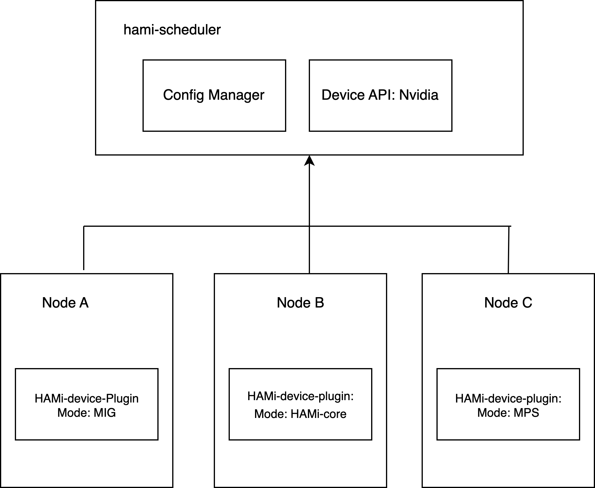
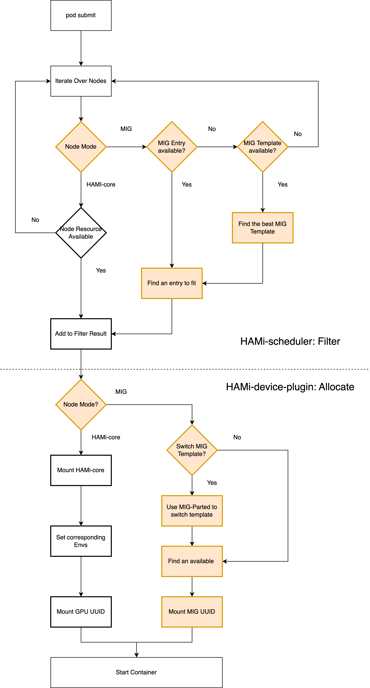

# NVIDIA GPU MPS and MIG dynamic slice plugin

## Special Thanks

This feature will not be implemented without the help of @sailorvii.

## Introduction

The NVIDIA GPU build-in sharing method includes: time-slice, MPS and MIG. The context switch for time slice sharing would waste some time, so we chose the MPS and MIG. The GPU MIG profile is variable, the user could acquire the MIG device in the profile definition, but current implementation only defines the dedicated profile before the user requirement. That limits the usage of MIG. We want to develop an automatic slice plugin and create the slice when the user require it.
For the scheduling method, node-level binpack and spread will be supported. Referring to the binpack plugin, we consider the CPU, Mem, GPU memory and other user-defined resource.
HAMi is done by using [hami-core](https://github.com/Project-HAMi/HAMi-core), which is a cuda-hacking library. But mig is also widely used across the world. A unified API for dynamic-mig and hami-core is needed.

## Targets

- CPU, Mem, and GPU combined schedule
- GPU dynamic slice: Hami-core and MIG
- Support node-level binpack and spread by GPU memory, CPU and Mem
- A unified vGPU Pool different virtualization techniques
- Tasks can choose to use MIG, use HAMi-core, or use both.

### Config maps
- hami-scheduler-device-configMap
This configmap defines the plugin configurations including resourceName, and MIG geometries, and node-level configurations.

```yaml
apiVersion: v1
data:
  device-config.yaml: |
    nvidia:
      resourceCountName: nvidia.com/gpu
      resourceMemoryName: nvidia.com/gpumem
      resourceCoreName: nvidia.com/gpucores
      knownMigGeometries:
      - models: [ "A30" ]
        allowedGeometries:
          - 
            - name: 1g.6gb
              memory: 6144
              count: 4
          - 
            - name: 2g.12gb
              memory: 12288
              count: 2
          - 
            - name: 4g.24gb
              memory: 24576
              count: 1
      - models: [ "A100-SXM4-40GB", "A100-40GB-PCIe", "A100-PCIE-40GB", "A100-SXM4-40GB" ]
        allowedGeometries:
          - 
            - name: 1g.5gb
              memory: 5120
              count: 7
          - 
            - name: 2g.10gb
              memory: 10240
              count: 3
            - name: 1g.5gb
              memory: 5120
              count: 1
          - 
            - name: 3g.20gb
              memory: 20480
              count: 2
          - 
            - name: 7g.40gb
              memory: 40960
              count: 1
      - models: [ "A100-SXM4-80GB", "A100-80GB-PCIe", "A100-PCIE-80GB"]
        allowedGeometries:
          - 
            - name: 1g.10gb
              memory: 10240
              count: 7
          - 
            - name: 2g.20gb
              memory: 20480
              count: 3
            - name: 1g.10gb
              memory: 10240
              count: 1
          - 
            - name: 3g.40gb
              memory: 40960
              count: 2
          - 
            - name: 7g.79gb
              memory: 80896
              count: 1
      nodeconfig: 
          - name: nodeA
            operatingmode: hami-core
          - name: nodeB
            operatingmode: mig
```

## Structure

 

## Examples

Dynamic mig is compatible with hami tasks, as the example below: 
Just Setting `nvidia.com/gpu` and `nvidia.com/gpumem`.

```yaml
apiVersion: v1
kind: Pod
metadata:
  name: gpu-pod1
spec:
  containers:
    - name: ubuntu-container1
      image: ubuntu:20.04
      command: ["bash", "-c", "sleep 86400"]
      resources:
        limits:
          nvidia.com/gpu: 2 # requesting 2 vGPUs
          nvidia.com/gpumem: 8000 # Each vGPU contains 8000m device memory （Optional,Integer)
```

A task can decide only to use `mig` or `hami-core` by setting `annotations.nvidia.com/vgpu-mode` to corresponding value, as the example below shows:

```yaml
apiVersion: v1
kind: Pod
metadata:
  name: gpu-pod1
  annotations:
    nvidia.com/vgpu-mode: "mig"
spec:
  containers:
    - name: ubuntu-container1
      image: ubuntu:20.04
      command: ["bash", "-c", "sleep 86400"]
      resources:
        limits:
          nvidia.com/gpu: 2 # requesting 2 vGPUs
          nvidia.com/gpumem: 8000 # Each vGPU contains 8000m device memory （Optional,Integer
```

## Procedures

The Procedure of a vGPU task which uses dynamic-mig is shown below:

 

Note that after submitting a task, deviceshare plugin will iterate over templates defined in configMap `hami-scheduler-device`, and find the first available template to fit. You can always change the content of that configMap, and restart vc-scheduler to customize.

If you submit the example on an empty A100-PCIE-40GB node, then it will select a GPU and choose MIG template below:

```yaml
  2g.10gb : 3
  1g.5gb : 1
```

Then start the container with 2g.10gb instances * 2

