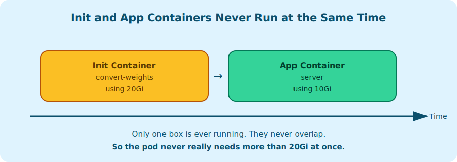
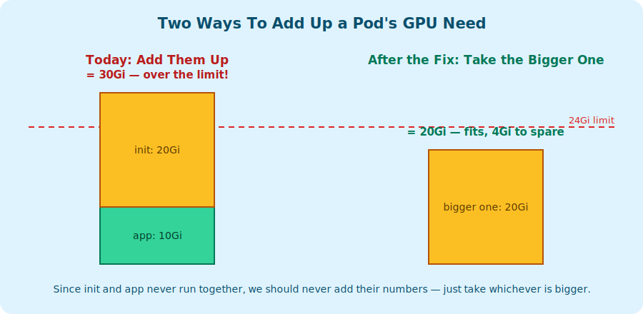
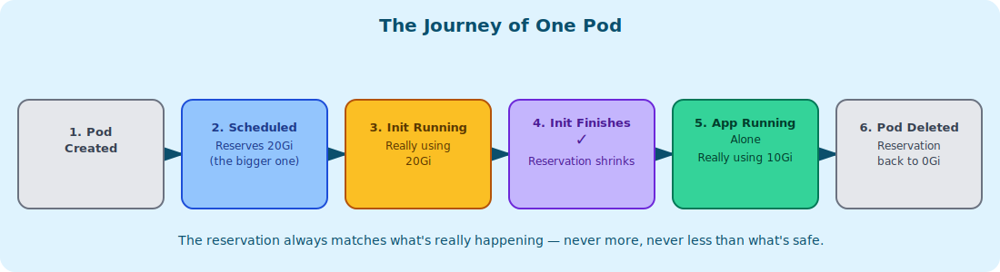

# HAMi Support for Init Container GPU Resource Accounting — Design

## Problem Summary

When a pod has both init containers and app containers requesting GPU resources, HAMi allocates the resources simultaneously/parallelly. But Kubernetes runs the init container sequentially to completion before any app container starts, so init and app containers never execute at the same time.

Note : This design covers init and app containers only. Sidecar containers are out of scope here and will be handled in a separate PR.
  

## The Problem in HAMi Today

`device.Resourcereqs()` this is built for one request entry per container, **init
containers first, then app containers**, in this order.

**1. Admission — `fitResourceQuota` (`webhook.go`)**

```
for _, ctr := range pod.Spec.Containers { 
    memoryReq += memReq * req
}

```

`pod.Spec.InitContainers` is never referenced. An init container's GPU
request is invisible to the quota check.

**2. Scheduling — `calcScore` / `fitInDevices` (`score.go`)**

```
for ctrid, n := range resourceReqs {       
    fit, reason := fitInDevices(node, n, task, nodeInfo, &score.Devices)
}
```

`calcScore` passes the **same `node` object** into `fitInDevices` on every
iteration, and it permanently adds each container's request
onto that node's tracked usage. That addition carries into the *next*
container's check, with no reset and no idea that init containers finish
before app containers start.

**Example:** A pod with an init container requesting 20Gi and an
app container requesting 10Gi, on a node with 24Gi free. The scheduler
checks it as if it needs `20 + 10 = 30Gi` at once, and rejects it — even
though the pod never uses more than 20Gi at any single moment.

**3. Usage recording — `AddPod`/`AddUsage`/`getNodesUsage`**

```
for _, ctrdevice := range ctrdevices {  
    res[memName] += int64(ctrdevice.Usedmem)
}
```

Both the namespace quota tracker and the per-node capacity aggregator sum
every container's stored usage, with no idea some entries came from
containers that terminated long ago.

These three problems share a root cause — nothing in HAMi knows "init
containers are sequential and finish before app containers start" — but
they are three independent code paths that each need to know it.

## The Core Idea

Think of a pod like a kitchen: one chef (the **init container**) preps
ingredients and leaves; only then does a second chef (the **app
container**) start cooking. They are never both in the kitchen at once.



So the correct formula for a pod's GPU footprint at any instant is:

```
effective = max( sum(app container requests), max(single init container request) )
```
**Assumption:**  The resources requested by the init container will always be the same as one of the app containers.

## Proposal

Applying this formula consistently for all resource dimensions (GPU count,
memory, cores, and per-device UUID; a multi-GPU pod where init and app
containers land on different physical devices must not have usage on
those devices merged):

- **Admission quota check** computes this effective value and checks it
  against namespace quota.
- **Scheduler fit & scoring** evaluates init containers independently
  against a fresh copy of node state, app containers cumulatively against
  a separate copy, then merges per device UUID via the same `max()`.
- **Usage recording** stores this effective value per device instead of
  the raw per-container sum, and automatically shrinks it to
  app-containers-only once a pod's init containers are confirmed finished
  via `pod.Status` — never before.

Pod annotations are untouched — the device plugin still needs the full
per-container device list to know which physical GPU each container uses.
Only accounting changes.

### Different cases

Assume a GPU cluster with one node, `node1`, with a single 24Gi GPU, and a
namespace quota of `nvidia.com/gpumem: 24Gi`.

#### Case 1 — Admission catches an init container request that could never fit

- **Pod request:** init container `convert-weights` requests 30Gi, app
  container `server` requests 4Gi.
- **Before:** allowed — only `server`'s 4Gi is checked.
- **After:** denied — `max(4Gi, 30Gi) = 30Gi` exceeds the 24Gi quota.

#### Case 2 — A pod that fits is no longer wrongly rejected

- **Node state:** empty, 24Gi available.
- **Pod request:** init 20Gi, app 10Gi.
- **Before:** rejected, "0 nodes fit" — scheduler required `20+10=30Gi`.
- **After:** scheduled — effective usage `max(10,20)=20Gi`, 4Gi headroom.

#### Case 3 — Recorded usage matches reality

- **Node state:** pod from Story 2 bound and running.
- **Before:** recorded `Used = 30Gi` — exceeds the node's entire capacity.
- **After:** recorded `Used = 20Gi` — matches the real peak.

#### Case 4 — Usage shrinks once the init container finishes

- **New pod request:** 12Gi, submitted while `model-warmup` is running.
- **Before:** denied forever — recorded usage never learns the init
  container finished, stays at 30Gi.
- **After:** once `convert-weights` is confirmed `Terminated`, recorded
  usage drops to 10Gi; `24-10=14Gi` free → the 12Gi pod is scheduled.



## Design Details

### Per-Resource, Per-Device Formulas

```
effective_gpu_count[uuid] = max( sum(app count requests on uuid),  max(init count requests on uuid) )
effective_mem[uuid]       = max( sum(app memory requests on uuid), max(init memory requests on uuid) )
effective_cores[uuid]     = max( sum(app core requests on uuid),   max(init core requests on uuid) )
```

Scoping per UUID also handles init and app containers landing on
different physical devices: each device gets its own effective value.

### Admission Quota Check

1. `initReq` per resource = **max** across init containers.
2. `appReq` per resource = **sum** across app containers.
3. `effectiveReq = max(appReq, initReq)`; deny if it exceeds quota.

**GPU count:** today's quota check enforces **memory and cores only** —
GPU count is not an independent quota dimension. `effectiveReq` is still
computed for count (steps 1–2) so the scheduler and usage recorder have a
consistent value to work with, but `FitQuota` does not compare it against
a namespace quota. Threading count through `FitQuota` the same way memory
and cores are is a possible future extension, not part of this change.

**Memory factor:** applied **once**, to the already-computed effective
value — not per container.

```
effective_mem = max(app_mem_sum, init_mem_peak)
if memoryFactor > 1:
    quota_check_mem = effective_mem * memoryFactor
```

### Scheduler Fit & Scoring

1. **Init pass:** fit each init container independently against a fresh
   deep-copy of node state; track the **max** per-device usage seen.
2. **App pass:** fit app containers cumulatively against a separate fresh
   copy.
3. **Merge**, per device UUID and resource:
   `effective_usage[uuid][resource] = max(app_cumulative, init_peak)`.
   Reject the node if this exceeds capacity.

### Usage Recording (Quota & Node Capacity)

Before storing usage, collapse the raw per-container `PodDevices` into an
accounting-only view:

```
collapsed = CollapseInitContainerUsage(pod, podDevices)
```

Passed to `PodManager.AddPod` / `QuotaManager.AddUsage` — never the raw
structure.

**On every pod update:**
1. Decode annotations to recover each container's device UUID.
2. Classify each container init/app using `pod.Spec`.
3. Re-apply `CollapseInitContainerUsage` (or `AppContainersOnly` once
   confirmed done).
4. Apply only the **delta** between old and new stored value.

**On deletion**, `TakeAndDeletePod` returns exactly the currently-stored
(possibly already-shrunk) value, and `RmUsage` subtracts exactly that —
add and remove always operate on the same number, so there's no drift.

### Shrink on Init Container Completion



**Condition:** every init container has `Status.Terminated` set (finished,
regardless of exit code), checked on every reconcile against current
object state — not gated on observing any particular `Phase` value.
`Phase == Running` is not required, since it was found to be unreliable
(does not consistently appear before `Succeeded`).

Two actions (shrink) and one no‑op (hold) once every init container has terminated:

- **Pod reaches a terminal phase (`Succeeded` or `Failed`):** every
  container in the pod — init and app — has finished. Usage shrinks to
  zero regardless of exit codes, since nothing in the pod is using GPU
  anymore. Unlike `Running`, `Succeeded`/`Failed` are true terminal
  states with no further transitions, so `Phase` is safe to use here.
- **All init containers exited `ExitCode: 0`, pod not yet terminal:**
  app containers have started or are starting → shrink to
  app-containers-only usage.
- **Any init container exited non-zero, pod not yet terminal:** pod may still restart (depending on restartPolicy). It still holds its allocated GPU devices, so usage is not shrunk at this point. The pod will either restart and eventually succeed, or be terminated permanently (phase → Failed), which will then trigger a shrink.

```
for each uuid:
if pod.Status.Phase in (Succeeded, Failed):
    new_usage[uuid] = 0   
else if all init containers terminated with ExitCode == 0:
    new_usage[uuid] = sum of app-container usage values on uuid only
                      (the same per-container fields — e.g. Usedmem —
                      that AddUsage/getNodesUsage already collapse;
                      not raw requests)
else :
   // No shrink. Init containers are still running, or one failed and the pod hasn't ended yet.
   //
   // Gap: if an earlier init container already succeeded, we still hold its memory until the whole pod ends — it's not released early.
   //
   // TODO(future): release memory as each init container finishes, not just at the end. Track which init container index last succeeded
   // (they run in order), and only count what's left after that.
        continue

delta[uuid] = new_usage[uuid] - old_usage[uuid]
apply delta[uuid] to QuotaManager and PodManager
```

Requests stay the basis for admission and scheduling decisions above;
once a pod is running, the recorded/shrunk value — the number quota and
node-capacity accounting compare against — is always derived from the
same usage fields `AddUsage`/`getNodesUsage` already track, so it can
never drift from what `CollapseInitContainerUsage` produced when the pod
started.

Only ever runs **after** `pod.Status` confirms completion.

**Idempotency:** `PodManager` stores one boolean per pod,
`initContainerResourceReleased` (default `false`), guarding only the
init-container shrink step:

if all initContainers terminated with ExitCode == 0 and !initContainerResourceReleased:
    shrink usage to app-containers-only
    initContainerResourceReleased = true

The terminal-phase release is not persisted as a separate state — it's
recomputed on every reconcile directly from `pod.Status.Phase`:

    if pod.Status.Phase in (Succeeded, Failed):
        usage = 0