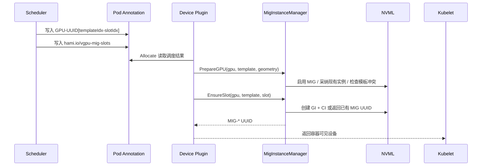

# 动态 MIG 实例释放与按需重建设计

## 背景

HAMi 的动态 MIG 模式通过调度器选择 MIG 模板，并由 NVIDIA device plugin 在容器启动前创建对应的 MIG 实例。旧实现主要依赖 `nvidia-mig-parted` 对整张 GPU 应用模板：当新任务需要不同模板时，需要等待卡上所有已有 MIG 任务结束后才能重新切分。

本次改动的目标是把 MIG 实例生命周期从“整卡模板重切”细化到“按 slot 创建和释放”：

- 调度器仍然按照稳定的 MIG slot 视图做资源分配。
- device plugin 在 `Allocate` 阶段只创建被当前容器实际使用的 MIG GI/CI。
- 容器结束后，device plugin 通过 kubelet pod-resources API 感知 MIG UUID 释放，并销毁对应 GI/CI。
- 空闲 slot 保留其模板、位置和 profile 信息，下一个任务命中同一 slot 时可原位重建。
- 配置层只使用 `profiles` 定义常见 MIG 模板，由代码内置 profile catalog 统一展开。

## 设计目标

1. **减少整卡重切次数**

   对同一 MIG 模板下的任务，只按需创建或销毁单个 slot 对应的 MIG 实例，避免每次分配都重新 apply 整卡模板。

2. **保护运行中任务**

   当某张 GPU 上存在其他模板下的活跃 MIG 实例时，device plugin 拒绝切换模板，避免销毁仍被容器使用的 GI/CI。

3. **保持调度视图稳定**

   调度器继续使用 `GPU-UUID[templateIdx-slotIdx]` 形式表达 MIG slot。即使底层 MIG UUID 因销毁和重建发生变化，调度器与 Pod 注解中的 slot 标识仍保持稳定。

4. **支持 plugin 重启恢复**

   device plugin 启动时保留忙碌 GPU 的现有 MIG 布局；空闲 GPU 被重置为 “MIG enabled, no partitions”，为后续按需创建留出干净状态。

5. **降低默认配置维护成本**

   默认 Helm 配置从冗长的旧模板字段切换为 `profiles` 列表，由代码内置 profile catalog 自动展开为调度器需要的 geometry。

## 配置模型

`AllowedMigGeometries` 新增 `profiles` 字段：

```yaml
knownMigGeometries:
- models: [ "A100-SXM4-40GB", "A100-40GB-PCIe", "A100-PCIE-40GB" ]
  profiles: [ "1g.5gb", "2g.10gb", "3g.20gb", "7g.40gb" ]
```

归一化逻辑位于 `pkg/device/nvidia/mig_profiles.go`：

- `profiles` 会被展开为 `[]Geometry`，每个 profile 形成一个单 profile 模板。
- profile 的 `core`、`memory`、`count` 从内置 catalog 读取。
- 未设置 `profiles` 的配置会被拒绝，不再兼容旧模板字段。
- 未知 profile 会返回配置错误，scheduler/device plugin 初始化失败，避免运行时产生不一致调度视图。

Helm 默认配置同步简化了 `charts/hami/templates/scheduler/device-configmap.yaml` 中的 NVIDIA `knownMigGeometries`，覆盖 A30、A100、H100、H20、H200、B200 等型号。

## 核心数据结构

### MIG slot 注解

调度器分配的 MIG slot 会写入 Pod 注解 `hami.io/vgpu-mig-slots`：

```json
[
  {
    "deviceUUID": "GPU-xxx[0-1]",
    "gpuUUID": "GPU-xxx",
    "templateIdx": 0,
    "slotIdx": 1
  }
]
```

实现位于 `pkg/device/nvidia/mig_slots.go`：

- `EncodeMigSlotAllocations` 从调度结果中提取 `templateIdx` 和 `slotIdx`。
- `DecodeMigSlotAllocations` 供 scheduler 和 device plugin 恢复 slot 语义。

这个注解解决了一个关键问题：底层 `MIG-*` UUID 是动态创建出来的，不适合作为调度器长期状态；`templateIdx + slotIdx` 才是 HAMi 资源模型里的稳定身份。

### MigInstanceManager

`pkg/device-plugin/nvidiadevice/nvinternal/plugin/migmgr.go` 新增 `MigInstanceManager`，作为节点内 MIG GI/CI 状态的单一管理者。

主要索引：

- `bySlot`: `slotKey -> migInstance`
- `byMigUUID`: `MIG UUID -> slotKey`
- `gpuLocks`: 每张 GPU 一个互斥锁，串行化同一物理卡上的 NVML 操作

`slotKey` 由三元组组成：

- `GPUIndex`
- `TemplateIdx`
- `PositionIdx`

`migInstance` 保存：

- profile 切片类型，例如 `1g`、`2g`
- NVML placement
- GI ID / CI ID
- 当前绑定的 MIG UUID
- `Present` 状态

当 `Present=false` 时，表示 slot 当前没有实际 GI/CI，但 manager 仍记住 profile 和 placement，后续可以原位创建。

## 分配流程

1. scheduler 在 `Fit` 阶段选择某张 GPU 的 MIG template 和 slot。
2. scheduler 通过 Pod 注解写入原有设备分配结果，同时额外写入 `hami.io/vgpu-mig-slots`。
3. kubelet 调用 device plugin `Allocate`。
4. `GetContainerDeviceStrArray` 解析 `GPU-UUID[templateIdx-slotIdx]`。
5. 如果当前 plugin 运行在 `mig` 模式，优先走 `resolveMigUUIDOnDemand`：
   - 解析 template 和 slot。
   - 根据 GPU 型号和 template index 查找 geometry。
   - 调用 `PrepareGPU` 准备物理 GPU。
   - 调用 `EnsureSlot` 创建或复用该 slot 的 GI/CI。
   - 返回真实 `MIG-*` UUID 给 kubelet。
6. 如果按需路径不可用或失败，Allocate 直接返回错误，不再回退到整卡 `nvidia-mig-parted` apply 路径。

简化流程如下：



## 释放流程

device plugin 在 `mig` 模式启动 `podresources.Watcher`，周期性调用 kubelet pod-resources API：

- socket 挂载路径：`/var/lib/kubelet/pod-resources`
- 默认轮询周期：10 秒
- 只关注当前 resource name，例如 `nvidia.com/gpu`

Watcher 保存上一轮 kubelet 视图，并与当前视图做 diff：

1. 某个 `MIG-*` device ID 从 kubelet pod-resources 中消失。
2. 回调 `MigInstanceManager.Release(MIG UUID)`。
3. manager 通过 `byMigUUID` 找到 slot。
4. 使用 NVML 销毁对应 CI 和 GI。
5. 将 slot 标记为 `Present=false`，清理 MIG UUID 反向索引。

释放回调还会通过当前节点 Pod 注解重建活跃 slot 集合，并调用 `ReconcileActiveSlots` 清理 manager 中仍 `Present` 但已不属于活跃 Pod 的 stale 实例。

## 启动恢复策略

device plugin 启动时，`mig_startup.go` 会执行一次 best-effort 检测，找出仍在使用的 GPU：

- 通过 kubelet pod-resources List 查询正在使用的 `MIG-*` UUID。
- 通过 NVML 查询父 GPU 或 MIG device 上的运行中 compute/graphics process。

随后 `resetIdleMigGPUs` 会修改启动 MIG spec：

- 忙碌 GPU 保留当前布局，不销毁运行中任务使用的 GI/CI。
- 空闲 GPU 设置为 `MigEnabled=true` 且 `MigDevices={}`，即开启 MIG 但不预创建分区。

这样可以在 plugin 重启后同时满足两点：

- 不影响已有容器。
- 空闲卡回到适合按需创建的初始状态。

## 调度器状态同步

调度器在统计节点用量时新增对 `hami.io/vgpu-mig-slots` 的解析：

- 对带 slot 注解的 Pod，直接根据 `DeviceUUID -> slot` 标记 `MigUsage.UsageList[slotIdx].InUse=true`。
- 如果设备还没有对应 `MigUsage`，使用 `device.PlatternMIG` 按 `templateIdx` 初始化模板视图。
- 如果 MIG 任务错误地落在 `hami-core` 模式 GPU 上，标记设备不健康并跳过。

这让 scheduler 不依赖底层 MIG UUID 的稳定性，而是依赖 HAMi 分配时写入的 slot 元数据恢复资源占用。

## 失败处理与兼容性

### 模板冲突

`PrepareGPU` 会检查同一 GPU 是否存在其他 template 下的活跃 slot：

- 如果存在 `Present=true` 的其他模板实例，则拒绝切换模板。
- 如果其他模板只剩 absent slot 记录，则清理旧记录并销毁旧布局残留后重建新模板 slot map。

调度侧将 MIG 模式下的 `CustomFilterRule` 失败原因细化为 `CardMigTopologyInfeasible`，用于区分：

- 设备资源不足。
- 自定义过滤失败。
- MIG 拓扑在不销毁活跃实例的前提下不可行。

### kubelet pod-resources 不可用

启动探测和 watcher 都对 pod-resources API 失败做降级处理：

- 启动探测失败时，继续使用 NVML 进程检测结果。
- watcher tick 失败时保留上一轮快照，避免误触发 release。
- kubelet socket 重建时，watcher 会关闭旧连接并在下一轮重连。

## 部署变更

`charts/hami/templates/device-plugin/daemonsetnvidia.yaml` 新增 hostPath 挂载：

```yaml
- name: pod-resources
  hostPath:
    path: /var/lib/kubelet/pod-resources
    type: Directory
```

容器内挂载为只读：

```yaml
- name: pod-resources
  mountPath: /var/lib/kubelet/pod-resources
  readOnly: true
```

该挂载是 watcher 访问 kubelet pod-resources unix socket 的前提。

## 测试覆盖

本分支新增和调整的测试覆盖以下场景：

- `NormalizeMigGeometries`：
  - `profiles` 展开为 geometry。
  - 缺少 `profiles` 的配置会被拒绝。
- `EncodeMigSlotAllocations` / `DecodeMigSlotAllocations`：
  - 从 `GPU-UUID[templateIdx-slotIdx]` 正确生成 slot 注解。
- `resetIdleMigGPUs`：
  - 空闲 GPU 被重置为空 MIG 布局。
  - 忙碌 GPU 保留原布局。
  - 无 devices entry 的 spec 不被修改。
- `podresources.Watcher`：
  - 能从 fake kubelet pod-resources server 读取设备快照。
  - 当前快照缺少上一轮设备时触发 release 回调。
- scheduler score 测试：
  - MIG 拓扑不可行时返回 `CardMigTopologyInfeasible`。

## 后续演进

- 为 `MigInstanceManager` 增加可注入 NVML backend，降低对真实 GPU 环境的单测依赖。
- 将 watcher 的轮询周期、超时时间暴露为配置项，适配大规模节点和 kubelet 压力场景。
- 在 metrics 中区分 slot absent、present、stale、release failed 等状态，便于定位资源回收问题。
- 为 `CardMigTopologyInfeasible` 增加更明确的事件或调度失败提示，帮助用户理解是 MIG 拓扑限制而不是普通资源不足。
