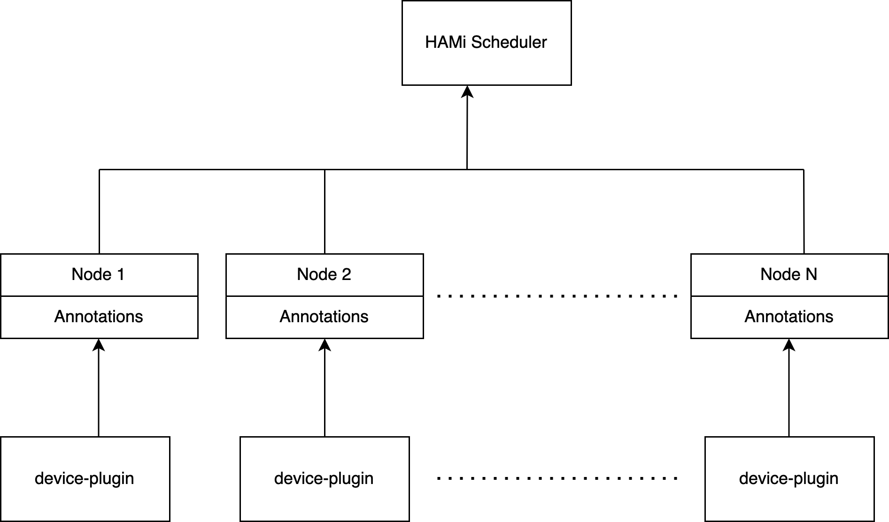
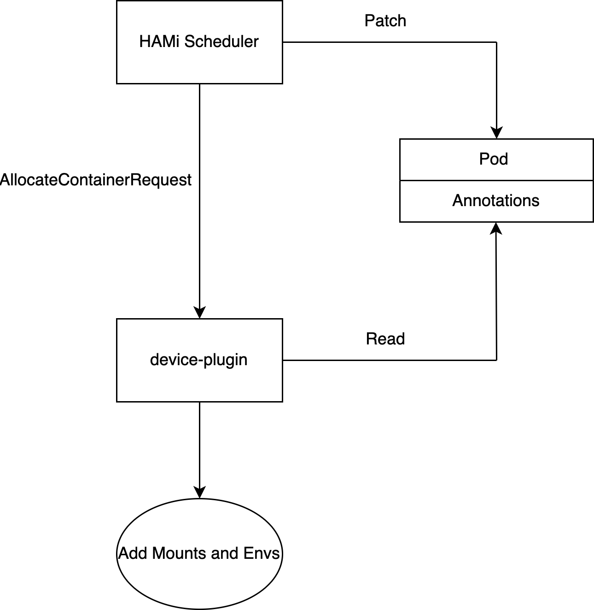

# Protocol

## Device Register

 

HAMi needs to know the spec of each AI devices in the cluster in order to schedule properly. During device registration, device-plugin needs to keep patching the spec of each device into node annotations every 30 seconds, in the format of the following:

```
hami.io/node-handshake-{device-type}: Reported_{device_node_current_timestamp}
hami.io/node-register-{deivce-type}: {Device 1}:{Device2}:...:{Device N}
```

The definiation of each device is in the following format:
```
{Device UUID},{device split count},{device memory limit},{device core limit},{device type},{device numa},{healthy}
```

An example is shown below:
```
hami.io/node-handshake-nvidia: Reported 2024-01-23 04:30:04.434037031 +0000 UTC m=+1104711.777756895
hami.io/node-handshake-mlu: Requesting_2024.01.10 04:06:57
hami.io/node-mlu-register: MLU-45013011-2257-0000-0000-000000000000,10,23308,0,MLU-MLU370-X4,0,false:MLU-54043011-2257-0000-0000-000000000000,10,23308,0,
hami.io/node-nvidia-register: GPU-00552014-5c87-89ac-b1a6-7b53aa24b0ec,10,32768,100,NVIDIA-Tesla V100-PCIE-32GB,0,true:GPU-0fc3eda5-e98b-a25b-5b0d-cf5c855d1448,10,32768,100,NVIDIA-Tesla V100-PCIE-32GB,0,true:

```
In this example, this node has two different AI devices, 2 Nvidia-V100 GPUs, and 2 Cambircon 370-X4 MLUs

Note that a device node may become unavailable due to hardware or network failure, if a node hasn't registered in last 5 minutes, scheduler will mark that node as 'unavailable'.

Since system clock on scheduler node and 'device' node may not align properly, scheduler node will patch the following device node annotations every 30s

```
hami.io/node-handshake-{device-type}: Requesting_{scheduler_node_current_timestamp}
```

If hami.io/node-handshake annotations remains in "Requesting_xxxx" and {scheduler current timestamp} > 5 mins + {scheduler timestamp in annotations}, then this device on that node will be marked "unavailable" in scheduler.
 

## Schedule Decision

 

HAMi scheduler needs to patch schedule decisions into pod annotations, in the format of the following:

```
hami.io/devices-to-allocate:{ctr1 request}:{ctr2 request}:...{Last ctr request}:
hami.io/device-node: {schedule decision node}
hami.io/device-schedule-time: {timestamp}
```

each container request is in the following format:

```
{device UUID},{device type keywork},{device memory request}:{device core request}
```

for example:

A pod with 2 containers, first container requests 1 GPU with 3G device Memory, second container requests 1 GPU with 5G device Memory, then the patched annotations will be like the

```
hami.io/devices-to-allocate: GPU-0fc3eda5-e98b-a25b-5b0d-cf5c855d1448,NVIDIA,3000,0:GPU-0fc3eda5-e98b-a25b-5b0d-cf5c855d1448,NVIDIA,5000,0: 
hami.io/vgpu-node: node67-4v100
hami.io/vgpu-time: 1705054796
```

