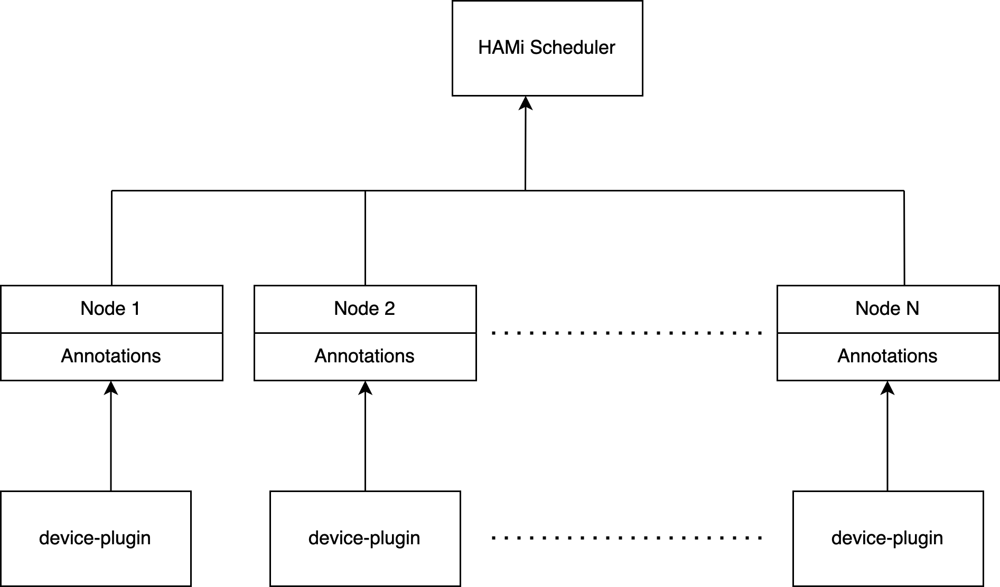
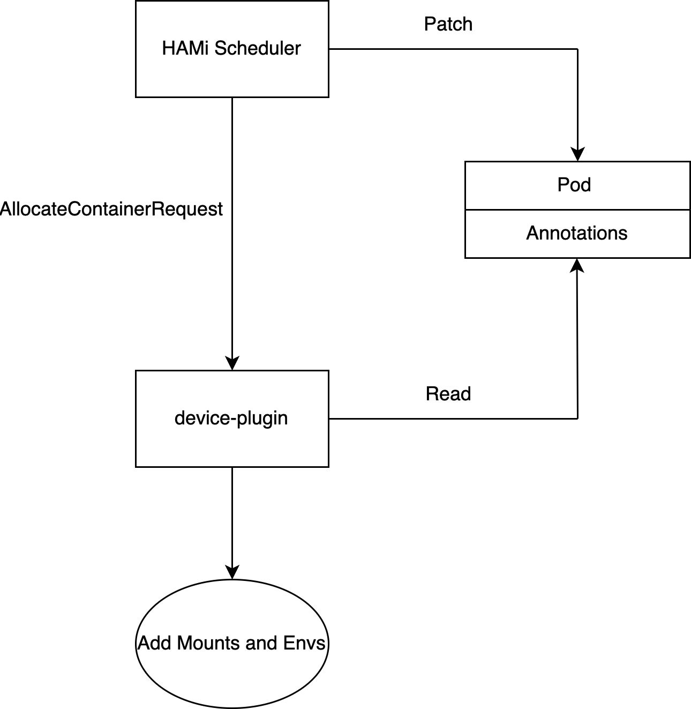

# Protocol

## Device Register

 

HAMi needs to know the spec of each AI devices in the cluster in order to schedule properly. During device registration, device-plugin needs to keep patching the spec of each device into node annotations every 30 seconds, in the format of the following:

```text
hami.io/node-handshake-{device-type}: Reported_{device_node_current_timestamp}
hami.io/node-{device-type}-register: {Device 1}:{Device2}:...:{Device N}
```

The definition of each device is nine comma-separated fields:

```text
{Device UUID},{device split count},{device memory limit},{device core limit},{device type},{device numa},{healthy},{device index},{mode}
```

The last two fields are:

| Field            | Meaning                                                        |
|------------------|----------------------------------------------------------------|
| `{device index}` | The device's index on the node. Must not be negative.          |
| `{mode}`         | The device's virtualization mode: `hami-core`, `mig` or `mps`. |

For backward compatibility the scheduler also accepts the older seven-field form,
which omits `{device index}` and `{mode}`. In that case it defaults the index to
`0` and the mode to `hami-core`, so a plugin registering with the seven-field
form can never have its devices scheduled as MIG. New plugins should write all
nine fields.

An example is shown below:

```text
hami.io/node-handshake-nvidia: Reported_2024-01-23 04:30:04
hami.io/node-handshake-mlu: Requesting_2024-01-10 04:06:57
hami.io/node-mlu-register: MLU-45013011-2257-0000-0000-000000000000,10,23308,0,MLU-MLU370-X4,0,false,0,hami-core:MLU-54043011-2257-0000-0000-000000000000,10,23308,0,MLU-MLU370-X4,0,true,1,hami-core:
hami.io/node-nvidia-register: GPU-00552014-5c87-89ac-b1a6-7b53aa24b0ec,10,32768,100,NVIDIA-Tesla V100-PCIE-32GB,0,true,0,hami-core:GPU-0fc3eda5-e98b-a25b-5b0d-cf5c855d1448,10,32768,100,NVIDIA-Tesla V100-PCIE-32GB,0,true,1,hami-core:
```

In this example, this node has two different AI devices, 2 Nvidia-V100 GPUs, and 2 Cambricon 370-X4 MLUs

A device node may become unavailable due to hardware or network failure. The
scheduler detects this with a handshake rather than by trusting the node's own
clock, since the system clocks on the scheduler node and the device node may not
align.

Whenever the handshake annotation does not already hold a `Requesting_` value,
the scheduler overwrites it with its own timestamp:

```text
hami.io/node-handshake-{device-type}: Requesting_{scheduler_node_current_timestamp}
```

This happens on each registration cycle, which runs every 15 seconds and also
whenever a node is added or deleted. The timestamp is written and parsed as
`2006-01-02 15:04:05` (Go's `time.DateTime`) in the scheduler's local timezone.
A value the scheduler cannot parse leaves the devices registered but never
refreshed, so a plugin must reproduce this layout exactly.

The device-plugin answers by overwriting the annotation with its own `Reported_`
value. The scheduler only parses the `Requesting_` form; any other value is read
as "the plugin has answered".

If `hami.io/node-handshake-{device-type}` remains in `Requesting_xxxx` and
{scheduler current timestamp} > 60 seconds + {scheduler timestamp in
annotations}, then the devices of that type on that node are marked
"unavailable" and removed from the scheduler's cache.

There is one exception. If the node still advertises the device type's count
resource in `.status.allocatable` with a value greater than zero, the scheduler
keeps the devices and skips the cleanup even though the handshake has expired.
This avoids dropping a node whose plugin is briefly unreachable while the kubelet
still reports its devices.
 

## Schedule Decision

 

HAMi scheduler needs to patch schedule decisions into pod annotations, in the format of the following:

```text
hami.io/vgpu-devices-to-allocate: {ctr1 request};{ctr2 request};...{Last ctr request};
hami.io/vgpu-node: {schedule decision node}
hami.io/vgpu-time: {timestamp}
```

`hami.io/vgpu-devices-to-allocate` is the key for NVIDIA GPUs. Each device backend registers its own key in `InRequestDevices`, and the names do not follow a single `{device-type}` pattern. For example, Cambricon MLU uses `hami.io/cambricon-mlu-devices-to-allocate`, Moore Threads uses `hami.io/mthreads-vgpu-devices-to-allocate`, and Hygon DCU uses `hami.io/dcu-devices-to-allocate`.

The scheduler writes one `-devices-to-allocate` annotation per device type. A pod that asks for more than one device type, for example NVIDIA and MLU, gets one annotation per type, and each annotation lists only the devices of that type.

Each container request lists that container's devices. Every device is four comma-separated fields terminated by `:`, and every container is terminated by `;`:

```text
{device UUID},{device type keyword},{device memory request},{device core request}:
```

for example:

A pod with 2 containers, first container requests 1 GPU with 3G device Memory, second container requests 1 GPU with 5G device Memory, then the patched annotations will be like this:

```text
hami.io/vgpu-devices-to-allocate: GPU-0fc3eda5-e98b-a25b-5b0d-cf5c855d1448,NVIDIA,3000,0:;GPU-0fc3eda5-e98b-a25b-5b0d-cf5c855d1448,NVIDIA,5000,0:;
hami.io/vgpu-node: node67-4v100
hami.io/vgpu-time: 1705054796
```

