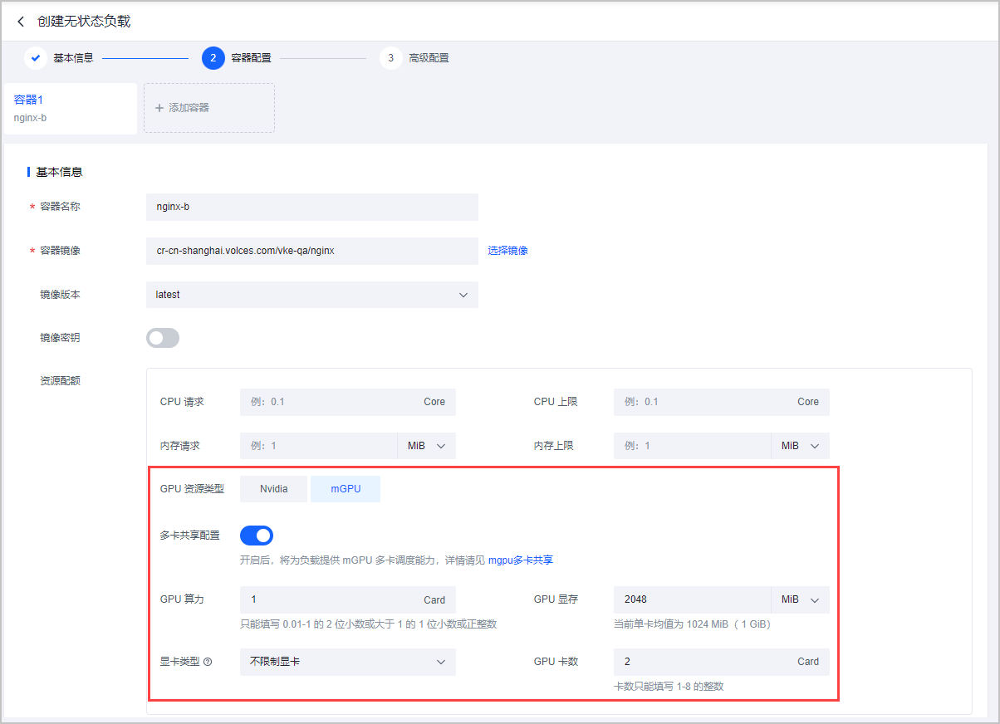
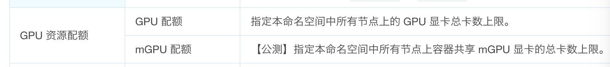
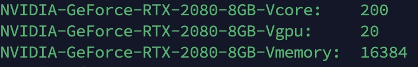

### 背景

目前社区在使用 `HAMI` 做资源配额时存在一些疑问和需求，现挣对这些问题进行调研和设计。

资源配额主要考虑 `ResourceQuota` 和 `volcano queue` 两种资源配额的形式；


### HAMI 现状

目前 `HAMI` 启动之后注册到 `Node` 上的节点只有一个资源类型 `nvidia.com/gpu: 20`, 没有注册算力和显存。

用户在创建工作负载的时候需要手动指定使用几张物理卡，每张卡使用多少显存和算力。

并且资源配额目前在 `ResourceQuota` 可以简单实现，但是在 `volcano queue` 上实现不了。

```yaml
apiVersion: v1
kind: ResourceQuota
metadata:
  name: compute-resources
spec:
  hard:
    requests.nvidia.com/gpu: 1  
    requests.nvidia.com/gpucore: 80
    requests.nvidia.com/gpumemory: 2000
```

这样 k8s 在计算资源配额的时候会分别计算每个字段是否满足条件，这样就有问题，假如创建了上述的  `ResourceQuota` , 然后创建下面的 `Deployment` :

```yaml
kind: Deployment
apiVersion: apps/v1
metadata:
  name: gpu-burn-test
spec:
  replicas: 2
  selector:
    matchLabels:
      app: gpu-burn-test
  template:
    metadata:
      labels:
        app: gpu-burn-test
    spec:
      containers:
        - name: container-1
          image: docker.io/chrstnhntschl/gpu_burn:latest
          command:
            - sleep
            - '100000'
          resources:
            limits:
              nvidia.com/gpucores: '10'
              nvidia.com/gpumem: '200'
              nvidia.com/gpu: '1'
```

这样的后果就是只能启动一个 `Pod` ，第二个 `Pod` 就会因为 `nvidia.com/gpu` 字段被使用了一次导致不能被调度。


如果我们修改为如下的资源配额方式：

```yaml
apiVersion: v1
kind: ResourceQuota
metadata:
  name: compute-resources
spec:
  hard: 
    requests.nvidia.com/gpucore: 80
    requests.nvidia.com/gpumemory: 20001
```    

那我们在单容器单卡维度上就可以正确的使用资源配额：

```yaml
kind: Deployment
apiVersion: apps/v1
metadata:
  name: gpu-burn-test
spec:
  replicas: 2
  selector:
    matchLabels:
      app: gpu-burn-test
  template:
    metadata:
      labels:
        app: gpu-burn-test
    spec:
      containers:
        - name: container-1
          image: docker.io/chrstnhntschl/gpu_burn:latest
          command:
            - sleep
            - '100000'
          resources:
            limits:
              nvidia.com/gpucores: '10'
              nvidia.com/gpumem: '200'
              nvidia.com/gpu: '1'
```


在部署第 9 个时候就会出现 forbidden的错误，这说明是正确的实现了资源配额限制。

但是假如用户使用的是单容器多卡那依然会存在问题：比如下面申请的资源

```yaml 
kind: Deployment
apiVersion: apps/v1
metadata:
  name: gpu-burn-test
spec:
  replicas: 2
  selector:
    matchLabels:
      app: gpu-burn-test
  template:
    metadata:
      labels:
        app: gpu-burn-test
    spec:
      containers:
        - name: container-1
          image: docker.io/chrstnhntschl/gpu_burn:latest
          command:
            - sleep
            - '100000'
          resources:
            limits:
              nvidia.com/gpucores: '10'
              nvidia.com/gpumem: '200'
              nvidia.com/gpu: '2'
```

这种场景下，用户就会出现申请两张卡，每张卡使用对应的算力和显存；如果这样的 Pod 启动 8 个就会超过设置在 Quota 中的总量。

整个 ns 使用了两倍的资源，相比于之前的单容器单卡。


### 调研

#### 火山云

https://www.volcengine.com/docs/6460/182418

mGPU 多卡共享



| 配置项       | 说明                                                         |
| ------------ | ------------------------------------------------------------ |
| GPU 资源类型 | 多卡共享仅在 mGPU 资源类型生效，本场景选择 mGPU。            |
| 多卡共享配置 | 默认关闭，本场景需 开启 此配置。开启后，将为工作负载提供 mGPU 多卡调度能力，即单个容器可以使用多张 GPU 卡提供算力和显存。 |
| GPU 算力     | 配置当前容器所需的 GPU 算力，这些算力将由多张 GPU 卡以等分的形式共同提供。需同时满足以下配置要求：只能填写 0.01~1 的两位小数、大于 1 的一位小数或正整数。例如：0.01、1.2 或 2。单卡算力=GPU 算力/GPU 卡数，计算结果的精度不能超过 0.01。 |
| GPU 显存     | 配置当前容器所需的 GPU 显存总和，这些显存将由多张 GPU 卡以等分的形式共同提供。 配置要求：单卡显存=GPU 显存/GPU 卡数，计算结果换算成 MiB 后，需为 1024~81920 之间的整数。 |
| GPU 卡数     | 多卡共享场景下，用来共同提供算力和显存的 GPU 卡数，配置范围：1~8 的整数。 |
| 显卡类型     | 配置 Pod 需要调度的 GPU 节点。默认不限制型号，配置型号后将按照所选型号指定 GPU 节点。 |


单张共享卡的资源：

* 每张 GPU卡的算力资源：`vke.volcengine.com/mgpu-core` / `vke.volcengine.com/container-multiple-gpu`

* 每张 GPU卡的显存资源：`vke.volcengine.com/mgpu-memory` / `vke.volcengine.com/container-multiple-gpu`

```yaml
    spec:
      containers:
        resources:
         requests:   #与 limits 保持一致
           vke.volcengine.com/mgpu-memory: 4096
           vke.volcengine.com/mgpu-core: 30
         limits:
           vke.volcengine.com/mgpu-memory: 4096   # GPU 显存，单位为 MiB，此处表示 GPU 显存为 4 GiB。
           vke.volcengine.com/mgpu-core: 30      # GPU 算力百分比，此处表示配置 30% 的 GPU 算力。
    metadata:
      annotations:
        vke.volcengine.com/container-multiple-gpu: "2" # GPU 卡数，例如 "1,2,3"，与容器一一对应，分别表示各容器所需使用的卡数。
```

在火山引擎[资源配额](https://www.volcengine.com/docs/6460/100962) 页面描述的是如下的用法：



目前我还没搞清楚他们是怎么通过配置mGPU的卡数来实现core和memroy的配额的。


#### 百度云

https://cloud.baidu.com/doc/CCE/s/1lye233ps

资源名称根据卡型号和显存大小来命名的，比如：

* NVIDIA T4：

    * baidu.com/t4\_16g\_cgpu

    * baidu.com/t4\_16g\_cgpu\_core

    * baidu.com/t4\_16g\_cgpu\_memory

| 资源名称                                                     | 类型  | 单位 | 说明                                                         |
| ------------------------------------------------------------ | ----- | ---- | ------------------------------------------------------------ |
| [baidu.com/xxx_xxx_cgpu](http://baidu.com/xxx_xxx_cgpu)      | int64 | 1    | GPU 卡数量，共享场景下请填 1。 单容器多卡情况下表示申请的GPU共享卡个数 |
| [baidu.com/xxx_xxx_cgpu_core](http://baidu.com/xxx_xxx_cgpu_core) | int64 | 5%   | GPU 卡算力，最小单位 5%                                      |
| [baidu.com/xxx_xxx_cgpu_memory](http://baidu.com/xxx_xxx_cgpu_memory) | int64 | GiB  | GPU 卡显存                                                   |
| [baidu.com/xxx_xxx_cgpu_memory_percent](http://baidu.com/xxx_xxx_cgpu_memory_percent) | int64 | 1%   | 按百分比申请 GPU 卡显存，最小单位 1%                         |


单容器单卡和 HAMI 的能力是一样的，不一样的是单容器多卡，下面我们重点看下这方面的能力。

单容器多卡能力：通过指定资源描述符使用sGPU的单容器多卡能力

##### GPU显存/算力同时隔离

单张共享卡的资源：

* 每张 GPU卡的算力资源：`baidu.com/xxx_xxx_cgpu_core`/ `baidu.com/xxx_xxx_cgpu`

* 每张 GPU卡的显存资源：`baidu.com/xxx_xxx_cgpu_memory`/ `baidu.com/xxx_xxx_cgpu`

资源描述示例，如下示例代表：该Pod共申请 50% 的算力，以及 10GiB 的显存，2张 GPU 共享卡。所以每张GPU共享卡的资源为 25% 的算力以及 5GiB 显存.

```yaml
resources:
    limits:
        baidu.com/a10_24g_cgpu: "2"
        baidu.com/a10_24g_cgpu_core: "50"
        baidu.com/a10_24g_cgpu_memory: "10"
```

##### GPU显存隔离，算力共享

单张共享卡的资源：

* 每张 GPU卡的算力资源：与其他容器共享 `100%` 的算力。

* 每张 GPU卡的显存资源：`baidu.com/xxx_xxx_cgpu_memory`/ `baidu.com/xxx_xxx_cgpu`

```yaml
resources:
    limits:
        baidu.com/a10_24g_cgpu: "2"
        baidu.com/a10_24g_cgpu_memory: "10"
```


##### 使用限制

* 单卡的显存/算力需要为正整数， 即算力（baidu.com/xxx\_xxx\_cgpu\_core/baidu.com/xxx\_xxx\_cgpu），显存（baidu.com/xxx\_xxx\_cgpu\_memory/baidu.com/xxx\_xxx\_cgpu ）需为正整数。

* 单卡的显存/算力需要大于等于显存/算力的最小单位。

* 如果没有申请\_cgpu\_memory或者\_cgpu\_memory\_percent，是不允许申请\_cgpu\_core


百度的这个资源注册还有一个好处，把卡型号都考虑进去了，这个可以解决管理员只想某些ns下的用户使用某些类型的卡。&#x20;


#### HAMI 社区用户

https://github.com/Project-HAMi/HAMi/issues/302

来自社区用户的分享

修改了 `device-plugin` ，把 core 和 memory 注册到 node 上了。



在申请资源的时候 core 和 memory 也和之前的含义不一样了，现在代表的是多卡的资源总和：

```yaml
nvidia.com/vcore: 60
nvidia.com/vmemory: 1000
nvidia.com/vgpu: 2
```

同样需要做一些资源校验：

比如：

* 算力除以卡数量是否超过整卡算力上限 100.

* 显存除以卡数量是否超过整卡显存上限。

```yaml
nvidia.com/vcore: 300
nvidia.com/vmemory: 10000
nvidia.com/vgpu: 2
```

原生资源配额就是：

* 只会配置 `vcore` 和 `vmemory` 两个字段，用户不感知切分数量

```yaml
apiVersion: v1
kind: ResourceQuota
metadata:
  name: compute-resources
spec:
  hard:
    requests.nvidia.com/vcore: 200
    requests.nvidia.com/vmemory: 20000
```

`Queue` 配额就是：

```yaml
apiVersion: scheduling.volcano.sh/v1beta1
kind: Queue
metadata:
  name: queue-66
spec:
  capability:
    nvidia.com/vcore: 200
    nvidia.com/vmemory: 20000
  reclaimable: false
  weight: 1
```


### 需求

1. 可以使用 `ResourceQuota` 和 `volcano Queue` 来限制资源 `core` 和 `memory` 的设置。

2. 如何限制某个 `ns` 下的用户只能使用指定类型的 `GPU` 卡。


### 方案

方案一、

使用类似百度云的方案；

1. 设置一个开启可以启用第二套资源注册逻辑

2. 资源注册的时候除了限制注册的可以虚拟化为多少个vgpu之外，把 core 和 memory 注册到 node 上。

3. 创建工作负载申请资源的时候单个卡的 core 和 memory 需要通过申请量除以申请卡数量。


假如在将来HAMI大重构的时候，我们把它叫做HMAI 2.0，比如要解决如下的问题：

* 调度性能瓶颈。

* 调度器+device-plugin 导致的pod GPU资源挂载错乱问题。

* 资源注册对于配额逻辑不能正常使用。

* 调度器针对厂商扩展较难。


方案二：

1. 在 Hami Scheduler Filter 中实现 `ResourceQuota` 的资源校验逻辑。by 孟轩

A. 思路是用户创建一个 `ResourceQuota`

```yaml
apiVersion: v1
kind: ResourceQuota
metadata:
  name: compute-resources
spec:
  hard:
    requests.nvidia.com/vcore: 200
    requests.nvidia.com/vmemory: 20000
```

B. 在 Scheduler Filter 接口中读取 ResourceQuota，然后通过计算当前创建的 Pod 资源是否超过配额，并且更新到 ResourceQuota 的 CR 中去。

|        | 问题                                                                                                                                                                        |
| ------ |---------------------------------------------------------------------------------------------------------------------------------------------------------------------------|
| 方案一 | 1. 需要兼容之前的独占卡的模式。<br/> 2. 用户使用习惯需要改变。<br/> 3. 对于之前存在使用百分比的资源使用方式，解决不了。                                                                                                    |
| 方案二 | 1. `ResourceQuota`它自己有控制器，它会先进行一次资源校验，所以和在 HAMI Scheduler 中进行 `ResourceQuota` 可能存在冲突。2. 在单容器多卡场景场景下`ResourceQuota` 会校验通过，但是到 HAMI Scheduler  的时候可能校验失败，这样就会出现两种不同的配额错误信息。 |


不论使用那种方案 `nvidia.com/gpumem-percentage` 字段都是不好处理的，因为使用百分比配置的时候，不同的卡调度结果可能出现不一样的值。

