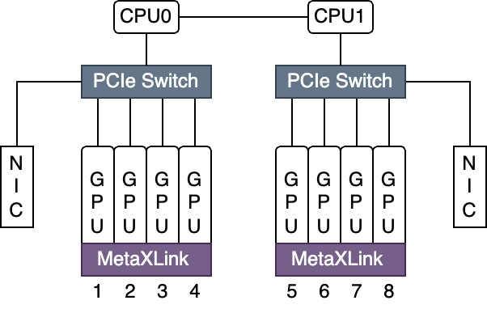
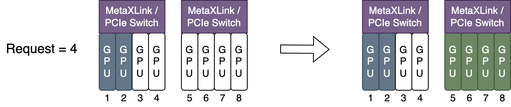
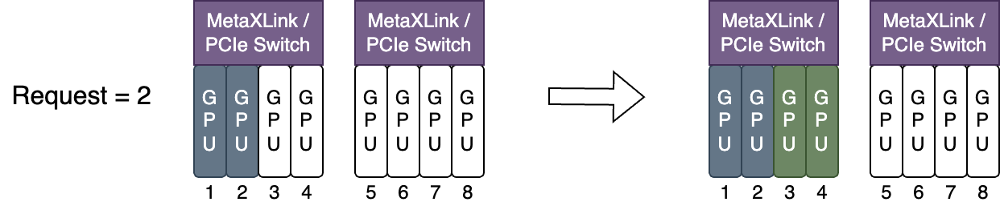

## Introduction

We support metax.com/gpu as follows:

- support metax.com/gpu by implementing most device-sharing features as nvidia-GPU
- support metax.com/gpu by implementing topo-awareness among metax GPUs

## support metax.com/gpu by implementing most device-sharing features as nvidia-GPU

device-sharing features include the following:

***GPU sharing***: Each task can allocate a portion of GPU instead of a whole GPU card, thus GPU can be shared among multiple tasks.

***Device Memory Control***: GPUs can be allocated with certain device memory size and have made it that it does not exceed the boundary.

***Device compute core limitation***: GPUs can be allocated with certain percentage of device core(60 indicate this container uses 60% compute cores of this device)

### Prerequisites

* Metax Driver >= 2.32.0
* Metax GPU Operator >= 0.10.2
* Kubernetes >= 1.23

### Enabling GPU-sharing Support

* Deploy Metax GPU Operator on metax nodes (Please consult your device provider to aquire its package and document)

* Deploy HAMi according to README.md

### Running Metax jobs

Metax GPUs can now be requested by a container
using the `metax-tech.com/sgpu`  resource type:

```yaml
apiVersion: v1
kind: Pod
metadata:
  name: gpu-pod1
spec:
  containers:
    - name: ubuntu-container
      image: ubuntu:22.04 
      imagePullPolicy: IfNotPresent
      command: ["sleep","infinity"]
      resources:
        limits:
          metax-tech.com/sgpu: 1 # requesting 1 GPU 
          metax-tech.com/vcore: 60 # each GPU use 60% of total compute cores
          metax-tech.com/vmemory: 4 # each GPU require 4 GiB device memory
```

> **NOTICE1:** *You can find more examples in [examples/metax folder](../examples/metax/sgpu)*

## support metax.com/gpu by implementing topo-awareness among metax GPUs

When multiple GPUs are configured on a single server, the GPU cards are connected to the same PCIe Switch or MetaXLink depending on whether they are connected
, there is a near-far relationship. This forms a topology among all the cards on the server, as shown in the following figure:



A user job requests a certain number of metax-tech.com/gpu resources, Kubernetes schedule pods to the appropriate node. gpu-device further processes the logic of allocating the remaining resources on the resource node following criterias below:
1. MetaXLink takes precedence over PCIe Switch in two way:
– A connection is considered a MetaXLink connection when there is a MetaXLink connection and a PCIe Switch connection between the two cards.
– When both the MetaXLink and the PCIe Switch can meet the job request
Equipped with MetaXLink interconnected resources.

2. When using `node-scheduler-policy=spread` , Allocate Metax resources to be under the same Metaxlink or Paiswich as much as possible, as the following figure shows:



3. When using `node-scheduler-policy=binpack`, Assign GPU resources, so minimize the damage to MetaxXLink topology, as the following figure shows:



### Important Notes

1. Device sharing is not supported yet.

2. These features are tested on MXC500

### Prerequisites

* Metax GPU extensions >= 0.8.0
* Kubernetes >= 1.23

### Enabling topo-awareness scheduling

* Deploy Metax GPU Extensions on metax nodes (Please consult your device provider to aquire its package and document)

* Deploy HAMi according to README.md

### Running Metax jobs

Metax GPUs can now be requested by a container
using the `metax-tech.com/gpu`  resource type:

```yaml
apiVersion: v1
kind: Pod
metadata:
  name: gpu-pod1
  annotations: hami.io/node-scheduler-policy: "spread" # when this parameter is set to spread, the scheduler will try to find the best topology for this task.
spec:
  containers:
    - name: ubuntu-container
      image: cr.metax-tech.com/public-ai-release/c500/colossalai:2.24.0.5-py38-ubuntu20.04-amd64 
      imagePullPolicy: IfNotPresent
      command: ["sleep","infinity"]
      resources:
        limits:
          metax-tech.com/gpu: 1 # requesting 1 vGPUs
```

> **NOTICE2:** *You can find more examples in [examples/metax folder](../examples/metax/gpu)*
