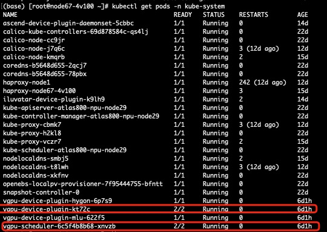

# Offline-install Maunal

For some cluster that don't have external web access, you can install HAMi by the following step:

1. Refer to [README.md](../README.md) until step 'Install and Uninstall'

2. copy the source of project into the master node in your cluster, placed in a path like "/root/HAMi"

3. pull the following images and save them into a '.tar' file, then move it into the master node in your cluster

Image list:
```
projecthami/hami:{HAMi version} 
docker.io/jettech/kube-webhook-certgen:v1.5.2
liangjw/kube-webhook-certgen:v1.1.1
registry.cn-hangzhou.aliyuncs.com/google_containers/kube-scheduler:{your kubernetes version}
```

```
docker pull {iamge} && docker save {image_name} -o {image_name}.tar 
```

4. Load these images using docker load, tag these images with your registry, and push them into your registry

```
docker load -i {image_name}.tar
docker tag projecthami/hami:{HAMi version} {registry}/hami:{HAMi version} 
docker push {registry}/hami:{HAMi version}
```

5. edit the following field in /root/HAMi/chart/vgpu/values.yaml to your image pushed

```
scheduler.kubeScheduler.image
scheduler.extender.image
scheduler.patch.image
scheduler.patch.imageNew
scheduler.devicePlugin.image
scheduler.devicePlugin.monitorimage
```

6. Execute the following command in your /root/HAMi/chart folder

```
helm install hami hami --set scheduler.kubeScheduler.imageTag={your k8s server version} -n kube-system
```

7. Verify your installation

execute the following command
```
kubectl get pods -n kube-system
```

If you can see both the 'device-plugin' and 'schduler' running, then HAMi is installed successfully, as the figure shown below:

 
