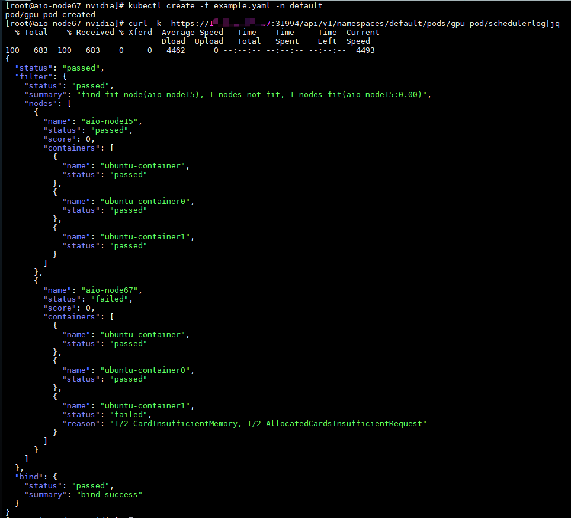
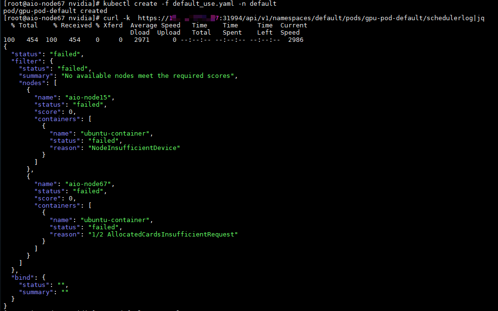

# Scheduler Log API Proposal: Pod Scheduling Diagnostics Enhancement for HAMI

## Table of Contents
- [Background](#background)
- [Current State](#current-state)
- [Problem Statement](#problem-statement)
- [Proposed Solution](#proposed-solution)
- [Design Details](#design-details)
- [Implementation Plan](#implementation-plan)
- [Benefits](#benefits)
- [Backward Compatibility](#backward-compatibility)
- [Conclusion](#conclusion)

## Background

In Kubernetes-based AI/ML environments, especially with heterogeneous resource schedulers like HAMI, users frequently encounter scheduling failures that are difficult to diagnose. HAMI (Heterogeneous Accelerator-aware Multi-Instance scheduler) is designed to handle complex scheduling requirements for specialized hardware such as NPUs, DCUs, MLUs, and other AI accelerators. Unlike standard CPU/GPU scheduling, heterogeneous resource scheduling involves complex constraints related to these specialized hardware devices, making failure analysis particularly challenging for users who may not be familiar with Kubernetes internals.

The current scheduler logging mechanism provides limited visibility into the scheduling decision process. Users must manually inspect scheduler logs, which are often verbose and require deep understanding of the scheduler's internal workings.

## Current State

Currently, HAMI scheduler provides minimal feedback when a Pod fails to schedule:

1. **Event-based notifications**: Kubernetes events show generic messages like "0/10 nodes are available: 10 Insufficient accelerator.example.com/device."
2. **Scheduler logs**: Detailed logs are written to scheduler logs, but they're:
    - Difficult to access for end users
    - Not structured for programmatic consumption
    - Mixed with other scheduler activities
    - Require knowledge of scheduler internals to interpret

For heterogeneous resource scheduling (NPU, DCU, MLU, etc.), the situation is worse. Failure reasons are often hardware-specific (e.g., "CardUuidMismatch", "CardInsufficientMemory") and not exposed in a user-friendly way.

## Problem Statement

The current scheduling diagnostics experience creates several pain points:

1. **Poor user experience**: End users (especially non-Kubernetes experts) cannot easily determine why their workload failed to schedule.
2. **Debugging inefficiency**: Cluster administrators must manually search through scheduler logs to diagnose issues, which is time-consuming.
3. **Lack of structured data**: Scheduler logs are unstructured text, making it difficult to build tooling around scheduling diagnostics.
4. **Heterogeneous resource complexity**: With multiple hardware vendors (NVIDIA, Ascend, DCU, etc.), failure reasons vary significantly and aren't consistently exposed.

This is particularly problematic in production environments where users need immediate feedback on why their AI training or inference workloads failed to schedule.

## Proposed Solution

We propose introducing a dedicated API endpoint that provides structured scheduling diagnostics for Pods, with a focus on making failure reasons clear and actionable for end users.

### API Endpoint
```
GET /api/v1/namespaces/{namespace}/pods/{name}/schedulerlog
```

### Response Structure
The response will provide a structured view of the scheduling process, organized by scheduling phase (filter and bind), with particular emphasis on node-level evaluation details:

```json
{
    "status": "failed",
    "filter": {
        "status": "passed",
        "summary": "",
        "nodes": [
            {
                "name": "node1",
                "status": "failed",
                "score": 0,
                "containers": [
                    {
                        "name": "container1",
                        "status": "failed",
                        "reason": "2/8 NumaNotFit, 3/8 CardInsufficientMemory, 2/8 CardInsufficientCore, 1/8 ExclusiveDeviceAllocateConflict"
                    }
                ]
            },
            {
                "name": "node2",
                "status": "failed",
                "score": 0,
                "containers": [
                    {
                        "name": "container1",
                        "status": "passed"
                    },
                    {
                        "name": "container2",
                        "status": "failed",
                        "reason": "4/8 CardInsufficientMemory, 3/8 CardUuidMismatch, 1/8 CardInsufficientCore"
                    }
                ]
            },
            {
                "name": "node3",
                "status": "passed",
                "score": 2.35,
                "containers": [
                    {
                        "name": "container1",
                        "status": "passed"
                    },
                    {
                        "name": "container2",
                        "status": "passed"
                    }
                ]
            }
        ]
    },
    "bind": {
        "status": "failed",
        "summary": "Failed to lock node, node aio-node15 has been locked within 5min"
    }
}
```

### Demonstration
#### scheduler success demonstration

```yaml
apiVersion: v1
kind: Pod
metadata:
  name: gpu-pod
spec:
  containers:
    - name: ubuntu-container
      image: ubuntu:18.04
      command: ["bash", "-c", "sleep 86400"]
      resources:
        limits:
          nvidia.com/gpu: 2 # declare how many physical GPUs the pod needs
          #nvidia.com/gpumem: 3000 # identifies 3000M GPU memory each physical GPU allocates to the pod
          nvidia.com/gpumem-percentage: 50 # identifies 50% GPU memory each physical GPU allocates to the pod. Can not be used with nvidia.com/gpumem
          #nvidia.com/gpucores: 90 # identifies 90% GPU GPU core each physical GPU allocates to the pod
          #nvidia.com/priority: 0 # we only have two priority class, 0(high) and 1(low), default: 1
          #The utilization of high priority task won't be limited to resourceCores unless sharing GPU node with other high priority tasks.
          #The utilization of low priority task won't be limited to resourceCores if no other tasks sharing its GPU.
    - name: ubuntu-container0
      image: ubuntu:18.04
      command: ["bash", "-c", "sleep 86400"]
    - name: ubuntu-container1
      image: ubuntu:18.04
      command: ["bash", "-c", "sleep 86400"]
      resources:
        limits:
          nvidia.com/gpu: 2 # declare how many physical GPUs the pod needs
          nvidia.com/gpumem: 2000 # identifies 2000M GPU memory each physical GPU allocates to the pod (Optional,Integer)
          #nvidia.com/gpucores: 90 # identifies 90% GPU GPU core each physical GPU allocates to the pod
```


1. create pod
2. use `curl https://<nodeip>:31994/api/v1/namespaces/default/pods/gpu-pod/schedulerlog` to get pod scheduling log



#### scheduler failure demonstration

```yaml
apiVersion: v1
kind: Pod
metadata:
  name: gpu-pod-default
spec:
  containers:
    - name: ubuntu-container
      image: ubuntu:22.04
      command: ["bash", "-c", "sleep 86400"]
      resources:
        limits:
          nvidia.com/gpu: 5 # declare how many physical GPUs the pod needs
          nvidia.com/gpumem: 3000 # identifies 3000M GPU memory each physical GPU allocates to the pod (Optional,Integer)
          nvidia.com/gpucores: 30 # identifies 30% GPU GPU core each physical GPU allocates to the pod (Optional,Integer)
```

1. create pod
2. use `curl https://<nodeip>:31994/api/v1/namespaces/default/pods/gpu-pod-default/schedulerlog` to get pod scheduling log




## Design Details

### Data Structure Rationale

1. **Node-Centric Organization**:
    - The structure is organized by nodes first (not containers), reflecting the actual scheduling workflow where nodes are evaluated sequentially.
    - This matches how the scheduler operates internally (node-by-node evaluation).

2. **Clear Failure Attribution**:
    - Each failed container evaluation includes a human-readable reason string that aggregates hardware-specific failure reasons.
    - The format `X/Y ReasonType` clearly shows how many devices failed for each reason (e.g., "4/8 CardInsufficientMemory" means 4 out of 8 devices had insufficient memory).

3. **Phase Separation**:
    - `filter` phase: Shows node filtering results (predicates)
    - `bind` phase: Shows binding results (if node was selected but binding failed)

4. **Status Hierarchy**:
    - Overall status at the top level
    - Phase-level status (filter/bind)
    - Node-level status
    - Container-level status

### Key Fields

- **status**: Overall scheduling status (`succeeded` or `failed`)
- **filter.status**: Whether any node passed filtering (`passed` or `failed`)
- **nodes**: Array of node evaluation results
    - **name**: Node name
    - **status**: Node evaluation status (`passed` or `failed`)
    - **score**: For passed nodes (used in scoring phase)
    - **containers**: Container evaluation results for this node
        - **name**: Container name
        - **status**: Container evaluation status (`passed` or `failed`)
        - **reason**: Failure reason(s) (for failed containers)
- **bind.status**: Binding phase status
- **bind.summary**: Detailed binding failure reason

## Implementation Plan

### 1. Scheduler Log Cache

- Implement a thread-safe LRU cache to store scheduling diagnostics
- Configurable maximum size (default: 1000 Pods)
- Entries automatically evicted based on least-recently-used policy
- Designed for concurrent access during multi-goroutine scheduling

### 2. Data Collection During Scheduling

- Enhance HAMI scheduler to populate the cache during scheduling process:
    - Record node evaluation results
    - Track container-specific failure reasons
    - Capture binding phase outcomes
- Ensure thread-safe writes to the cache

### 3. API Endpoint Implementation

- Add new HTTP endpoint to HAMI scheduler
- Implement authentication/authorization (using existing scheduler permissions)
- Format response according to proposed structure
- Handle error cases (Pod not found, etc.)

### 4. Documentation and UI Integration

- Update documentation with API usage examples
- Provide sample code for integration with monitoring tools
- Design for potential UI integration in dashboard applications

## Benefits

1. **Improved User Experience**:
    - Users can immediately see why their workload failed to schedule
    - No need to understand scheduler internals or search through logs
    - Clear, actionable failure reasons

2. **Enhanced Debugging**:
    - Cluster administrators can quickly diagnose scheduling issues
    - Structured data enables automated analysis tools
    - Hardware-specific failure reasons are clearly exposed

3. **Better Support for Heterogeneous Resources**:
    - Specialized failure reasons for different hardware types are preserved
    - Users can distinguish between different types of resource constraints

4. **Standardized Diagnostics**:
    - Consistent format for scheduling diagnostics across different environments
    - Enables building of common tooling for scheduling analysis

## Backward Compatibility

This proposal introduces a new API endpoint without affecting existing functionality:

- No changes to scheduler behavior or existing APIs
- No impact on current scheduling workflows
- The feature can be enabled/disabled via configuration
- Existing logging mechanisms remain unchanged

The implementation will include proper versioning in the API path (`/api/v1/...`) to allow for future evolution.

## Conclusion

This proposal addresses a critical gap in Kubernetes scheduling diagnostics, particularly for heterogeneous resource environments. By providing a structured, user-friendly view of the scheduling process, it significantly improves the user experience for workload developers while giving cluster administrators powerful diagnostic capabilities.

The node-centric design accurately reflects the scheduling workflow and provides clear attribution of failure reasons at the appropriate level of detail. This enhancement will make HAMI scheduler more accessible to users of all skill levels while maintaining the power and flexibility required for complex scheduling scenarios.

We believe this feature will be particularly valuable for users working with specialized AI hardware, where scheduling failures are common but difficult to diagnose with current tools.