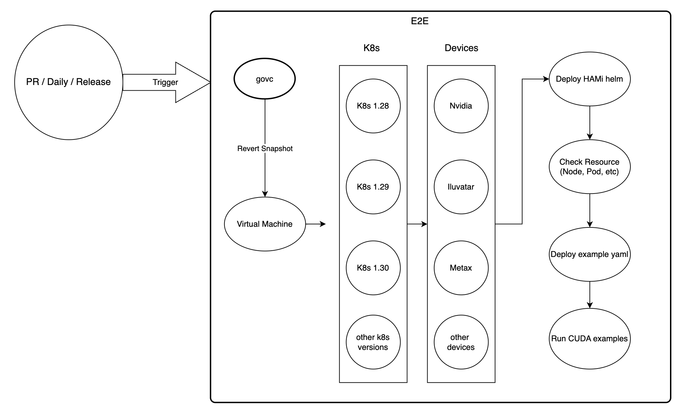

# Support E2E Testing

<!-- toc -->

- [Summary](#summary)
- [Motivation](#motivation)
    - [Goals](#goals)
    - [Non-Goals](#non-goals)
- [Proposal](#proposal)
    - [Test Scope](#test-scope)
    - [Implementation Details](#implementation-details)
    - [User Stories (Optional)](#user-stories-optional)
        - [Story 1](#story-1)
        - [Story 2](#story-2)
        - [Story 3](#story-3)
    - [Risks and Mitigations](#risks-and-mitigations)
- [Design Details](#design-details)

<!-- /toc -->

## Summary

<!--
This section is incredibly important for producing high-quality, user-focused
documentation such as release notes or a development roadmap. It should be
possible to collect this information before implementation begins, in order to
avoid requiring implementors to split their attention between writing release
notes and implementing the feature itself. KEP editors and SIG Docs
should help to ensure that the tone and content of the `Summary` section is
useful for a wide audience.

A good summary is probably at least a paragraph in length.

Both in this section and below, follow the guidelines of the [documentation
style guide]. In particular, wrap lines to a reasonable length, to make it
easier for reviewers to cite specific portions, and to minimize diff churn on
updates.

[documentation style guide]: https://github.com/kubernetes/community/blob/master/contributors/guide/style-guide.md
-->

This KEP proposes to support End-to-End (E2E) testing for HAMi, ensuring its functionality and compatibility
within the Kubernetes ecosystem.

It introduces mechanisms to validate the entire workflow of the feature and
guarantee that it meets production-level requirements.

## Motivation

<!--
This section is for explicitly listing the motivation, goals, and non-goals of
this KEP.  Describe why the change is important and the benefits to users. The
motivation section can optionally provide links to [experience reports] to
demonstrate the interest in a KEP within the wider Kubernetes community.

[experience reports]: https://github.com/golang/go/wiki/ExperienceReports
-->

End-to-end (E2E) tests validate the complete functionality of a system, ensuring that the end-user experience 
aligns with developer specifications. 

While unit and integration tests provide valuable feedback, they are often insufficient in distributed systems. 
Minor changes may pass unit and integration tests but still introduce unforeseen issues at the system level.

Comprehensive E2E test coverage is essential to mitigate the risks of regressions, improve reliability, 
and maintain confidence in the system's seamless integration with Kubernetes. 
Without it, HAMi's robustness and user trust may be compromised.

### Goals

<!--
List the specific goals of the KEP. What is it trying to achieve? How will we
know that this has succeeded?
-->

- Setup E2E testing basic environment.
- Define the scope and scenarios for E2E testing of HAMi.
- Implement E2E tests that cover key workflows and edge cases.
- Ensure compatibility with the Kubernetes.
- Establish a reliable and repeatable test framework for future enhancements.

### Non-Goals

<!--
What is out of scope for this KEP? Listing non-goals helps to focus discussion
and make progress.
-->

- Unit or integration testing of the feature (covered elsewhere).
- Performance benchmarking beyond basic scenarios.

## Proposal

<!--
This is where we get down to the specifics of what the proposal actually is.
This should have enough detail that reviewers can understand exactly what
you're proposing, but should not include things like API designs or
implementation. What is the desired outcome and how do we measure success?.
The "Design Details" section below is for the real
nitty-gritty.
-->

This proposal aims to integrate E2E testing for HAMi. Tests will be implemented using the 
Kubernetes E2E testing framework (e.g. Ginkgo) and adhere to community best practices.

### Test Scope

- Core functionality: Validate basic operations and workflows of the feature.
- Edge cases: Test unusual scenarios or invalid inputs to ensure robustness.
- Compatibility: 
  - Verify that the feature integrates with different heterogeneous devices.
  - Verify that the feature integrates with different Kubernetes versions.
  - Verify that the feature integrates with different CUDA versions. (Optional)
- Error handling: Ensure appropriate error messages and recovery mechanisms are in place.

### Implementation Details

- Test environment will hold in local environment.
- Tests will be written using the [Ginkgo](https://onsi.github.io/ginkgo/) testing framework.
- All tests will use isolated namespaces to avoid conflicts.
- Resource cleanup will be automated after each test run.
- CI integration will ensure tests run against PRs, daily builds, and releases.

### User Stories (Optional)

<!--
Detail the things that people will be able to do if this KEP is implemented.
Include as much detail as possible so that people can understand the "how" of
the system. The goal here is to make this feel real for users without getting
bogged down.
-->

#### Story 1
Automating E2E testing with helm deployment

#### Story 2
Automating E2E testing with resource validation

### Story 3
Automating E2E testing with Kubernetes resource deploy

### Risks and Mitigations

<!--
What are the risks of this proposal, and how do we mitigate? Think broadly.
For example, consider both security and how this will impact the larger
Kubernetes ecosystem.

How will security be reviewed, and by whom?

How will UX be reviewed, and by whom?

Consider including folks who also work outside the SIG or subproject.
-->

- Resource Limitations
  - During E2E testing, testing clusters may encounter resource constraints, 
  such as insufficient CPU, memory, or storage. This could lead to test failures, 
  degraded performance, or timeouts during deployments.
- Environment Instability
  - Instabilities in the testing environment, such as network latency, intermittent network failures, 
  or cluster node failures, can cause tests to fail or behave inconsistently.

## Design Details

<!--
This section should contain enough information that the specifics of your
change are understandable. This may include API specs (though not always
required) or even code snippets. If there's any ambiguity about HOW your
proposal will be implemented, this is the place to discuss them.
-->

