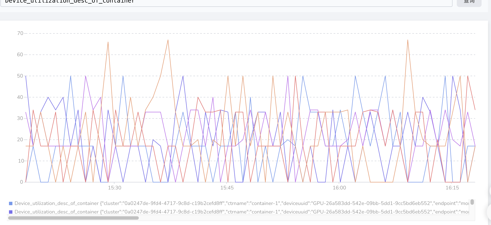

# Support GPU Utilization Metrics

## Summary
Currently, HMAi supports dividing a Nvidia GPU card into several vGPU cards to efficiently utilize the 
efficiency of the GPU. When I assign a vGPU to a Pod, HAMi cannot provide information on the Pod's 
utilization of the vGPU. This results in users being unable to observe the usage situation of the Pod's vGPU.

This KEP proposes support for monitoring vGPU utilization.


## Motivation

### Goals
- Support for monitoring vGPU utilization

### Non-Goals

Does not support monitoring of GPU utilization for non-Nvidia GPUs.

## Proposal

### User Stories (Optional)


#### Story 1

I have partitioned a Nvidia GPU card into 4 parts and deployed 2 Pods on this card.
Currently, I want to observe the GPU usage of these two Pods separately, in order to assess 
whether my business logic is reasonable.

Currently, HAMi provides a `HostCoreUtilization` usage rate for the entire GPU card, 
but it still cannot observe the use of GPUs from each Pod's perspective.

### Notes/Constraints/Caveats (Optional)


### Risks and Mitigations

Because the design scheme will expand the fields of the `struct shared_region` structure, there may be potential incompatibilities.

## Design Details

Modify the shared_region, add a `gpu_util` field to record the current pid's GPU usage.
```c++
typedef struct {
    uint64_t dec_util;
    uint64_t enc_util;
    uint64_t sm_util;
} device_gpu_t;

typedef struct {
    int32_t pid;
    int32_t hostpid;
    device_memory_t used[CUDA_DEVICE_MAX_COUNT];
    uint64_t monitorused[CUDA_DEVICE_MAX_COUNT];
    int32_t status;
    device_gpu_t gpu_util[CUDA_DEVICE_MAX_COUNT]; // new field
} shrreg_proc_slot_t;


int set_gpu_device_gpu_monitor(int32_t pid,int dev, unsigned int smUtil){  // new function
    //LOG_WARN("set_gpu_device_memory_monitor:%d %d %lu",pid,dev,monitor);
    int i;
    ensure_initialized();
    lock_shrreg();
    for (i=0;i<region_info.shared_region->proc_num;i++){
        if (region_info.shared_region->procs[i].hostpid == pid){
            LOG_INFO("set_gpu_device_gpu_monitor:%d %d %lu->%lu",pid,dev,region_info.shared_region->procs[i].gpuUsed[dev].smUtil,smUtil);
            region_info.shared_region->procs[i].gpu_util[dev].smUtil = smUtil;
            break;
        }
    }
    unlock_shrreg();
    return 1;
}
```

Modify the `get_used_gpu_utilization` method, to record the GPU usage rate of the current pid.

```c++

int get_used_gpu_utilization(int *userutil,int *sysprocnum) {
    ...
    unsigned int nvmlCounts;
    CHECK_NVML_API(nvmlDeviceGetCount(&nvmlCounts));

    int devi,cudadev;
    for (devi=0;devi<nvmlCounts;devi++){
      sum=0;
      summonitor=0;
      shrreg_proc_slot_t *proc;
      cudadev = nvml_to_cuda_map((unsigned int)(devi));
      if (cudadev<0)
        continue;
      CHECK_NVML_API(nvmlDeviceGetHandleByIndex(cudadev, &device));
      nvmlReturn_t res = nvmlDeviceGetComputeRunningProcesses(device,&infcount,infos);
      if (res==NVML_ERROR_INSUFFICIENT_SIZE){
        continue;
      }
      gettimeofday(&cur,NULL);
      microsec = (cur.tv_sec - 1) * 1000UL * 1000UL + cur.tv_usec;
      res = nvmlDeviceGetProcessUtilization(device,processes_sample,&processes_num,microsec);
      if (res==NVML_ERROR_INSUFFICIENT_SIZE){
        userutil[cudadev] = 0;
        for (i=0; i<infcount; i++){
          ...
          set_gpu_device_memory_monitor(infos[i].pid,cudadev,summonitor);
          set_gpu_device_gpu_monitor(infos[i].pid,cudadev,0);                                        // new line.
        } 
        continue;
      }
      for (i=0; i<processes_num; i++){
           ....
          set_gpu_device_memory_monitor(processes_sample[i].pid,cudadev,summonitor);
          set_gpu_device_gpu_monitor(processes_sample[i].pid,cudadev,processes_sample[i].smUtil);     // new line.
      }
      ...
    }
    return 0;
}
```


Modify vGPUMonitor to obtain the GPU usage rate of each process in a container 
by querying `sm_util` in the shared_region. Finally, expose metrics.

```go
	ctrDeviceUtilizationdesc = prometheus.NewDesc(
		"Device_utilization_desc_of_container",
		"Container device utilization description",
		[]string{"podnamespace", "podname", "ctrname", "vdeviceid", "deviceuuid"}, nil,
	)
    // 获取 container 中每个进程 的 GPU 利用率。
    func getTotalUtilization(usage podusage, vidx int) deviceUtilization {
      added := deviceUtilization{
          decUtil: 0,
          encUtil: 0,
          smUtil:  0,
      }
      for _, val := range usage.sr.procs {
        added.decUtil += val.gpuUtil[vidx].decUtil
        added.encUtil += val.gpuUtil[vidx].encUtil
        added.smUtil += val.gpuUtil[vidx].smUtil
      }
      return added
    }
	
	// 暴露 GPU 利用率
    utilization := getTotalUtilization(srPodList[sridx], i)

    ch <- prometheus.MustNewConstMetric(
    ctrDeviceUtilizationdesc,
    prometheus.GaugeValue,
    float64(utilization.smUtil),
    val.Namespace, val.Name, ctrName, fmt.Sprint(i), uuid,
    )
```

The effect is shown in the picture.

### Test Plan

Deploy multiple real Pods that can use GPU to a node, observe whether HAMi has provided the real GPU usage rate of these Pods.

## Alternatives

<!--
What other approaches did you consider, and why did you rule them out? These do
not need to be as detailed as the proposal, but should include enough
information to express the idea and why it was not acceptable.
-->

<!--
Note: This is a simplified version of kubernetes enhancement proposal template.
https://github.com/kubernetes/enhancements/tree/3317d4cb548c396a430d1c1ac6625226018adf6a/keps/NNNN-kep-template
-->