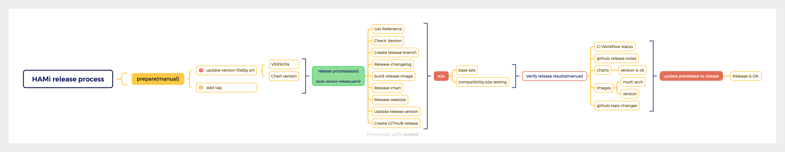

# workflow for release

## TLDR: The content is very long-winded, you can go directly to the [core content](#release-process)

## Release Notes and Assets

Release notes are available on GitHub at <https://github.com/Project-HAMi/HAMi/releases>.

## Release Management

This section provides guidelines on release timelines and release branch maintenance.

### Release Timelines

HAMi uses the Semantic Versioning 2.0.0 [schema](https://semver.org/). This project follows a given version number MAJOR.MINOR.PATCH.

### MAJOR release

Major releases contain large features, design and architectural changes, and may include incompatible API changes. Major releases are low frequency and stable over a long period of time.

### MINOR release

Minor releases contain features, enhancements, and fixes that are introduced in a backwards-compatible manner. Since HAMi is a fast growing project and features continue to iterate rapidly, having a minor release approximately every few months helps balance speed and stability.

* Roughly every 1-3 months

### PATCH release

Patch releases are for backwards-compatible bug fixes and very minor enhancements which do not impact stability or compatibility. Typically only critical fixes are selected for patch releases. Usually there will be at least one patch release in a minor release cycle.

* When critical fixes are required, or roughly each month

### Versioning

HAMi uses GitHub tags to manage versions. New releases and release candidates are published using the wildcard tag`v<major>.<minor>.<patch>`.

Whenever a PR is merged into the master branch, CI will pull the latest code, generate an image and upload it to the image repository. The latest image of HAMi components can usually be downloaded online using the latest tag.
Whenever a release is released, the image will also be released, and the tag is the same as the tag of the release above.

### Branches and PRs

Release branches and PRs are managed as follows:

* All changes are always first committed to `master`.
* Branches are created for each major or minor release.
* The branch name will contain the version, for example release-v0.23
* Patch releases are created from a release branch.
* For critical fixes that need to be included in a patch release, PRs should always be first merged to master and then cherry-picked to the release branch. PRs need to be guaranteed to have a release note written and these descriptions will be reflected in the next patch release.
* For complex changes, specially critical bugfixes, separate PRs may be required for master and release branches.

## release process

This is the architecture diagram of the HAMi release process

## [Manual] pre-steps

Update version information through PR and create a new tag

* update 'version' and 'appVersion' filed in 'charts/hami/Chart.yaml' by pr
* update 'version' in 'charts/hami/values.yaml' by pr
* update version in '/VERSION' by pr
* a version tag should be set on right branch. The version should go with
  * v0.1.0
  * v0.2.0

## [automatic] push a version tag

> planing indicates that the plan is in progress and has not yet started.

If a tag vx.x.x is pushed , the following steps will automatically run:

1. check the tag name is same with <https://github.com/Project-HAMi/HAMi/blob/master/VERSION>

2. generate pre-release-notes

3. create a branch named 'release-vx.x.x'

4. build the images with the pushed tag, and push to dockerhub registry <https://hub.docker.com/r/projecthami/hami/tags>

5. build the helm chart with the pushed tag
   1. Update HAMi charts version
   2. build the chart package with the pushed tag, and submit a PR to branch 'gh-pages'

    you cloud get the chart with command `helm repo add hami https://Project-HAMi.github.io/HAMi`

6. generate release-notes and upload helm charts to github release
   1. upload HAMi chart tgz to release <https://github.com/wawa0210/HAMi/releases>
   2. **[planing]** save changelogs to <https://github.com/Project-HAMi/HAMi/blob/master/docs/CHANGELOG/${latest_tag}.md>

7. **[planing]** build HAMi website

8. **[planing]** Running e2e tests

9. **[planing]** Run version compatibility e2e test

For the detail, refer to <https://github.com/Project-HAMi/HAMi/blob/master/.github/workflows/auto-release.yaml>

## [Manual] post

***Although AI is smart enough, the HAMi maintainer team needs to ensure that the version is released reliably. This is why we need to do it manually at the end.***

🔥🔥🔥 Finally, if the github action release runs successfully, the version rlease is complete and has passed the e2e test (including images, charts, release-notes, etc.)

Finally, we need to make sure that the GITHUB release information is what we expected (release-note content, Assets, etc.). If it is confirmed, modify the version to the official version instead of the pre-release version.

### task list

* [ ] Push the image to ghcr

* [ ] save changelogs to <https://github.com/Project-HAMi/HAMi/blob/master/docs/CHANGELOG/${latest_tag}.md>

* [ ] build HAMi website

* [ ] Running e2e tests

* [ ] Run version compatibility e2e test
